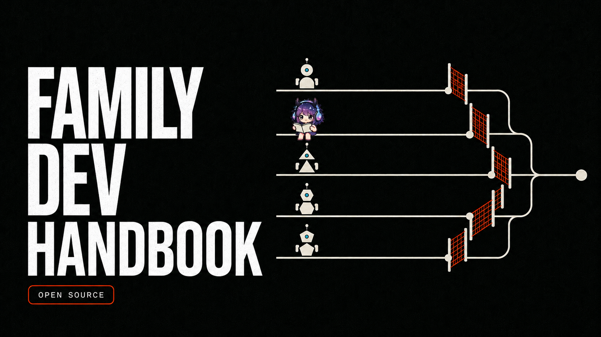
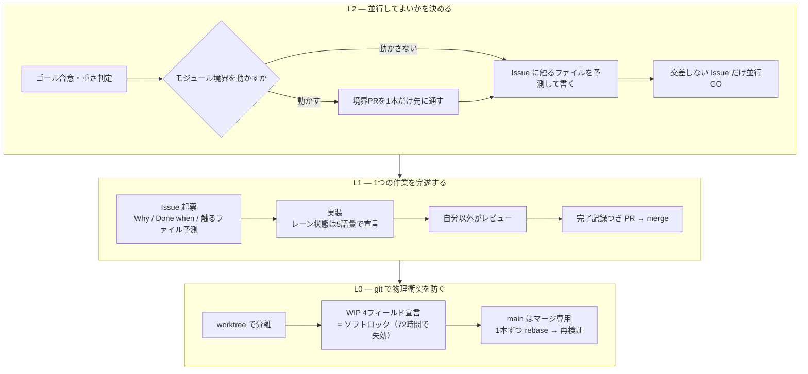
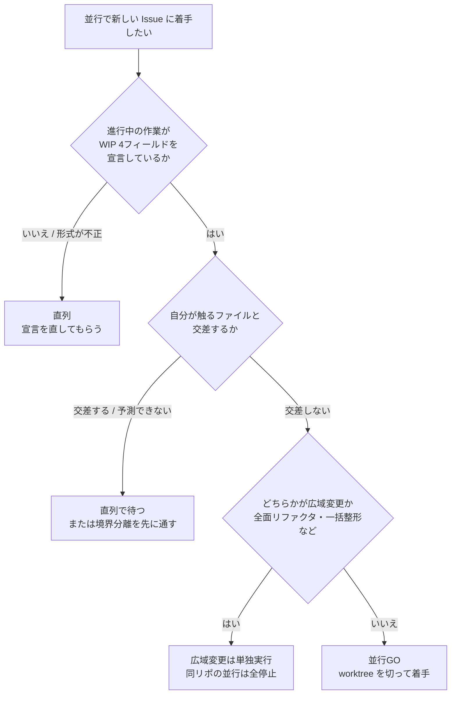

# Family Dev Handbook

<div align="center">

[🇺🇸 English](README.md) ｜ **🇯🇵 日本語（正本）** ｜ [🇨🇳 简体中文](README.zh.md) ｜ [🇹🇭 ไทย](README.th.md)



[](LICENSE)


複数の AI エージェントと複数のセッションが、同じコードベースを衝突せずに並行開発するための共通ルールです。<br>
同じファイルを同時に直して壊す・「できました」が信用できない・引き継いだ時に何が終わっているか分からない、を解決します。<br>
判断を人の注意力から、着手前の機械的な判定と、証拠つきのゲートへ移すことで解決します。

**検証できないなら、直列。**

🔧 [ルール本文 — L0 git 規律](docs/03-git-protocol.md) ｜ 📘 [様式の正本 — Issue テンプレート](templates/issue-template.md)

</div>

---

<a id="toc"></a>

## 目次

- [こんな経験はありませんか？](#problems)
- [前提](#premises)
- [できること](#what-you-get)
- [使うのに必要なもの](#requirements)
- [使いはじめる](#get-started)
- [安心して使える理由](#safety)
- [並行してよいかの決め方](#parallel-go)
- [ルールの全体像](#rules)
- [もっと詳しく](#docs)
- [Caty AI ファミリー](#ecosystem)
- [開発ステータス](#status)
- [コントリビュート](#contributing)
- [ライセンス](#license)

---

<a id="problems"></a>

## こんな経験はありませんか？

AI エージェントに任せる仕事が増えると、コードそのものより先に、こういうことが起き始めます。

- **同じファイルを2人（2体）が同時に直していた** — 気づくのは merge の時
- **「できました」が信用できない** — 何をどこまで確かめたのかが残っていない
- **引き継いだ瞬間、何が終わっているか分からない** — 前のセッションの記憶はもうない
- **並行してよいのか毎回悩む** — 判断が人によって違い、事故のたびにルールだけが増える

この4つを、注意力ではなく仕組みで潰すために作られたのがこのハンドブックです。

その前に、このハンドブックが何を出発点にしているかを先にお伝えします。

---

<a id="premises"></a>

## 前提

読み始める前に共有しておきたい出発点が3つあります。以降の説明は、この3つを出発点にしています。3つは順序ではなく、どれから入っても同じ土俵に立つための前提です。

### Issue から始める

**コードを触る前に、GitHub の Issue を1本立てる**ところから始めます（Issue-first）。

会話やチャットで決めたことは、セッションが終われば消えます。AI エージェントは毎回記憶ゼロで始まるので、なおさらです。残るのは Issue の本文と Pull Request の差分だけで、だからこそその2つを引き継ぎの唯一の正本にします。誰が忘れっぽいかという話ではなく、**忘れることを前提にした置き場所を1つ決めておく**、という話です。

詳しくは [Issue-first とは](docs/why-issue-first.md) へ。

### モジュールは小さく切る

**並行できるかどうかは、着手する前にコードの形で決まっています。**

多くの責務が同居した巨大なファイルが1つあると、そのエリアでは何をやっても触るファイルが交差するので、いつも直列になります。だから分割は「あとで、きれいにするためにやる整理」ではなく、**先にやる投資**として扱います。返ってくるものは3つです。

- **並行できる** — 分割した瞬間から、そのエリアの並行が構造的に安全になる
- **集中できる** — 読む量が減るほど、エージェントは目の前の仕事だけに向かえる
- **差し替えられる** — ブロックのつけ外しのように、壊れた1つだけを直せる

これを自分で設計する必要はありません。**このハンドブックをエージェントに渡しておけば、分割すべき場所は向こうから Issue として上がってきます。**

詳しくは [なぜモジュールを小さく切るのか](docs/why-small-modules.md) へ。

### 複雑さは要件で消す

**設計でハマったら、より賢い設計ではなく、まず要件を疑います。**

難しさの多くは設計ではなく要件が連れてきます。前提を1つ消せると、設計の難所が実装ごと・保守ごと、まるごと消えます。ただし疑うのはエージェントの自由、**消す決定は依頼した人のもの**です。受け入れた複雑さは理由を Issue に1行残します。

詳しくは [なぜシンプルに作るのか](docs/why-simple-systems.md) へ。

---

<a id="what-you-get"></a>

## できること

問題を3つの層に分け、それぞれ別の方法で潰します。上の層ほど「事故を予防する」、下の層ほど「事故を検出して封じ込める」役割です。

図に出てくる言葉を先に3つだけ。**レーン**＝1本の Issue に対応する作業の流れ。**WIP**＝ work in progress（作業中）の宣言。**ソフトロック**＝宣言している間だけ他の人がそこを触らない、という約束です。



- 🚦 **並行してよいかを、着手前に決める**

  「2つの作業が触るファイルの集合は交差しない」と着手前に分かる時だけ、並行を許します。判断は3つの問いで決まり、どれか1つでも確かめられなければ自動的に直列へ倒れます。

- 📋 **1つの作業を、証拠つきで終わらせる**

  Issue には Why・Done when・触るファイルの予測を必ず書きます。merge には完了記録（Done when の全項目に PASS / FAIL / 理由付き N/A・候補となるコミット・宣言と実際の差分の照合・自分以外によるレビュー）を要求します。「できました」が言葉ではなく記録になります。

- 🔒 **物理的な衝突を、git の使い方で封じ込める**

  1セッション＝1 Issue＝1ブランチ＝1 worktree（同じリポジトリを複数の作業フォルダに分ける git の機能）。main はマージ専用。作業中のレーンは4つの項目を宣言している間だけソフトロックとして扱われ、72時間で自然に失効します。

効くかどうかの前に、そもそも何が必要か。答えは「ほとんど何も要りません」です。

---

<a id="requirements"></a>

## 使うのに必要なもの

このリポジトリはドキュメントだけでできています。インストールするプログラムはありません。

| 必要なもの | 対応 |
|---|---|
| 実行するランタイム（Node / Python など） | 不要（ドキュメントのみ・インストール作業なし） |
| バージョン管理 | ✅ git |
| 作業の記録場所 | ✅ GitHub の Issue / Pull Request |
| AI エージェント | ✅ 常時読み込まれる設定ファイル（`CLAUDE.md` / `AGENTS.md` / システムプロンプトなど）を持つものなら種類を問わない |
| 人間だけの運用 | ✅ 可（AI を使わないチームでもそのまま使える） |

特定のエージェント製品・特定の記憶基盤・特定のツールチェーンには依存しません。守る対象はプロトコルであって、道具立てではないためです。組み込み先の一覧をどう管理するかは [docs/04](docs/04-adoption.md) にあります。

揃っていれば、導入は「貼る」だけです。

---

<a id="get-started"></a>

## 使いはじめる

導入とは、各エージェントの常時コンテキストにルールの要約を置くことです。

### AI に入れてもらう

普段使っているエージェントに、次のように頼みます。

```text
https://github.com/caty-ai/family-dev-handbook の docs/04-adoption.md にある
「配布用の要約ブロック」を、私の常時コンテキスト（CLAUDE.md / AGENTS.md）に貼ってください。
その設定ファイルがまだ無ければ作ってください。
1行目の owner は私の名前、last-verified は今日の日付に書き換えてください。
2行目の「正本:」には、このハンドブックのリポジトリ URL を入れてください。
handbook-revision の値は書き換えないでください。
```

### 自分で入れる

1. [docs/04](docs/04-adoption.md) の「配布用の要約ブロック」を開く（40行ほどのテキストです）
2. 常時読み込まれる設定ファイルに、丸ごと貼る
3. 1行目の `owner` と `last-verified` を自分と今日の日付に書き換える。`handbook-revision` はそのまま残す
4. 2行目の `正本:` を、このハンドブックのリポジトリ URL（fork したなら fork 先）に書き換える

貼るのはこれだけです。中身は7系統の rule ID（`L2-1`〜`L2-6` / `L1-1`〜`L1-11` / `L0-1`〜`L0-9` / `FP-1`〜`FP-9` / `E-1`〜`E-10` / `B-1`〜`B-5` / `LC-1`〜`LC-5`）と、それぞれ1行の方針（ポスチャ）だけで、条文の本文は入っていません。**本文の正本はこのリポジトリで、要約と食い違ったら正本が正です。** 自分のリポジトリに合わせて厳しくするのは自由ですが、緩めるのは禁止しています。

やめたくなったら、貼った40行を消すだけで元に戻ります。ほかのファイルには触りません。

リポジトリ側の準備（並行安全マップ・Issue テンプレート・main の保護）は [docs/04](docs/04-adoption.md) にあります。

貼る前に引っかかる点があるはずです。先に答えておきます。

---

<a id="safety"></a>

## 安心して使える理由

- **全部を一度に入れなくてよい** — L0（git 規律）だけでも効きます。L2 と L1 は運用が回りはじめてから足せます
- **今の Issue / PR 運用を作り替えなくてよい** — 足すのは Issue 本文の3項目と、レーンの状態を表す5つの言葉（WIP / HOLD / MERGED / SUPERSEDED / ABANDONED）だけです
- **緩める方向の改変だけが禁止** — 自分のリポジトリで厳しくするのは自由です。守るのは「正本より緩い要約を配らない」の一点だけ
- **エージェントが守らない前提で設計されている** — 気配りや記憶に頼らず常時読み込まれる場所に置き、判定は交差するかしないかの2値で、確かめられなければ必ず直列側へ倒れます

**向かない使い方**もあります。

- 1人・1セッションで、常に直列にしか作業しない — L0-4 以外はほとんど空振りします
- Issue / PR を使わない運用 — L1 の完遂ゲートが成立しません
- 単発の bug fix だけを回す小さなリポジトリ — 上流レビュー（実装に入る前に別のモデルへ設計を見せる確認・L1-9）は最初から適用対象外です

運用で毎回いちばん迷うのは「いま並行で始めてよいか」です。その判定だけ、ここで完結させます。

---

<a id="parallel-go"></a>

## 並行してよいかの決め方

3つの問いで決まります。どれか1つでも確かめられなければ、並行しません。



もし何をやっても毎回交差してしまうなら、それは判定の問題ではなく切り方の問題です（[なぜモジュールを小さく切るのか](docs/why-small-modules.md)）。

この1枚は `L2-4` というたった1条にすぎません。全体の地図はこの先です。

---

<a id="rules"></a>

## ルールの全体像

ルールは7系統に分かれ、すべてに変わらない ID が振ってあります。要約も会話も Issue も、この ID で指し合います。

| 系統 | 決めること | rule ID | 本文 |
|---|---|---|---|
| **L2** マイルストーンループ | 並行してよいか | `L2-1`〜`L2-6` | [docs/01](docs/01-milestone-loop.md) |
| **L1** Issue ループ | 1つの作業をどう完遂するか | `L1-1`〜`L1-11` | [docs/02](docs/02-issue-loop.md) |
| **L0** git 規律 | 物理衝突をどう防ぐか | `L0-1`〜`L0-9` | [docs/03](docs/03-git-protocol.md) |
| **FP** 失敗時姿勢 | 検証できない時どちらへ倒すか | `FP-1`〜`FP-9` | [docs/05](docs/05-fail-posture.md) |
| **E** Epic レーン | 複数 Issue の束をどう運ぶか | `E-1`〜`E-10` | [docs/06](docs/06-epic-lane.md) |
| **B** 委譲ブリーフ | 1回の委譲をどう契約にするか | `B-1`〜`B-5` | [docs/07](docs/07-delegation-brief.md) |
| **LC** ライフサイクル | 置いた物をいつ・どう退場させるか | `LC-1`〜`LC-5` | [docs/08](docs/08-lifecycle.md) |

とくに効き目を左右する条文が2つあります。ひとつは **FP** の合言葉「検証不能なら直列。fail-open は『通過』を意味しない」— 確かめられない時に通す側へ倒す設計を選んだとしても、それは「確認済み」の意味には決してならない、という宣言です。もうひとつは **高リスク領域の単一定義**で、ここに触れる作業は人間が必ず止まり、レビューの席が増えます（対外公開・課金・不可逆な操作・権限まわりの境界などが該当します。正確な線引きは正本を見てください）。同じ定義を2か所に持たないよう、正本は [docs/06](docs/06-epic-lane.md) の1箇所だけに置いています。

Epic レーン（`E-1`〜`E-10`）は任意です。オーナーが承認して初めて成立し、それまでは通常の Issue 運用のまま使えます。

<details>
<summary>コア契約 P1〜P5（v0.1.0 で導入した5つの背骨）</summary>

| 契約 | 内容 | rule ID |
|---|---|---|
| **P1 WIPロック** | WIP は `agent / date / Files to touch / Branch` の4フィールドを備える間だけソフトロック。宣言外のファイルは触らない、stale は72時間、引き取りは TAKEOVER 手続 | `L0-1`〜`L0-3` |
| **P2 レーン状態** | 閉じた5状態語彙。WIP は宣言する状態であって既定値ではない。不明・不正な状態は非アクティブ扱いで修復待ち。リトライは有限で、使い切りは成功にならない | `L1-4`〜`L1-6` |
| **P3 再開チェック** | 再開・引き継ぎレーンの最初の書き込み前に、4点（ロック / スコープ / ブランチ / Done when）の確認結果を Issue に投稿する | `L0-9` |
| **P4 失敗時姿勢** | ガード付きの遷移ごとに fail-open / fail-closed を事前宣言する。欠落は常に権限が縮む方向へ。成果物の本文は自己承認しない | `FP-1`〜`FP-9` |
| **P5 完了証拠ゲート** | merge には完了記録が必須。Done when 全項目の PASS / FAIL / 理由付き N/A・証拠・候補 SHA・宣言と diff の照合・別モデルまたは別エージェントのレビュアー | `L1-7`〜`L1-8` |

この5つは以後、凍結して扱っています。

</details>

条文の本文はすべて `docs/` にあります。索引をどうぞ。

---

<a id="docs"></a>

## もっと詳しく

docs と templates の機械翻訳版（English / 简体中文 / ไทย）は [i18n/](i18n/) にあります — 正本は日本語で、食い違えば日本語が正です。

| ファイル | 内容 |
|---|---|
| [docs/why-issue-first.md](docs/why-issue-first.md) | Issue-first とは — 前提の解説（**条文ではありません**。会話でなく Issue から始める理由・Issue に何を書くか・要らない場合） |
| [docs/why-small-modules.md](docs/why-small-modules.md) | なぜモジュールを小さく切るのか — 前提の解説（**条文ではありません**。分割が並行可能性への投資である理由・「小さい」の意味・このハンドブック自身の切り方） |
| [docs/why-simple-systems.md](docs/why-simple-systems.md) | なぜシンプルに作るのか — 前提の解説（**条文ではありません**。複雑さを設計でなく要件で消す理由・疑うときの質問・「疑うのは自由、消す決定は依頼者のもの」） |
| [docs/01-milestone-loop.md](docs/01-milestone-loop.md) | L2 マイルストーンループ — 並行の可否を決める層（`L2-1`〜`L2-6`） |
| [docs/02-issue-loop.md](docs/02-issue-loop.md) | L1 Issue ループ — 完遂・レーン状態・完了証拠ゲート・上流異種レビュー（`L1-1`〜`L1-11`） |
| [docs/03-git-protocol.md](docs/03-git-protocol.md) | L0 git 規律 — WIP ロック・worktree・マージ手順・再開チェック（`L0-1`〜`L0-9`） |
| [docs/04-adoption.md](docs/04-adoption.md) | 導入方法 — 組み込み先・配布用の要約ブロック・要約の規律 |
| [docs/05-fail-posture.md](docs/05-fail-posture.md) | 失敗時姿勢 — 検証できない時にどちらへ倒すか（`FP-1`〜`FP-9`） |
| [docs/06-epic-lane.md](docs/06-epic-lane.md) | Epic レーン — 人間の確認を Epic 単位に束ねる層・高リスク領域の単一定義（`E-1`〜`E-10`） |
| [docs/07-delegation-brief.md](docs/07-delegation-brief.md) | B 委譲ブリーフ — サブエージェントへ仕事を1回渡すときの依頼文の契約（`B-1`〜`B-5`） |
| [docs/08-lifecycle.md](docs/08-lifecycle.md) | LC ワークスペース・ライフサイクル — 置いた物の退場を契約にする層・退場条件の数値はローカル正本（`LC-1`〜`LC-5`） |
| [templates/issue-template.md](templates/issue-template.md) | Issue テンプレートと全レーンコメント様式（WIP / HOLD / 終端 / TAKEOVER / 再開チェック / 完了記録） |
| [templates/epic-template.md](templates/epic-template.md) | Epic テンプレートと人間チェックポイント表 |
| [templates/brief-template.md](templates/brief-template.md) | 委譲ブリーフのテンプレート（3層構造・書き方の要点） |
| [templates/architecture-parallel-map.md](templates/architecture-parallel-map.md) | 各リポの `ARCHITECTURE.md` に置く「並行安全マップ」テンプレート |
| [CONTRIBUTING.md](CONTRIBUTING.md) | コントリビュートの流れ（Issue-first / WIP 宣言 / 完了記録の要約） |

最後に、このハンドブックがどこから来て、どこで使われているかを一言だけ。

---

<a id="ecosystem"></a>

## Caty AI ファミリー

<!-- family:generated:family-footer:start -->

---

このリポジトリは **Caty AI ファミリー** の一員です — AI エージェントの家族を運用するためのオープンなツール群。公開準備中のモジュールを含む全体の地図は [Family OS](https://github.com/caty-ai/family-os) にあります。

| 軸 | モジュール | 何をするもの | 状態 |
| --- | --- | --- | --- |
| 地図 | [Family OS](https://github.com/caty-ai/family-os) | AIファミリー全体の地図 — モジュール・状態・つながり | 公開・MIT |
| 掟 | **Family Dev Handbook** | 開発の交通ルール — Issue・PR・worktree・受け渡し・並行開発 | 公開・MIT |
| 縦軸・基盤 | [Caty Agent Harness](https://github.com/caty-ai/caty-agent-harness) | AIエージェントのタスク基盤 — 試行・リトライ・チェックポイント・完了判定 | 公開・MIT |
| 縦軸 | [context-kit](https://github.com/caty-ai/context-kit) | エージェント1体分のコンテキスト衛生キット — 大出力の退避・委譲ブリーフ検査・安全フック・記憶検索 | 公開・MIT |
| 縦軸 | [Persona Engine](https://github.com/caty-ai/persona-engine) | エージェントに人格を与える — 人格レイヤーと感情のグラデーション | 公開・MIT |
| 縦軸 | **Persona Growth Loop** | 人格そのものを育てる — 最小・冪等な提案づくり | 公開準備中 |
| 縦軸 | [X Collector](https://github.com/caty-ai/x-collector) | Xやウェブの素材を1日1回のダイジェストに — 人にもエージェントにも | 公開・MIT |
| 縦軸 | **Self Growth Loop** | エージェントが自分の能力を育てるループ — 提案・ガバナンス・採用記録 | 公開準備中 |
| 横軸・基盤 | [Family Memory Architecture](https://github.com/caty-ai/family-memory-architecture) | 記憶バス — 家族が知っていることを共有する層 | 公開・MIT |
| 横軸 | [Sitter](https://github.com/caty-ai/sitter) | 委譲したエージェント実行の見張り番 — 監視・証拠の記録・再起動 | 公開・MIT |

<!-- family:generated:family-footer:end -->

このハンドブックは単体で完結します。外部サービスも、姉妹リポジトリも、特定の記憶基盤も必要ありません。必要なのは git と Issue / PR、そしてルールを守る主体だけです。表の各リポジトリも同じように単独で使えます — 組み合わせは任意で、どれか1つだけを使っても成立します。

エージェント横断の一般規範（fail-posture の適用範囲など）のオーナーは family-os 側にあり、**人間とエージェントの協働プロトコルの文言だけがこのハンドブックの担当**です。一般規範をここに新設することはしません。

現在地とこれからです。

---

<a id="status"></a>

## 開発ステータス

現行バージョンは **v0.7.1**（2026-08-07）。サイズ判別基準（S / M / L / H / Epic・[docs/01](docs/01-milestone-loop.md) の L2-1）が条文になりました — サイズの定義表と3軸（影響範囲・不可逆性・期間）で判定し、迷ったら重い側へ倒します。レビュー席数（L1-11）や Epic 入口（E-1）への入力が、導入先の暗黙知に頼らなくなります。v0.7.1 は上流レビュー（[docs/02](docs/02-issue-loop.md) の L1-9）の対象列挙を同じサイズ体系（L / H / Epic = 重い側）へ揃える文言追従です。

- **v0.7.0**（2026-08-07） — サイズ判別基準（`L2-1` 拡張・[docs/01](docs/01-milestone-loop.md)）。定義表と3軸・迷ったら重い側
- **v0.6.0**（2026-08-07） — ワークスペース・ライフサイクル層（`LC-1`〜`LC-5`・[docs/08](docs/08-lifecycle.md)）。置いた物の退場を契約に（退場トリガー・検査は警告のみ・退場条件の数値はローカル正本）
- **v0.5.0**（2026-08-06） — 委譲ブリーフ層（`B-1`〜`B-5`・[docs/07](docs/07-delegation-brief.md)）。依頼文を実装仕様・実装チェック・レビュー基準の3層で契約に（様式は [templates/brief-template.md](templates/brief-template.md)）
- **v0.4.0**（2026-08-05） — 第3の前提「シンプルに作る — 複雑さは要件で消す」（[docs/why-simple-systems.md](docs/why-simple-systems.md)）と、L2-1 への要件疑いフック（消す決定は依頼者）
- **v0.3.0**（2026-07-31） — Epic レーン（`E-1`〜`E-10`）と、実装着手前の上流異種レビュー（`L1-9`〜`L1-11`）
- **v0.2.1 / v0.2.0**（2026-07-22） — MIT ライセンスと community health files の整備、家族固有の記述を外した汎用化
- **v0.1.0 / v0.1.1**（2026-07-21） — ルールを散文から契約へ。安定 rule ID・閉じた5状態語彙・証拠つきマージゲート・失敗時姿勢の宣言

これからの予定は [Issue 一覧](https://github.com/caty-ai/family-dev-handbook/issues)が正本です。README では二重に管理しません。

提案の入り口も、同じルールの上にあります。

---

<a id="contributing"></a>

## コントリビュート

- 変更提案はこのリポジトリに Issue を立て、PR を出し、別モデルまたは別エージェントのレビューを受けてから merge します（self-approve は禁止です）
- **このハンドブック自身がこの手順で更新されています** — WIP 4フィールド宣言 → worktree → クロスモデルレビュー → 完了記録つき PR。条文の追加も改定も、すべてこの手順を通っています
- 詳しい流れは [CONTRIBUTING.md](CONTRIBUTING.md) へ

使う条件は、いちばんゆるい形にしてあります。

---

<a id="license"></a>

## ライセンス

[MIT](LICENSE) © 2026 Caty

ルールは広まってこそ意味があるので、改変も再配布も自由な MIT にしています。fork して自分のチームに合わせて厳しくする使い方を想定しています。

<div align="center">

**ドキュメントのみ** ｜ **ランタイム不要** ｜ **git と Issue / PR だけで動く**

</div>
