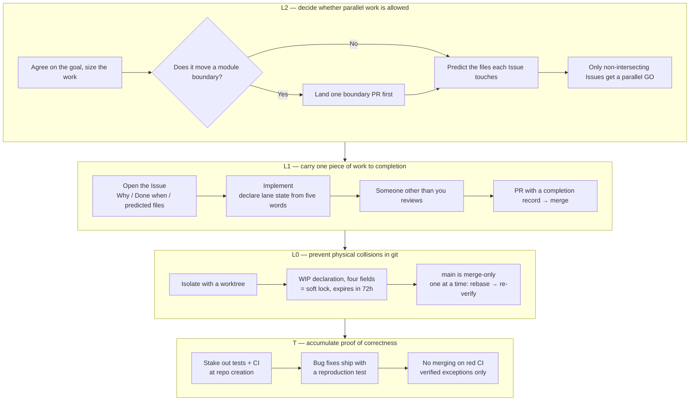
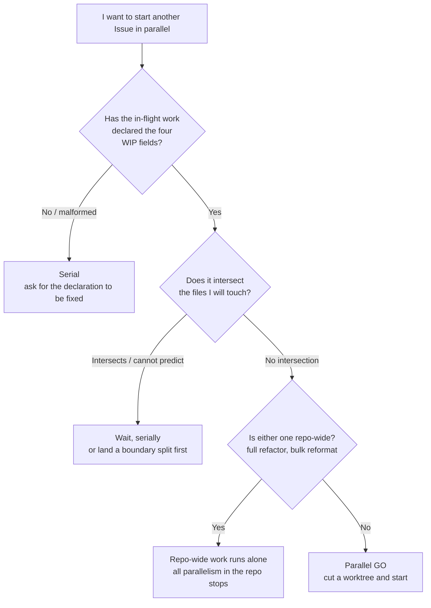

# Family Dev Handbook

<div align="center">

**🇺🇸 English** ｜ [🇯🇵 日本語（正本 / canonical）](README.ja.md) ｜ [🇨🇳 简体中文](README.zh.md) ｜ [🇹🇭 ไทย](README.th.md)


[](LICENSE)


[](https://github.com/caty-ai/family-dev-handbook/actions/workflows/test-lint.yml)

A shared protocol that lets multiple AI agents and multiple sessions develop the same codebase in parallel without colliding.<br>
It addresses three failures: two workers editing the same file at once, a "done!" you cannot trust, and a handoff where nobody knows what actually finished.<br>
It addresses them by moving judgment out of human attentiveness and into a mechanical check made before work starts, plus a merge gate that demands evidence.

**If you cannot verify it, go serial.**

🔧 [The rules themselves — L0 git discipline](docs/03-git-protocol.md) ｜ 📘 [Canonical formats — the Issue template](templates/issue-template.md)

</div>
<!-- repo-state:begin (generated; do not edit) -->
<p align="center"><sub>generation: <code>2f3782b</code> (2026-09-05T07:56:18Z) · verify: <a href="https://api.github.com/repos/caty-ai/family-dev-handbook/commits/main">API HEAD</a> · <a href="./status.json">status.json</a></sub></p>
<!-- repo-state:end -->

---

<a id="toc"></a>

## Contents

- [Does any of this sound familiar?](#problems)
- [Premises](#premises)
- [What you get](#what-you-get)
- [What you need](#requirements)
- [Getting started](#get-started)
- [Why it is safe to adopt](#safety)
- [Deciding whether you can work in parallel](#parallel-go)
- [The full rule map](#rules)
- [Deeper documentation](#docs)
- [The Caty AI family](#ecosystem)
- [Development status](#status)
- [Contributing](#contributing)
- [Acknowledgements](#acknowledgements)
- [License](#license)

---

<a id="problems"></a>

## Does any of this sound familiar?

As you hand more work to AI agents, these start happening before any code problem does.

- **Two workers were editing the same file at the same time** — and you only find out at merge time
- **"It's done" is not trustworthy** — nothing records what was checked, or how far
- **A handoff leaves you blind** — the previous session's memory is gone
- **Every time, you agonize over whether parallel work is safe** — the call differs per person, and each accident only adds another rule

This handbook exists to close those four with machinery instead of attentiveness.

Before that, here is what everything below starts from.

---

<a id="premises"></a>

## Premises

Three starting points are worth sharing before you read on. Everything below starts from these three. They are not a sequence — whichever you enter from, they put you on the same ground.

### Start from an Issue

Work begins by **opening a GitHub Issue before touching any code** (Issue-first).

Whatever you settle in conversation disappears when the session ends, and an AI agent begins every session with no memory at all. What survives is the Issue body and the Pull Request diff, which is exactly why those two are treated as the single source of truth for every handoff. This is not a claim about anyone being forgetful — it is about **choosing one place to put things, on the assumption that memory will be lost**.

The long version: [what Issue-first means](docs/why-issue-first.md).

### Keep modules small

**Whether parallel work is possible is already settled, before anyone starts, by the shape of the code.**

When a single huge file carries many responsibilities at once, everything in that area touches it, so everything in that area is serial. So splitting is not tidying to be done later — it is an **investment made first**. It returns three things.

- **Parallelism** — the moment an area is split, parallel work in it becomes structurally safe
- **Focus** — the less there is to read, the more an agent stays on the job in front of it
- **Replaceability** — like unclipping one block, a broken piece is fixed without touching the rest

You do not have to design any of this yourself. **Hand the handbook to your agents and the places that need splitting come to you as Issues.**

The long version: [why modules are kept small](docs/why-small-modules.md).

### Remove complexity at the requirement, not in the design

**When the design gets hard, do not reach for a cleverer design — question the requirement first.**

Most difficulty is brought in by requirements, not by design. Remove one premise and the hard part of the design disappears wholesale — implementation, tests, and future maintenance included. Questioning is always free for an agent; **the decision to drop a requirement belongs to the person who asked**. Complexity you accept after questioning gets one line of justification in the Issue.

The long version: [why systems are kept simple](docs/why-simple-systems.md).

---

<a id="what-you-get"></a>

## What you get

The problem is split across three layers, each closed a different way. The upper layers *prevent* accidents; the lower layer *detects and contains* them. And as of v0.10.0, a foundation sits beneath the three — **T, the test & CI baseline** — so that not only "how work proceeds" but "proof that the artifact is correct" is under contract.

Three words from the diagram, up front. A **lane** is the flow of work belonging to one Issue. **WIP** is a declaration that work is in progress. A **soft lock** is the promise that nobody else touches those files while the declaration stands.



- 🚦 **Decide parallelism before anyone starts**

  Parallel work is allowed only when you can tell, before starting, that the two sets of files being touched do not intersect. Three questions decide it, and if even one cannot be answered the decision falls back to serial automatically.

- 📋 **Finish one piece of work with evidence**

  Every Issue must state Why, Done when, and the files it expects to touch. Every merge must carry a completion record: PASS / FAIL / justified N/A for each Done when item, the candidate commit, the declared files checked against the real diff, and a review by someone other than the author. "It's done" becomes a record rather than a claim.

- 🔒 **Contain physical collisions through how you use git**

  One session = one Issue = one branch = one worktree (the git feature that splits a single repository into several working folders). main is merge-only. An active lane counts as a soft lock only while its four fields are declared, and it expires on its own after 72 hours.

- 🧪 **Accumulate proof of correctness in tests and CI**

  A repository that contains code carries a CI harness from the day it is created, and a bug fix merges together with a reproduction test for that bug (red before the fix, green after). Merging while CI is red is prohibited — the only thing that passes is a known, unrelated red that satisfies every verification condition. Instead of "it should work", the proof keeps piling up.

Before asking whether it works, ask what it costs to try. The answer is: almost nothing.

---

<a id="requirements"></a>

## What you need

The rules in this repository are documentation only. There is nothing to install for the repository itself ([templates/ci/](templates/ci/README.md) contains distributable gate templates — YAML plus scripts — that you copy into your own repos).

| What | Status |
|---|---|
| A runtime (Node, Python, …) | Not needed — the rules are docs only; templates/ci holds distributable gate templates (YAML + scripts) |
| Version control | ✅ git |
| A place to record work | ✅ GitHub Issues / Pull Requests |
| AI agents | ✅ Any agent with an always-loaded config file (`CLAUDE.md`, `AGENTS.md`, a system prompt, …) |
| Humans only, no AI | ✅ Works as-is for teams without AI agents |

There is no dependency on a particular agent product, memory infrastructure, or toolchain, because what you adopt is the protocol, not the tooling. How to track your own adoption targets is covered in [docs/04](docs/04-adoption.md).

Once you have those, adoption is a matter of pasting.

---

<a id="get-started"></a>

## Getting started

Adopting means putting a summary of the rules into each agent's always-loaded context.

The pages under `docs/` are written in Japanese only. The summary block is meant to be pasted as-is, so you do not need to read Japanese to adopt this — but the rule text behind the IDs is Japanese.

### Have your AI install it

Ask the agent you already use:

```text
Open docs/04-adoption.md in https://github.com/caty-ai/family-dev-handbook
and paste its "distribution summary block" into my always-loaded context
(CLAUDE.md / AGENTS.md). Create that config file if it does not exist yet.
On the first line, set owner to my name and last-verified to today's date.
On the second line, fill in the repository URL after "正本:".
Do not change the handbook-revision value.
```

### Do it yourself

1. Open the "distribution summary block" in [docs/04](docs/04-adoption.md) — it is about 50 lines of text
2. Paste the whole thing into a config file that is always loaded
3. On the first line, rewrite `owner` and `last-verified` for yourself and today. Leave `handbook-revision` untouched
4. On the second line, rewrite `正本:` to the URL of this repository (or of your fork, if you forked it)

That is the whole installation. What you pasted is ten families of rule IDs (`L2-1`–`L2-6`, `L1-1`–`L1-11`, `L0-1`–`L0-9`, `FP-1`–`FP-9`, `E-1`–`E-10`, `B-1`–`B-5`, `LC-1`–`LC-5`, `R-1`–`R-6`, `T-1`–`T-7`, `PB-1`–`PB-5`) and one line of posture for each — the rule text itself is not in there. **This repository is the canonical source, and where the summary and the source disagree, the source wins.** Making your local copy stricter is up to you; loosening it is not allowed.

If you change your mind, delete those 50-odd lines and you are back where you started. Nothing else is touched.

Repository-side preparation (the parallel-safety map, Issue templates, protecting main, a test runner + CI) is described in [docs/04](docs/04-adoption.md).

Something is probably still nagging at you before you paste. Here are the answers.

---

<a id="safety"></a>

## Why it is safe to adopt

- **You do not have to adopt all of it at once** — L0 (git discipline) pays off on its own. L2 and L1 can be added once things are running
- **You do not have to rebuild your current Issue / PR practice** — you are adding three fields to Issue bodies and five words for lane state (WIP / HOLD / MERGED / SUPERSEDED / ABANDONED)
- **Only loosening is forbidden** — making it stricter in your own repository is entirely up to you. The one rule is: never distribute a summary looser than the source
- **It is designed on the assumption that agents will not comply** — it relies on neither care nor memory, it lives where context is always loaded, the check is a binary intersect-or-not, and anything unverifiable falls to the serial side

There are also **uses this does not fit**.

- One person, one session, always working serially — nothing but L0-4 will fire
- A practice that does not use Issues / PRs — the L1 completion gate cannot hold
- A small repository that only ships isolated bug fixes — upstream review (showing the design to a different model before implementation starts, L1-9) never applies in the first place

The question that comes up most in daily use is "can I start this in parallel right now?" That one is answered here, in full.

---

<a id="parallel-go"></a>

## Deciding whether you can work in parallel

Three questions decide it. If even one cannot be answered, you do not go parallel.



If everything you try intersects with something, that is not a problem with the check but with how the code is cut ([why modules are kept small](docs/why-small-modules.md)).

That single diagram is one clause, `L2-4`. The map of everything else is below.

---

<a id="rules"></a>

## The full rule map

The rules fall into ten families, and every one of them carries an ID that does not change. Summaries, conversations, and Issues all point at each other through those IDs.

| Family | What it decides | Rule IDs | Text |
|---|---|---|---|
| **L2** Milestone loop | Whether parallel work is allowed | `L2-1`–`L2-6` | [docs/01](docs/01-milestone-loop.md) |
| **L1** Issue loop | How one piece of work reaches completion | `L1-1`–`L1-11` | [docs/02](docs/02-issue-loop.md) |
| **L0** git discipline | How physical collisions are prevented | `L0-1`–`L0-9` | [docs/03](docs/03-git-protocol.md) |
| **FP** Failure posture | Which way to fall when you cannot verify | `FP-1`–`FP-9` | [docs/05](docs/05-fail-posture.md) |
| **E** Epic lane | How a bundle of Issues is carried | `E-1`–`E-10` | [docs/06](docs/06-epic-lane.md) |
| **B** Delegation brief | How a single delegation becomes a contract | `B-1`–`B-5` | [docs/07](docs/07-delegation-brief.md) |
| **LC** Lifecycle | When and how what you put down leaves | `LC-1`–`LC-5` | [docs/08](docs/08-lifecycle.md) |
| **R** Rejection rubric | What gets accepted and what gets declined | `R-1`–`R-6` | [docs/09](docs/09-rejection-rubric.md) |
| **T** Test & CI baseline | How proof of correctness is accumulated | `T-1`–`T-7` | [docs/10](docs/10-test-ci-baseline.md) |
| **PB** Publication readiness | What gates publishing a repository | `PB-1`–`PB-5` | [docs/11](docs/11-publication.md) |

Two clauses matter most for whether any of this actually works. One is the **FP** watchword, "if you cannot verify it, go serial — fail-open never means *passed*" — a declaration that even where you deliberately choose to let something through unverified, that can never be read as having been confirmed. The other is the **single definition of high-risk territory**. Work that touches it always stops for a human, and its review seats increase (publishing, spending money, irreversible operations, and permission boundaries are the kind of thing it covers — read the canonical text for the exact line). So that the definition never lives in two places, its only canonical home is [docs/06](docs/06-epic-lane.md).

The Epic lane (`E-1`–`E-10`) is optional. It only comes into being when an owner approves it; until then everything runs as ordinary Issues.

<details>
<summary>Core contracts P1–P5 (the five pillars introduced in v0.1.0)</summary>

This core contract, P1–P5, is a separate thing from the PB layer (`PB-1`–`PB-5`, [docs/11](docs/11-publication.md)).

| Contract | Content | Rule IDs |
|---|---|---|
| **P1 WIP lock** | A WIP is a soft lock only while it carries the four fields `agent / date / Files to touch / Branch`. Files outside the declaration are off limits, stale is 72 hours, and takeover follows the TAKEOVER procedure | `L0-1`–`L0-3` |
| **P2 Lane state** | A closed five-state vocabulary. WIP is a state you declare, never a default. Unknown or malformed state counts as inactive and awaits repair. Retries are finite, and exhausting them is not success | `L1-4`–`L1-6` |
| **P3 Resume check** | Before the first write in a resumed or inherited lane, post the result of a four-point check (lock / scope / branch / Done when) to the Issue | `L0-9` |
| **P4 Failure posture** | Declare fail-open or fail-closed in advance for every guarded transition. A missing declaration always narrows authority. An artifact's own body never self-approves | `FP-1`–`FP-9` |
| **P5 Completion-evidence gate** | A merge requires a completion record: PASS / FAIL / justified N/A for every Done when item, inline evidence, the candidate SHA, the declaration checked against the diff, and a reviewer that is a different model or a different agent | `L1-7`–`L1-8` |

These five have been treated as frozen ever since.

</details>

All of the rule text lives under `docs/`. Here is the index.

---

<a id="docs"></a>

## Deeper documentation

The files below are Japanese (canonical). A machine-translated English mirror of docs/ and templates/ lives in [i18n/](i18n/README.md) — where they disagree, the Japanese text wins.

| File | Content |
|---|---|
| [docs/why-issue-first.md](docs/why-issue-first.md) | What Issue-first means — the premise explained (**not a contract**: why work starts from an Issue rather than a conversation, what goes in one, and when you do not need one) |
| [docs/why-small-modules.md](docs/why-small-modules.md) | Why modules are kept small — the premise explained (**not a contract**: why splitting is an investment in parallelism, what "small" actually measures, and how this handbook is cut) |
| [docs/why-simple-systems.md](docs/why-simple-systems.md) | Why systems are kept simple — the premise explained (**not a contract**: why complexity is removed at the requirement rather than in the design, the questions to ask, and "questioning is free; dropping a requirement belongs to the requester") |
| [docs/01-milestone-loop.md](docs/01-milestone-loop.md) | L2 milestone loop — the layer that decides whether parallel work is allowed (`L2-1`–`L2-6`) |
| [docs/02-issue-loop.md](docs/02-issue-loop.md) | L1 Issue loop — completion, lane state, the completion-evidence gate, upstream heterogeneous review (`L1-1`–`L1-11`) |
| [docs/03-git-protocol.md](docs/03-git-protocol.md) | L0 git discipline — WIP lock, worktrees, merge procedure, resume check (`L0-1`–`L0-9`) |
| [docs/04-adoption.md](docs/04-adoption.md) | Adoption — where to install it, the distribution summary block, the discipline of summaries |
| [docs/05-fail-posture.md](docs/05-fail-posture.md) | Failure posture — which way to fall when verification is impossible (`FP-1`–`FP-9`) |
| [docs/06-epic-lane.md](docs/06-epic-lane.md) | Epic lane — bundling human checkpoints per Epic, and the single definition of high-risk territory (`E-1`–`E-10`) |
| [docs/07-delegation-brief.md](docs/07-delegation-brief.md) | B delegation brief — the contract carried by the prompt each time work is handed to a subagent (`B-1`–`B-5`) |
| [docs/08-lifecycle.md](docs/08-lifecycle.md) | LC workspace lifecycle — the layer that turns departure into a contract; the numbers in exit conditions live in local settings (`LC-1`–`LC-5`) |
| [docs/09-rejection-rubric.md](docs/09-rejection-rubric.md) | R rejection rubric — the intent layer for what gets accepted and what gets declined: the three auto-decline reasons, welcome/decline criteria, premise verification, the placement ladder, and promoting policies to checks (`R-1`–`R-6`) |
| [docs/10-test-ci-baseline.md](docs/10-test-ci-baseline.md) | T test & CI baseline — initial setup, the regression-test default, the brief-format hookup, fail-closed merge, the release default, the test-output contract, and honest badges and numbers. An appendix carries a non-normative runner cheat sheet (`T-1`–`T-7`) |
| [docs/11-publication.md](docs/11-publication.md) | PB publication readiness — the layer that gates publishing a repository with the canonical checklist (`PB-1`–`PB-5`) |
| [templates/issue-template.md](templates/issue-template.md) | Issue template and every lane comment format (WIP / HOLD / termination / TAKEOVER / resume check / completion record) |
| [templates/epic-template.md](templates/epic-template.md) | Epic template and the human checkpoint table |
| [templates/brief-template.md](templates/brief-template.md) | Delegation-brief template (the three-layer structure and writing guidance) |
| [templates/publication-checklist.md](templates/publication-checklist.md) | Repository publication checklist — the canonical source for the item-by-item verdicts, procedures, and evidence artifacts across A1–E4 |
| [templates/architecture-parallel-map.md](templates/architecture-parallel-map.md) | The "parallel-safety map" template for each repository's `ARCHITECTURE.md` |
| [templates/ci/](templates/ci/README.md) | The machine-gate template set — test+lint / secret scan / PR size / unrelated-history rejection / high-risk human-review gate / report assembler (deployment guide included) |
| [templates/conformance/](templates/conformance/README.md) | 31 conformance vectors for seat decisions (abstract IDs; `L1-9` / `L1-10` / `L1-11` / `FP-7`) plus how a member runs them |
| [templates/seat-resolver/](templates/seat-resolver/README.md) | Reference implementation of seat resolution (config-driven, passes all 31 conformance vectors, an example rather than a required component) |
| [CONTRIBUTING.md](CONTRIBUTING.md) | How to contribute (Issue-first / WIP declaration / completion record, in brief) |

One last note on where this handbook comes from and where it is used.

---

<a id="ecosystem"></a>

## The Caty AI family

<!-- family:generated:family-footer:start -->

---

Part of the **Caty AI family** — open tools for running a family of AI agents. The full map, including modules still being prepared for release, lives in [Family OS](https://github.com/caty-ai/family-os).

| Axis | Module | What it does | State |
| --- | --- | --- | --- |
| Map | [Family OS](https://github.com/caty-ai/family-os) | The map of the whole family — every module, its state, and how they fit | published, MIT |
| Rules | **Family Dev Handbook** | The rules of the road — issues, PRs, worktrees, handoffs, parallel development | published, MIT |
| Vertical · foundation | [Caty Agent Harness](https://github.com/caty-ai/caty-agent-harness) | Task backbone for AI agents — retries, checkpoints, and honest completion | published, MIT |
| Vertical | [context-kit](https://github.com/caty-ai/context-kit) | Six-piece context hygiene kit for one agent — bounded output, delegation briefs, safety guards, recall, worktree snapshots | published, MIT |
| Vertical | [Persona Engine](https://github.com/caty-ai/persona-engine) | Layers relationship and emotion onto an agent's existing persona | published, MIT |
| Vertical | [Persona Growth Loop](https://github.com/caty-ai/persona-growth-loop) | Grows the persona itself — minimal, idempotent proposals | published, MIT |
| Vertical | [X Collector](https://github.com/caty-ai/x-collector) | Turns X and the web into one daily digest — for people and agents | published, MIT |
| Vertical | [Self Growth Loop](https://github.com/caty-ai/self-growth-loop) | Lets an agent grow its own abilities — proposals, governance, adoption records | published, MIT |
| Horizontal · foundation | [Family Memory Architecture](https://github.com/caty-ai/family-memory-architecture) | The memory bus — how the family shares what it knows | published, MIT |
| Horizontal | [Sitter](https://github.com/caty-ai/sitter) | Babysits delegated agent runs — watches, keeps evidence, restarts only within declared bounds | published, MIT |
| Horizontal | [Alpha Nightshift](https://github.com/caty-ai/alpha-nightshift) | Nightly autonomous maintenance loop — isolated night lanes behind a deny-by-default guard; humans cherry-pick in the morning | published, MIT |

<!-- family:generated:family-footer:end -->

This handbook is complete on its own. No external service, no sibling repository, and no particular memory infrastructure is required. All you need is git, Issues / PRs, and parties that follow the rules. The same goes for every repository in the table — each stands alone, combining them is optional, and using exactly one of them is a valid way to use them.

Cross-agent general norms (such as how far fail-posture reaches) are owned on the family-os side; **this handbook owns only the human-to-agent collaboration protocol — its clauses, plus the distributable templates (templates/) that help enforce them**. General norms are never newly created here.

Here is where things stand, and where they are going.

---

<a id="status"></a>

## Development status

The current version is **v0.18.0** (2026-08-21). It adds the **PB layer** that gates repository publication (`PB-1`–`PB-5`, [docs/11](docs/11-publication.md)) and its canonical checklist ([templates/publication-checklist.md](templates/publication-checklist.md), 28 items A1–E4) ([#109](https://github.com/caty-ai/family-dev-handbook/issues/109); inventory and owner rulings in [#100](https://github.com/caty-ai/family-dev-handbook/issues/100)). A publication lane writes its completion record as a per-item PASS / FAIL / justified-N/A table with evidence artifacts, and the repository is not published while any item remains FAIL or unverifiable (fail-closed). (c)-items pass only by owner-issued records (three issuer forms; self-assertion never passes). Two owner rulings are baked in: the single `size-exempt`-label form for oversized vendored canonical files (D7), and the must-pass full-history secret scan before publication (C1 — a manual run + transcript until the job exists). The layer IDs are `PB` to avoid colliding with the frozen core contracts P1–P5 (a convergent 3-seat design-review finding). PB-5 is a time-limited pilot clause that lapses once the designated first and second consumer lanes' gap feedback is folded into the canon.

- **v0.17.0** (2026-08-21) — It adds the machine-enforcement layer for T-5 release fulfillment ([#103](https://github.com/caty-ai/family-dev-handbook/issues/103)). ① **release-sync carrier** ([templates/ci/](templates/ci/README.md); the reusable is API-only — no checkout) — an annotated SemVer `v*` tag push auto-creates the GitHub Release (notes = the tag message; lightweight / non-SemVer / empty-message tags go red; exemptions come only from `.github/release-sync-ignore` on the default branch, so a tagged tree cannot exempt itself). ② **Drift audit** (`templates/ci/check-release-drift.sh`) — detects and reports tag↔Release divergence via the API alone (detection only, no auto-deletion; an unreadable state exits 2 with zero findings). ③ **Norm update** — the tag-URL obligation is now fulfilled only when the **Release actually exists** ([docs/10](docs/10-test-ci-baseline.md) `T-5`; even a bare tag returns 200 at `/releases/tag/<name>`, so a URL's existence does not imply a Release's). The record-vs-reality PR-side check and a scheduled sweep are tracked in [#106](https://github.com/caty-ai/family-dev-handbook/issues/106).

- **v0.16.0** (2026-08-19) — Adds two clauses that close the honesty gap in tests and status displays ([#81](https://github.com/caty-ai/family-dev-handbook/issues/81)). ① **Test-output contract** (`T-6`, [docs/10](docs/10-test-ci-baseline.md)) — a family-written runner dynamically emits `suites: declared=N executed=M skipped=K`, with `declared = executed + skipped` as an invariant. Exit codes are a closed set; a missing required dependency is reported as `missing-dep:` with exit 127; and the summary is required even on abnormal exit. A SKIP rate above 20% is red, while repositories that change the cap keep the local value and rationale in the LC-3 pattern. Adoption is complete only when the CI reconciliation gate is enabled. ② **Display contract** (`T-7`, [docs/10](docs/10-test-ci-baseline.md)) — green belongs only to a machine-painted result. A public repository with a README must show either a live badge tied to the T-1 test workflow or a grey `CI: not yet`; static colors are limited to the closed `lightgrey` / `blue` allowlist. The canonical Project status form is inlined in the clause, and measured numbers require a run URL plus measurement date. The design originated in consistency campaign W0-4 and family-os#56, then passed a 3-seat design review.

- **v0.15.0** (2026-08-18) — Four amendments to the statutes ([#75](https://github.com/caty-ai/family-dev-handbook/issues/75), fed back from a 5-seat cross-review of a grok-build runtime analysis). ① **Ratchet ban for follow-up rounds** (`L1-3`, [docs/02](docs/02-issue-loop.md)) — from round 2 onward, new blocking findings are limited to demonstrated defects or unmet gate criteria. A narrow clause that stops the "ratchet churn" where, as review rounds progress, new preferences turn into late blocking findings and the lane never terminates. ② **Citation requirement for findings** (`R-4`, [docs/09](docs/09-rejection-rubric.md)) — a finding that can't point to a path:line or quote an execution log cannot be marked blocking (raising it as a non-blocking concern is fine). Codifies the citation floor on which ① layers its additional demonstration requirement — two layered bars, not one. ③ **A reason sentence added to B-4** ([docs/07](docs/07-delegation-brief.md)) — because runtimes exist where a standing instruction file goes unread and degrades across the delegation boundary, write any needed conventions inline in the brief body. ④ **A hygiene sentence for automation that touches git** (`L0-7`, [docs/03](docs/03-git-protocol.md)) — make identity / config explicit via env every time, and never read or write the user's git state.

- **v0.14.1** (2026-08-16) — No amendments to the statutes — it corrects the v0.12.0 history entry in the READMEs (4 languages), which had drifted from the `T-5` clause. An unfulfilled lane (one that declared `vX.Y.Z` but never cut the tag) **stays open as WIP without terminating** and rides the stale clock; it is not placed under inactive treatment — that applies to a **MERGED lacking a tag URL**. The same paragraph also called the closed enumeration for `N/A` "three types" where the clause has **four** (including the epic-child case that shipped in v0.12.0). The statute ([docs/10](docs/10-test-ci-baseline.md)), its i18n mirrors and the [docs/04](docs/04-adoption.md) digest were correct all along; only the READMEs lagged — this is the handbook applying its own rule that the summary layer follows the statute ([#73](https://github.com/caty-ai/family-dev-handbook/issues/73)).

- **v0.14.0** (2026-08-16) — No amendments to the statutes — what is new is a **reference implementation** of seat resolution ([templates/seat-resolver/](templates/seat-resolver/README.md)): a config-driven resolver that **passes all 31 conformance vectors** shipped in v0.13.0. The rule table, model vocabulary, lineages, risk areas, and writer all come from configuration, so a household can swap in its own composition (no real model IDs appear in the code or the example config). It is **a reference example, not a required component** — no statute requires it, and a household adopts it only if it wants to. Keep **one seat implementation per household**: copying the same mechanism into several repositories splits authority and revisions. What families share is not the implementation but conformance against [templates/conformance/](templates/conformance/README.md) ([#71](https://github.com/caty-ai/family-dev-handbook/issues/71)).

- **v0.13.0** (2026-08-15) — No amendments to the statutes — what is new are the **conformance vectors** for seat decisions ([templates/conformance/](templates/conformance/README.md)). They are 31 cases that let each household's selector (the program that resolves seats) **grade itself, implementation-independently**, against `L1-9` seat counts, `L1-10` heterogeneity and lineage, and `L1-11` seat scaling plus FP-7. They carry no real model IDs (abstract IDs only), and where a vector and a statute disagree the statute wins (the vectors are derived). A case the selector cannot express counts as FAIL rather than skip (fail-closed), and a new version ships as a new file so older ones remain (adoption records point at a version) ([#63](https://github.com/caty-ai/family-dev-handbook/issues/63)).

- **v0.12.0** (2026-08-15) — It adds the release-default clause (`T-5`, [docs/10](docs/10-test-ci-baseline.md)). Until now, a release tag was covered by nothing more than the one line "tag it at a stable point" — forgetting to cut one tripped no alarm, and it was structurally forgotten the moment the session changed (this has been observed repeatedly in practice). T-5 doesn't try to "make you remember" — instead, **forgetting it means the completion record ([L1-7](docs/02-issue-loop.md)) doesn't pass**. Every completion record now carries a **release field** (one of three vocabulary items: a `vX.Y.Z` declaration / `deferred` (a reason plus an Issue carrying an exit trigger) / `N/A` (a reason from four closed types)), and a **ship-equivalent change** (a merge that changes behavior users act on, a public API, a distributed artifact, or a norm users must follow) cannot choose `N/A` (when in doubt, treat it as ship-equivalent). To keep the declaration from being the end of the story, **a lane no longer terminates until its MERGED comment carries the URL of a cut tag** — an unfulfilled lane **stays open as WIP without terminating**, so it rides the stale clock (`L0-3`) and a forgotten tag stays visible even in a repo where no further lane arrives (a MERGED lacking a tag URL is **malformed**, its termination does not hold, and it falls under `L1-4`'s inactive treatment). `deferred` lives on a resurfacing surface (an Issue carrying a trigger), and if it happens twice in a row, the third ship-equivalent merge must cut a tag (the same shape of escalation as `R-6` — the count can be verified after the fact via the completion record's `previous release`). Enforcement is uniform across every repo — a repo with no ship-equivalent changes naturally lands on N/A, so there is no real burden on a private scratch repo ([#64](https://github.com/caty-ai/family-dev-handbook/issues/64)).

- **v0.11.0** (2026-08-15) — Two amendments to the review-seat clauses (`L1-10` / `L1-11`, [docs/02](docs/02-issue-loop.md)). First, **the S / M seat floor rises from 2 to 3 heterogeneous seats** — effective **per member (household)**: the effective-date data lives in one pinned Issue per household in its own canonical handbook repo (the fork, if forked), a household before its effective date is legal at the old floor of 2 (so the enforcement gap is a schedule, not a violation — and a household with no 3-field pinned Issue cannot claim pre-effective status), and SEAT-WAIT is explicitly scoped to lanes only. Second, **the named-catalog clause and correlated-seats**: a family-shared catalog of real model names is data, lives outside the handbook, and is non-normative — the catalog can neither legalise a seat the law forbids nor make usable a model the member cannot verify live. For seat lineage, machine-selected paths (draws, substitutions) require pairwise-distinct lineage or a recorded exception, while a same-lineage seat on an owner-named panel is legal only with a recorded correlated-seats flag. The starting point is the MoA family-wide design — the codification of v2.1 after two seven-seat design-review rounds and a three-seat delta check ([#45](https://github.com/caty-ai/family-dev-handbook/issues/45) / [#57](https://github.com/caty-ai/family-dev-handbook/issues/57))

- **v0.10.0** (2026-08-14) — the test & CI baseline layer (`T-1`–`T-4`, [docs/10](docs/10-test-ci-baseline.md)). A new repository with code sets up a test runner + CI at creation time; size M / L / H bug fixes carry a reproduction test by default; delegation briefs that touch code standardize "tests added or changed, and their results"; merging on a red CI is prohibited (the only exception is a known-and-unrelated red satisfying four conditions). Starting point: [caty-ai/x-collector#9](https://github.com/caty-ai/x-collector/issues/9)
- **v0.9.2** (2026-08-11) — a hardening revision of the machine-gate template set ([templates/ci/](templates/ci/README.md)). It closes, at the template level, three "silently green" defects surfaced by real-world feedback from the first deployment (3 repos) (a new standing category `RISK_PATHS_AUTH`, case hardening for the `none` declaration plus a sanity check on declaration lines, deployment-verification pitfalls added to the templates/ci README). Went through 4 rounds of multi-seat review (all 3 seats GO), and has been synced out to the already-deployed repos
- **v0.9.1** (2026-08-10, untagged, template-only revision) — a new standing category `RISK_PATHS_GATES`, plus adding Makefile / `scripts/ci/**` to the default net (feedback from the v0.9.0 deployment verification)

- **v0.9.0** (2026-08-10) — It adds the machine-gate template set ([templates/ci/](templates/ci/README.md)) — six standalone gates (test+lint, secret scan, PR size, unrelated-history rejection, high-risk human-review gate, report assembler) you deploy by copying into a repo. Every gate fails closed on unresolved or unconfigured state, and approvals are bound to the head SHA. The design drew in part on [Hermes Agent](https://github.com/NousResearch/hermes-agent) (MIT — see [Acknowledgements](#acknowledgements)).

- **v0.8.0** (2026-08-09) — the rejection-rubric layer (`R-1`–`R-6`, [docs/09](docs/09-rejection-rubric.md)) — where the L layers define *how to proceed*, this intent layer defines *what gets accepted and what gets declined*. Only three mechanically clear-cut reasons allow closing without a human; every value judgment is reserved for the owner. It also codifies six kinds of welcome contributions, seven things declined even when well-built, four premise-verification patterns, a six-rung placement ladder, and "a broken policy gets promoted to a check" (drawing in part on the Contribution Rubric of [Hermes Agent](https://github.com/NousResearch/hermes-agent), MIT).

- **v0.7.1** (2026-08-07) — a wording follow-up aligning the scope enumeration of upstream review (`L1-9`, [docs/02](docs/02-issue-loop.md)) with the size system (L / H / Epic = the heavy side)
- **v0.7.0** (2026-08-07) — the size criteria (`L2-1` extension, [docs/01](docs/01-milestone-loop.md)): definition table plus three axes, round up when in doubt
- **v0.6.0** (2026-08-07) — the workspace-lifecycle layer (`LC-1`–`LC-5`, [docs/08](docs/08-lifecycle.md)): departure as a contract (exit triggers, inspection warns only, numbers in exit conditions canonical in local settings)
- **v0.5.0** (2026-08-06) — the delegation-brief layer (`B-1`–`B-5`, [docs/07](docs/07-delegation-brief.md)): the prompt that hands work to a subagent becomes a three-layer contract of specification, self-verification, and reviewer criteria ([templates/brief-template.md](templates/brief-template.md))
- **v0.4.0** (2026-08-05) — the third premise: keep systems simple, remove complexity at the requirement ([docs/why-simple-systems.md](docs/why-simple-systems.md)), and the requirement-questioning hook in L2-1 (dropping a requirement belongs to the requester)
- **v0.3.0** (2026-07-31) — the Epic lane (`E-1`–`E-10`) and upstream heterogeneous review before implementation begins (`L1-9`–`L1-11`)
- **v0.2.1 / v0.2.0** (2026-07-22) — MIT license and community health files; generalization that removed family-specific wording
- **v0.1.0 / v0.1.1** (2026-07-21) — rules turned from prose into contracts: stable rule IDs, a closed five-state vocabulary, an evidence-gated merge, and pre-declared failure postures

What comes next is tracked canonically in the [Issue list](https://github.com/caty-ai/family-dev-handbook/issues). This README does not keep a second copy.

The way in for proposals sits on the same rules.

## Project status

[](https://github.com/caty-ai/family-dev-handbook/actions/workflows/test-lint.yml)

- CI: Local callers exercise the reusable `@ci-v1` set (five gates), including Test + Lint; suite-count reconciliation is enabled. Run the same CI entry points locally with `make test` and `make lint`.
- 検証済み環境: `ubuntu-latest` and `macos-latest` are exercised in CI; macOS is also used for local development. WSL2 is in scope as well — it runs the same GNU path the `ubuntu-latest` lane verifies (clone inside the Linux filesystem, not `/mnt/c`).
- maturity: `stable` — the normative canonical handbook.
- 既知の制約: The statutes are docs-only. `templates/` bundles samples for adopters to copy into their own CI (gate templates, YAML + Python), while `scripts/` holds this repository's own check scripts. Relative links and anchors of the four README mirrors are checked by `make lint` in CI.

---

<a id="contributing"></a>

## Contributing

- Open an Issue in this repository, send a PR, get it reviewed by a different model or a different agent, then merge (self-approval is not allowed)
- **This handbook is maintained under its own rules** — WIP declaration with four fields → worktree → cross-model review → a PR carrying a completion record. Every clause added or amended has gone through that same path
- The full flow is in [CONTRIBUTING.md](CONTRIBUTING.md)

Before the license, one thank-you to the project this work drew on.

---

<a id="acknowledgements"></a>

## Acknowledgements

- [Hermes Agent](https://github.com/NousResearch/hermes-agent) (Nous Research, MIT) — an open-source autonomous agent framework. Its contribution rubric and CI gate structure taught us a lot, and we drew on parts of them when designing the R rejection-rubric layer (docs/09) and templates/ci — which includes files derived from the project (two adapted, one verbatim copy). Per-file provenance is recorded in [templates/ci/NOTICE.md](templates/ci/NOTICE.md).

The terms of use are as loose as they get.

---

<a id="license"></a>

## License

[MIT](LICENSE) © 2026 Sho Jikumaru

Rules are only worth anything if they spread, so this is MIT — modify and redistribute freely. Forking it and tightening it for your own team is exactly the intended use.

The documents under `docs/` are written in Japanese, and this English README is a translation. Where the two differ, the Japanese text is canonical.

<div align="center">

**Rules are docs only** ｜ **No runtime** ｜ **Runs on git and Issues / PRs alone**

</div>
