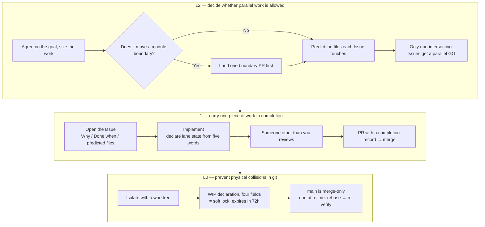
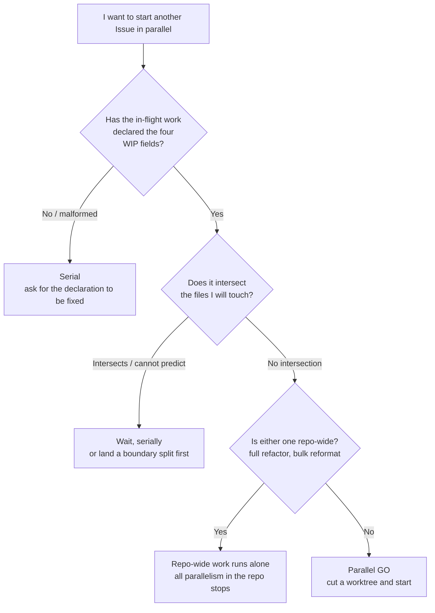

# Family Dev Handbook

<div align="center">

**🇺🇸 English** ｜ [🇯🇵 日本語（正本 / canonical）](README.ja.md) ｜ [🇨🇳 简体中文](README.zh.md) ｜ [🇹🇭 ไทย](README.th.md)


[](LICENSE)


A shared protocol that lets multiple AI agents and multiple sessions develop the same codebase in parallel without colliding.<br>
It addresses three failures: two workers editing the same file at once, a "done!" you cannot trust, and a handoff where nobody knows what actually finished.<br>
It addresses them by moving judgment out of human attentiveness and into a mechanical check made before work starts, plus a merge gate that demands evidence.

**If you cannot verify it, go serial.**

🔧 [The rules themselves — L0 git discipline](docs/03-git-protocol.md) ｜ 📘 [Canonical formats — the Issue template](templates/issue-template.md)

</div>

---

<a id="toc"></a>

## Contents

- [Does any of this sound familiar?](#problems)
- [Premises](#premises)
- [What you get](#what-you-get)
- [What you need](#requirements)
- [Getting started](#get-started)
- [Why it is safe to adopt](#safety)
- [Deciding whether you can work in parallel](#parallel-go)
- [The full rule map](#rules)
- [Deeper documentation](#docs)
- [The Caty AI family](#ecosystem)
- [Development status](#status)
- [Contributing](#contributing)
- [License](#license)

---

<a id="problems"></a>

## Does any of this sound familiar?

As you hand more work to AI agents, these start happening before any code problem does.

- **Two workers were editing the same file at the same time** — and you only find out at merge time
- **"It's done" is not trustworthy** — nothing records what was checked, or how far
- **A handoff leaves you blind** — the previous session's memory is gone
- **Every time, you agonize over whether parallel work is safe** — the call differs per person, and each accident only adds another rule

This handbook exists to close those four with machinery instead of attentiveness.

Before that, here is what everything below starts from.

---

<a id="premises"></a>

## Premises

Three starting points are worth sharing before you read on. Everything below starts from these three. They are not a sequence — whichever you enter from, they put you on the same ground.

### Start from an Issue

Work begins by **opening a GitHub Issue before touching any code** (Issue-first).

Whatever you settle in conversation disappears when the session ends, and an AI agent begins every session with no memory at all. What survives is the Issue body and the Pull Request diff, which is exactly why those two are treated as the single source of truth for every handoff. This is not a claim about anyone being forgetful — it is about **choosing one place to put things, on the assumption that memory will be lost**.

The long version: [what Issue-first means](docs/why-issue-first.md).

### Keep modules small

**Whether parallel work is possible is already settled, before anyone starts, by the shape of the code.**

When a single huge file carries many responsibilities at once, everything in that area touches it, so everything in that area is serial. So splitting is not tidying to be done later — it is an **investment made first**. It returns three things.

- **Parallelism** — the moment an area is split, parallel work in it becomes structurally safe
- **Focus** — the less there is to read, the more an agent stays on the job in front of it
- **Replaceability** — like unclipping one block, a broken piece is fixed without touching the rest

You do not have to design any of this yourself. **Hand the handbook to your agents and the places that need splitting come to you as Issues.**

The long version: [why modules are kept small](docs/why-small-modules.md).

### Remove complexity at the requirement, not in the design

**When the design gets hard, do not reach for a cleverer design — question the requirement first.**

Most difficulty is brought in by requirements, not by design. Remove one premise and the hard part of the design disappears wholesale — implementation, tests, and future maintenance included. Questioning is always free for an agent; **the decision to drop a requirement belongs to the person who asked**. Complexity you accept after questioning gets one line of justification in the Issue.

The long version: [why systems are kept simple](docs/why-simple-systems.md).

---

<a id="what-you-get"></a>

## What you get

The problem is split across three layers, each closed a different way. The upper layers *prevent* accidents; the lower layer *detects and contains* them.

Three words from the diagram, up front. A **lane** is the flow of work belonging to one Issue. **WIP** is a declaration that work is in progress. A **soft lock** is the promise that nobody else touches those files while the declaration stands.



- 🚦 **Decide parallelism before anyone starts**

  Parallel work is allowed only when you can tell, before starting, that the two sets of files being touched do not intersect. Three questions decide it, and if even one cannot be answered the decision falls back to serial automatically.

- 📋 **Finish one piece of work with evidence**

  Every Issue must state Why, Done when, and the files it expects to touch. Every merge must carry a completion record: PASS / FAIL / justified N/A for each Done when item, the candidate commit, the declared files checked against the real diff, and a review by someone other than the author. "It's done" becomes a record rather than a claim.

- 🔒 **Contain physical collisions through how you use git**

  One session = one Issue = one branch = one worktree (the git feature that splits a single repository into several working folders). main is merge-only. An active lane counts as a soft lock only while its four fields are declared, and it expires on its own after 72 hours.

Before asking whether it works, ask what it costs to try. The answer is: almost nothing.

---

<a id="requirements"></a>

## What you need

This repository is documentation only. There is no program to install.

| What | Status |
|---|---|
| A runtime (Node, Python, …) | Not needed — docs only, nothing to install |
| Version control | ✅ git |
| A place to record work | ✅ GitHub Issues / Pull Requests |
| AI agents | ✅ Any agent with an always-loaded config file (`CLAUDE.md`, `AGENTS.md`, a system prompt, …) |
| Humans only, no AI | ✅ Works as-is for teams without AI agents |

There is no dependency on a particular agent product, memory infrastructure, or toolchain, because what you adopt is the protocol, not the tooling. How to track your own adoption targets is covered in [docs/04](docs/04-adoption.md).

Once you have those, adoption is a matter of pasting.

---

<a id="get-started"></a>

## Getting started

Adopting means putting a summary of the rules into each agent's always-loaded context.

The pages under `docs/` are written in Japanese only. The summary block is meant to be pasted as-is, so you do not need to read Japanese to adopt this — but the rule text behind the IDs is Japanese.

### Have your AI install it

Ask the agent you already use:

```text
Open docs/04-adoption.md in https://github.com/caty-ai/family-dev-handbook
and paste its "distribution summary block" into my always-loaded context
(CLAUDE.md / AGENTS.md). Create that config file if it does not exist yet.
On the first line, set owner to my name and last-verified to today's date.
On the second line, fill in the repository URL after "正本:".
Do not change the handbook-revision value.
```

### Do it yourself

1. Open the "distribution summary block" in [docs/04](docs/04-adoption.md) — it is about 40 lines of text
2. Paste the whole thing into a config file that is always loaded
3. On the first line, rewrite `owner` and `last-verified` for yourself and today. Leave `handbook-revision` untouched
4. On the second line, rewrite `正本:` to the URL of this repository (or of your fork, if you forked it)

That is the whole installation. What you pasted is seven families of rule IDs (`L2-1`–`L2-6`, `L1-1`–`L1-11`, `L0-1`–`L0-9`, `FP-1`–`FP-9`, `E-1`–`E-10`, `B-1`–`B-5`, `LC-1`–`LC-5`) and one line of posture for each — the rule text itself is not in there. **This repository is the canonical source, and where the summary and the source disagree, the source wins.** Making your local copy stricter is up to you; loosening it is not allowed.

If you change your mind, delete those 40 lines and you are back where you started. Nothing else is touched.

Repository-side preparation (the parallel-safety map, Issue templates, protecting main) is described in [docs/04](docs/04-adoption.md).

Something is probably still nagging at you before you paste. Here are the answers.

---

<a id="safety"></a>

## Why it is safe to adopt

- **You do not have to adopt all of it at once** — L0 (git discipline) pays off on its own. L2 and L1 can be added once things are running
- **You do not have to rebuild your current Issue / PR practice** — you are adding three fields to Issue bodies and five words for lane state (WIP / HOLD / MERGED / SUPERSEDED / ABANDONED)
- **Only loosening is forbidden** — making it stricter in your own repository is entirely up to you. The one rule is: never distribute a summary looser than the source
- **It is designed on the assumption that agents will not comply** — it relies on neither care nor memory, it lives where context is always loaded, the check is a binary intersect-or-not, and anything unverifiable falls to the serial side

There are also **uses this does not fit**.

- One person, one session, always working serially — nothing but L0-4 will fire
- A practice that does not use Issues / PRs — the L1 completion gate cannot hold
- A small repository that only ships isolated bug fixes — upstream review (showing the design to a different model before implementation starts, L1-9) never applies in the first place

The question that comes up most in daily use is "can I start this in parallel right now?" That one is answered here, in full.

---

<a id="parallel-go"></a>

## Deciding whether you can work in parallel

Three questions decide it. If even one cannot be answered, you do not go parallel.



If everything you try intersects with something, that is not a problem with the check but with how the code is cut ([why modules are kept small](docs/why-small-modules.md)).

That single diagram is one clause, `L2-4`. The map of everything else is below.

---

<a id="rules"></a>

## The full rule map

The rules fall into seven families, and every one of them carries an ID that does not change. Summaries, conversations, and Issues all point at each other through those IDs.

| Family | What it decides | Rule IDs | Text |
|---|---|---|---|
| **L2** Milestone loop | Whether parallel work is allowed | `L2-1`–`L2-6` | [docs/01](docs/01-milestone-loop.md) |
| **L1** Issue loop | How one piece of work reaches completion | `L1-1`–`L1-11` | [docs/02](docs/02-issue-loop.md) |
| **L0** git discipline | How physical collisions are prevented | `L0-1`–`L0-9` | [docs/03](docs/03-git-protocol.md) |
| **FP** Failure posture | Which way to fall when you cannot verify | `FP-1`–`FP-9` | [docs/05](docs/05-fail-posture.md) |
| **E** Epic lane | How a bundle of Issues is carried | `E-1`–`E-10` | [docs/06](docs/06-epic-lane.md) |
| **B** Delegation brief | How a single delegation becomes a contract | `B-1`–`B-5` | [docs/07](docs/07-delegation-brief.md) |
| **LC** Lifecycle | When and how what you put down leaves | `LC-1`–`LC-5` | [docs/08](docs/08-lifecycle.md) |

Two clauses matter most for whether any of this actually works. One is the **FP** watchword, "if you cannot verify it, go serial — fail-open never means *passed*" — a declaration that even where you deliberately choose to let something through unverified, that can never be read as having been confirmed. The other is the **single definition of high-risk territory**. Work that touches it always stops for a human, and its review seats increase (publishing, spending money, irreversible operations, and permission boundaries are the kind of thing it covers — read the canonical text for the exact line). So that the definition never lives in two places, its only canonical home is [docs/06](docs/06-epic-lane.md).

The Epic lane (`E-1`–`E-10`) is optional. It only comes into being when an owner approves it; until then everything runs as ordinary Issues.

<details>
<summary>Core contracts P1–P5 (the five pillars introduced in v0.1.0)</summary>

| Contract | Content | Rule IDs |
|---|---|---|
| **P1 WIP lock** | A WIP is a soft lock only while it carries the four fields `agent / date / Files to touch / Branch`. Files outside the declaration are off limits, stale is 72 hours, and takeover follows the TAKEOVER procedure | `L0-1`–`L0-3` |
| **P2 Lane state** | A closed five-state vocabulary. WIP is a state you declare, never a default. Unknown or malformed state counts as inactive and awaits repair. Retries are finite, and exhausting them is not success | `L1-4`–`L1-6` |
| **P3 Resume check** | Before the first write in a resumed or inherited lane, post the result of a four-point check (lock / scope / branch / Done when) to the Issue | `L0-9` |
| **P4 Failure posture** | Declare fail-open or fail-closed in advance for every guarded transition. A missing declaration always narrows authority. An artifact's own body never self-approves | `FP-1`–`FP-9` |
| **P5 Completion-evidence gate** | A merge requires a completion record: PASS / FAIL / justified N/A for every Done when item, inline evidence, the candidate SHA, the declaration checked against the diff, and a reviewer that is a different model or a different agent | `L1-7`–`L1-8` |

These five have been treated as frozen ever since.

</details>

All of the rule text lives under `docs/`. Here is the index.

---

<a id="docs"></a>

## Deeper documentation

The files below are Japanese (canonical). A machine-translated English mirror of docs/ and templates/ lives in [i18n/en/](i18n/en/) — where they disagree, the Japanese text wins.

| File | Content |
|---|---|
| [docs/why-issue-first.md](docs/why-issue-first.md) | What Issue-first means — the premise explained (**not a contract**: why work starts from an Issue rather than a conversation, what goes in one, and when you do not need one) |
| [docs/why-small-modules.md](docs/why-small-modules.md) | Why modules are kept small — the premise explained (**not a contract**: why splitting is an investment in parallelism, what "small" actually measures, and how this handbook is cut) |
| [docs/why-simple-systems.md](docs/why-simple-systems.md) | Why systems are kept simple — the premise explained (**not a contract**: why complexity is removed at the requirement rather than in the design, the questions to ask, and "questioning is free; dropping a requirement belongs to the requester") |
| [docs/01-milestone-loop.md](docs/01-milestone-loop.md) | L2 milestone loop — the layer that decides whether parallel work is allowed (`L2-1`–`L2-6`) |
| [docs/02-issue-loop.md](docs/02-issue-loop.md) | L1 Issue loop — completion, lane state, the completion-evidence gate, upstream heterogeneous review (`L1-1`–`L1-11`) |
| [docs/03-git-protocol.md](docs/03-git-protocol.md) | L0 git discipline — WIP lock, worktrees, merge procedure, resume check (`L0-1`–`L0-9`) |
| [docs/04-adoption.md](docs/04-adoption.md) | Adoption — where to install it, the distribution summary block, the discipline of summaries |
| [docs/05-fail-posture.md](docs/05-fail-posture.md) | Failure posture — which way to fall when verification is impossible (`FP-1`–`FP-9`) |
| [docs/06-epic-lane.md](docs/06-epic-lane.md) | Epic lane — bundling human checkpoints per Epic, and the single definition of high-risk territory (`E-1`–`E-10`) |
| [docs/07-delegation-brief.md](docs/07-delegation-brief.md) | B delegation brief — the contract carried by the prompt each time work is handed to a subagent (`B-1`–`B-5`) |
| [docs/08-lifecycle.md](docs/08-lifecycle.md) | LC workspace lifecycle — the layer that turns departure into a contract; the numbers in exit conditions live in local settings (`LC-1`–`LC-5`) |
| [templates/issue-template.md](templates/issue-template.md) | Issue template and every lane comment format (WIP / HOLD / termination / TAKEOVER / resume check / completion record) |
| [templates/epic-template.md](templates/epic-template.md) | Epic template and the human checkpoint table |
| [templates/brief-template.md](templates/brief-template.md) | Delegation-brief template (the three-layer structure and writing guidance) |
| [templates/architecture-parallel-map.md](templates/architecture-parallel-map.md) | The "parallel-safety map" template for each repository's `ARCHITECTURE.md` |
| [CONTRIBUTING.md](CONTRIBUTING.md) | How to contribute (Issue-first / WIP declaration / completion record, in brief) |

One last note on where this handbook comes from and where it is used.

---

<a id="ecosystem"></a>

## The Caty AI family

<!-- family:generated:family-footer:start -->

---

Part of the **Caty AI family** — open tools for running a family of AI agents. The full map, including modules still being prepared for release, lives in [Family OS](https://github.com/caty-ai/family-os).

| Axis | Module | What it does | State |
| --- | --- | --- | --- |
| Map | [Family OS](https://github.com/caty-ai/family-os) | The map of the whole family — every module, its state, and how they fit | published, MIT |
| Rules | **Family Dev Handbook** | The rules of the road — issues, PRs, worktrees, handoffs, parallel development | published, MIT |
| Vertical · foundation | [Caty Agent Harness](https://github.com/caty-ai/caty-agent-harness) | Task backbone for AI agents — retries, checkpoints, and honest completion | published, MIT |
| Vertical | [context-kit](https://github.com/caty-ai/context-kit) | Five-piece context hygiene kit for one agent — bounded output, delegation briefs, safety guards, recall | published, MIT |
| Vertical | [Persona Engine](https://github.com/caty-ai/persona-engine) | Gives an agent a persona — layered personality and graded emotion | published, MIT |
| Vertical | **Persona Growth Loop** | Grows the persona itself — minimal, idempotent proposals | publication in preparation |
| Vertical | [X Collector](https://github.com/caty-ai/x-collector) | Turns X and the web into one daily digest — for people and agents | published, MIT |
| Vertical | **Self Growth Loop** | Lets an agent grow its own abilities — proposals, governance, adoption records | publication in preparation |
| Horizontal · foundation | [Family Memory Architecture](https://github.com/caty-ai/family-memory-architecture) | The memory bus — how the family shares what it knows | published, MIT |
| Horizontal | [Sitter](https://github.com/caty-ai/sitter) | Babysits delegated agent runs — watches, keeps evidence, restarts | published, MIT |

<!-- family:generated:family-footer:end -->

This handbook is complete on its own. No external service, no sibling repository, and no particular memory infrastructure is required. All you need is git, Issues / PRs, and parties that follow the rules. The same goes for every repository in the table — each stands alone, combining them is optional, and using exactly one of them is a valid way to use them.

Cross-agent general norms (such as how far fail-posture reaches) are owned on the family-os side; **only the wording of the human-to-agent collaboration protocol belongs to this handbook**. General norms are never newly created here.

Here is where things stand, and where they are going.

---

<a id="status"></a>

## Development status

The current version is **v0.7.1** (2026-08-07). It turned the size criteria (S / M / L / H / Epic, L2-1 in [docs/01](docs/01-milestone-loop.md)) into contract text — a size definition table plus three axes (blast radius, irreversibility, duration) decide the size, and when in doubt you round up. The inputs to reviewer seat counts (L1-11) and the Epic entrance (E-1) no longer rely on adopters' tacit knowledge. v0.7.1 is a wording follow-up that aligns the scope enumeration of upstream review (L1-9 in [docs/02](docs/02-issue-loop.md)) with the same size system (L / H / Epic = the heavy side).

- **v0.7.0** (2026-08-07) — the size criteria (`L2-1` extension, [docs/01](docs/01-milestone-loop.md)): definition table plus three axes, round up when in doubt
- **v0.6.0** (2026-08-07) — the workspace-lifecycle layer (`LC-1`–`LC-5`, [docs/08](docs/08-lifecycle.md)): departure as a contract (exit triggers, inspection warns only, numbers in exit conditions canonical in local settings)
- **v0.5.0** (2026-08-06) — the delegation-brief layer (`B-1`–`B-5`, [docs/07](docs/07-delegation-brief.md)): the prompt that hands work to a subagent becomes a three-layer contract of specification, self-verification, and reviewer criteria ([templates/brief-template.md](templates/brief-template.md))
- **v0.4.0** (2026-08-05) — the third premise: keep systems simple, remove complexity at the requirement ([docs/why-simple-systems.md](docs/why-simple-systems.md)), and the requirement-questioning hook in L2-1 (dropping a requirement belongs to the requester)
- **v0.3.0** (2026-07-31) — the Epic lane (`E-1`–`E-10`) and upstream heterogeneous review before implementation begins (`L1-9`–`L1-11`)
- **v0.2.1 / v0.2.0** (2026-07-22) — MIT license and community health files; generalization that removed family-specific wording
- **v0.1.0 / v0.1.1** (2026-07-21) — rules turned from prose into contracts: stable rule IDs, a closed five-state vocabulary, an evidence-gated merge, and pre-declared failure postures

What comes next is tracked canonically in the [Issue list](https://github.com/caty-ai/family-dev-handbook/issues). This README does not keep a second copy.

The way in for proposals sits on the same rules.

---

<a id="contributing"></a>

## Contributing

- Open an Issue in this repository, send a PR, get it reviewed by a different model or a different agent, then merge (self-approval is not allowed)
- **This handbook is maintained under its own rules** — WIP declaration with four fields → worktree → cross-model review → a PR carrying a completion record. Every clause added or amended has gone through that same path
- The full flow is in [CONTRIBUTING.md](CONTRIBUTING.md)

The terms of use are as loose as they get.

---

<a id="license"></a>

## License

[MIT](LICENSE) © 2026 Caty

Rules are only worth anything if they spread, so this is MIT — modify and redistribute freely. Forking it and tightening it for your own team is exactly the intended use.

The documents under `docs/` are written in Japanese, and this English README is a translation. Where the two differ, the Japanese text is canonical.

<div align="center">

**Docs only** ｜ **No runtime** ｜ **Runs on git and Issues / PRs alone**

</div>
