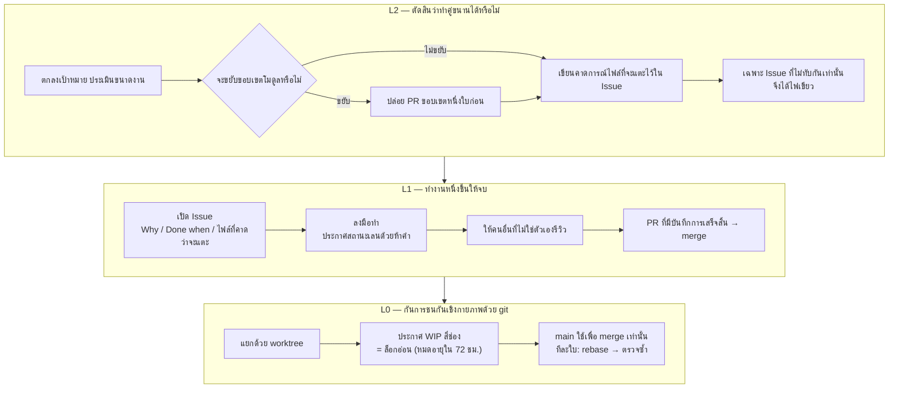
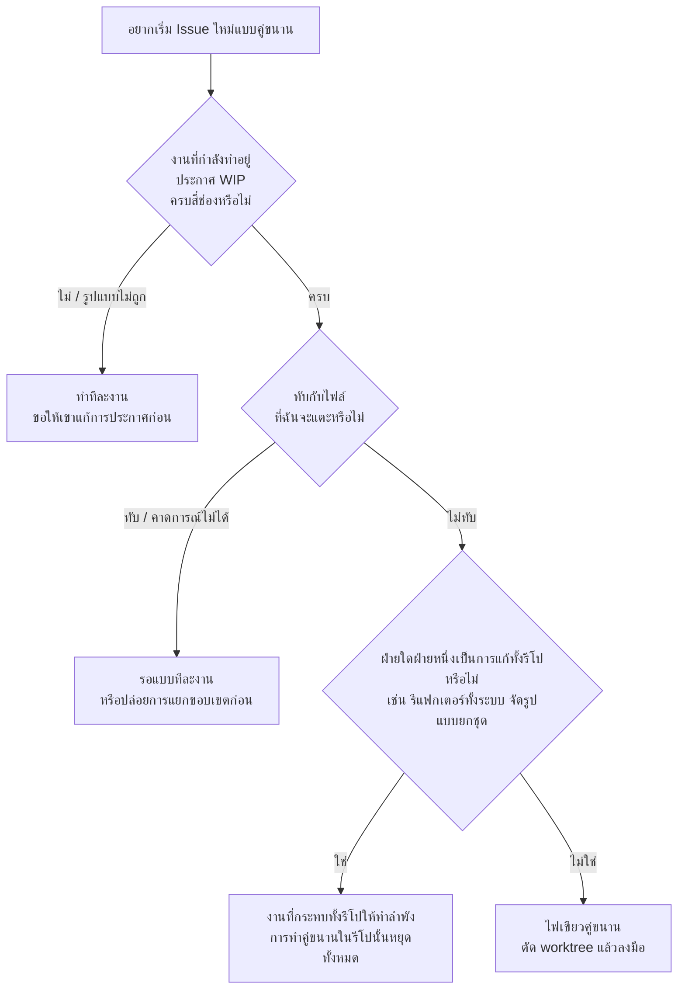

# Family Dev Handbook

<div align="center">

[🇺🇸 English](README.md) ｜ [🇯🇵 日本語（正本）](README.ja.md) ｜ [🇨🇳 简体中文](README.zh.md) ｜ **🇹🇭 ไทย**


[](LICENSE)


กฎกลางที่ทำให้เอเจนต์ AI หลายตัวและเซสชันหลายเซสชัน พัฒนาโค้ดเบสเดียวกันไปพร้อมกันได้โดยไม่ชนกัน<br>
มันแก้สามเรื่องนี้ คือ สองฝ่ายแก้ไฟล์เดียวกันพร้อมกันจนพัง คำว่า “เสร็จแล้ว” ที่เชื่อถือไม่ได้ และตอนส่งงานต่อแล้วไม่มีใครรู้ว่าอะไรเสร็จไปแล้วบ้าง<br>
วิธีแก้คือย้ายการตัดสินใจออกจากความใส่ใจของคน ไปไว้ที่การตรวจเชิงกลไกก่อนลงมือ และประตูรวมโค้ดที่เรียกร้องหลักฐาน เมื่อยืนยันไม่ได้ ก็ไม่ทำพร้อมกัน แต่เปลี่ยนเป็นทำทีละงาน (serial)

**ถ้าตรวจสอบไม่ได้ ก็ทำทีละงาน**

🔧 [ตัวบทของกฎ — วินัย git ระดับ L0](docs/03-git-protocol.md) ｜ 📘 [แบบฟอร์มฉบับหลัก — เทมเพลต Issue](templates/issue-template.md)

</div>

---

<a id="toc"></a>

## สารบัญ

- [คุณเคยเจอแบบนี้ไหม](#problems)
- [ข้อตั้งต้น](#premises)
- [สิ่งที่คุณจะได้](#what-you-get)
- [สิ่งที่ต้องมีก่อนใช้งาน](#requirements)
- [เริ่มต้นใช้งาน](#get-started)
- [ทำไมจึงนำไปใช้ได้อย่างสบายใจ](#safety)
- [วิธีตัดสินว่าทำคู่ขนานได้หรือไม่](#parallel-go)
- [ภาพรวมของกฎทั้งหมด](#rules)
- [เอกสารเชิงลึก](#docs)
- [ครอบครัว Caty AI](#ecosystem)
- [สถานะการพัฒนา](#status)
- [การมีส่วนร่วม](#contributing)
- [สัญญาอนุญาต](#license)

---

<a id="problems"></a>

## คุณเคยเจอแบบนี้ไหม

เมื่องานที่มอบให้เอเจนต์ AI มากขึ้น สิ่งเหล่านี้มักเกิดขึ้นก่อนปัญหาในตัวโค้ดเสียอีก

- **สองฝ่าย (สองตัว) กำลังแก้ไฟล์เดียวกันอยู่พร้อมกัน** — กว่าจะรู้ตัวก็ตอนรวมโค้ดแล้ว
- **คำว่า “เสร็จแล้ว” เชื่อถือไม่ได้** — ไม่มีบันทึกว่าตรวจอะไรไปบ้าง และตรวจไปถึงไหน
- **พอรับงานต่อก็มืดแปดด้าน** — ความจำของเซสชันก่อนหน้าหายไปหมดแล้ว
- **ต้องมานั่งลังเลทุกครั้งว่าทำคู่ขนานได้ไหม** — แต่ละคนตัดสินไม่เหมือนกัน และทุกครั้งที่เกิดอุบัติเหตุก็ได้มาแค่กฎเพิ่มอีกข้อ

คู่มือเล่มนี้มีอยู่เพื่อปิดสี่ข้อนี้ด้วยกลไก แทนที่จะพึ่งความใส่ใจ

ก่อนอื่น ขอบอกก่อนว่าคู่มือเล่มนี้ตั้งต้นจากอะไร

---

<a id="premises"></a>

## ข้อตั้งต้น

ก่อนจะเริ่มอ่าน มีจุดตั้งต้นสองข้อที่อยากบอกไว้ก่อน คำอธิบายทั้งหมดหลังจากนี้ตั้งอยู่บนสองข้อนี้

### เริ่มจาก Issue

งานเริ่มต้นด้วยการ**เปิด GitHub Issue หนึ่งใบก่อนจะแตะโค้ดใด ๆ** (Issue-first)

สิ่งที่ตกลงกันในบทสนทนาจะหายไปเมื่อเซสชันจบลง และเอเจนต์ AI ยิ่งเป็นเช่นนั้น เพราะมันเริ่มต้นด้วยความจำเป็นศูนย์ทุกครั้ง สิ่งที่เหลืออยู่มีเพียงเนื้อหาของ Issue กับ diff ของ Pull Request และด้วยเหตุนี้เองสองสิ่งนั้นจึงถูกถือเป็นฉบับหลักเพียงหนึ่งเดียวของการส่งงานต่อ นี่ไม่ใช่เรื่องว่าใครขี้ลืม แต่เป็นเรื่องของการ**เลือกที่เก็บไว้หนึ่งแห่ง บนสมมติฐานว่าความจำจะหายไปแน่นอน**

อ่านฉบับเต็มได้ที่ [Issue-first คืออะไร](docs/why-issue-first.md)

### แบ่งโมดูลให้เล็ก

**การจะทำคู่ขนานได้หรือไม่ ถูกกำหนดไว้แล้วโดยรูปร่างของโค้ด ตั้งแต่ก่อนที่ใครจะลงมือ**

เมื่อไฟล์ขนาดใหญ่ไฟล์เดียวแบกความรับผิดชอบหลายอย่างไว้ด้วยกัน ไม่ว่าจะทำอะไรในบริเวณนั้นก็ต้องไปแตะไฟล์นั้น บริเวณนั้นจึงต้องทำทีละงานเสมอ การแยกไฟล์จึงไม่ใช่ “การจัดระเบียบที่ไว้ค่อยทำทีหลัง” แต่เป็น**การลงทุนที่ทำก่อน** และมันคืนกลับมาสามอย่าง

- **ทำคู่ขนานได้** — ทันทีที่บริเวณนั้นถูกแยก การทำคู่ขนานในบริเวณนั้นก็ปลอดภัยเชิงโครงสร้าง
- **จดจ่อได้** — ยิ่งต้องอ่านน้อยลง เอเจนต์ก็ยิ่งอยู่กับงานตรงหน้าได้
- **เปลี่ยนชิ้นส่วนได้** — เหมือนถอดตัวต่อออกทีละก้อน ชิ้นที่พังชิ้นเดียวก็ซ่อมได้โดยไม่ต้องแตะที่เหลือ

คุณไม่จำเป็นต้องออกแบบสิ่งเหล่านี้เอง **แค่ส่งคู่มือเล่มนี้ให้เอเจนต์ของคุณ จุดที่ควรแยกก็จะถูกยกขึ้นมาเป็น Issue เอง**

อ่านฉบับเต็มได้ที่ [ทำไมจึงแบ่งโมดูลให้เล็ก](docs/why-small-modules.md)

---

<a id="what-you-get"></a>

## สิ่งที่คุณจะได้

ปัญหาถูกแบ่งออกเป็นสามชั้น และแต่ละชั้นถูกปิดด้วยวิธีที่ต่างกัน ชั้นบนทำหน้าที่ *ป้องกัน* อุบัติเหตุ ส่วนชั้นล่างทำหน้าที่ *ตรวจจับและกักกัน* มัน

ขออธิบายคำสามคำที่จะโผล่ในแผนภาพก่อน **เลน** คือสายงานที่ผูกกับ Issue หนึ่งใบ **WIP** คือการประกาศว่างานกำลังดำเนินอยู่ (work in progress) และ **ล็อกอ่อน** คือข้อตกลงว่าคนอื่นจะไม่แตะไฟล์เหล่านั้นตราบใดที่การประกาศยังอยู่



- 🚦 **ตัดสินเรื่องคู่ขนานตั้งแต่ก่อนลงมือ**

  จะอนุญาตให้ทำคู่ขนานก็ต่อเมื่อรู้ได้ตั้งแต่ก่อนลงมือว่า “ชุดไฟล์ที่งานสองชิ้นจะแตะนั้นไม่ทับกัน” การตัดสินขึ้นอยู่กับคำถามสามข้อ และถ้ามีข้อใดข้อหนึ่งที่ตอบไม่ได้ มันจะเอนไปทางทำทีละงานโดยอัตโนมัติ

- 📋 **ทำงานหนึ่งชิ้นให้จบพร้อมหลักฐาน**

  ทุก Issue ต้องเขียน Why, Done when และไฟล์ที่คาดว่าจะแตะ ทุกการ merge ต้องมีบันทึกการเสร็จสิ้นแนบมาด้วย ได้แก่ PASS / FAIL / N/A พร้อมเหตุผลของ Done when ทุกข้อ คอมมิตที่เป็นตัวเลือก การเทียบสิ่งที่ประกาศไว้กับ diff จริง และผู้รีวิวที่ไม่ใช่ผู้เขียนเอง คำว่า “เสร็จแล้ว” จึงกลายจากคำพูดเป็นบันทึก

- 🔒 **กักการชนกันเชิงกายภาพไว้ด้วยวิธีใช้ git**

  หนึ่งเซสชัน = หนึ่ง Issue = หนึ่งบรานช์ = หนึ่ง worktree (ฟีเจอร์ของ git ที่แยกรีโปเดียวออกเป็นหลายโฟลเดอร์ทำงาน) main ใช้เพื่อ merge เท่านั้น เลนที่กำลังทำงานจะนับเป็นล็อกอ่อนเฉพาะช่วงที่ยังประกาศครบสี่ช่องเท่านั้น และจะหมดอายุไปเองใน 72 ชั่วโมง

ก่อนจะถามว่ามันได้ผลไหม ลองถามว่าการลองใช้มันต้องจ่ายเท่าไร คำตอบคือ แทบไม่ต้องจ่ายอะไรเลย

---

<a id="requirements"></a>

## สิ่งที่ต้องมีก่อนใช้งาน

รีโปนี้ประกอบด้วยเอกสารล้วน ๆ ไม่มีโปรแกรมให้ติดตั้ง

| สิ่งที่ต้องมี | สถานะ |
|---|---|
| รันไทม์ (Node, Python ฯลฯ) | ไม่จำเป็น — มีแต่เอกสาร ไม่ต้องติดตั้งอะไร |
| ระบบควบคุมเวอร์ชัน | ✅ git |
| ที่สำหรับบันทึกงาน | ✅ Issue / Pull Request ของ GitHub |
| เอเจนต์ AI | ✅ ตัวไหนก็ได้ ขอเพียงมีไฟล์ตั้งค่าที่ถูกโหลดตลอดเวลา (`CLAUDE.md` / `AGENTS.md` / system prompt ฯลฯ) |
| ใช้คนล้วน ไม่ใช้ AI | ✅ ได้ (ทีมที่ไม่ใช้ AI ก็ใช้ได้ตามนี้เลย) |

มันไม่ผูกกับผลิตภัณฑ์เอเจนต์ตัวใดตัวหนึ่ง ไม่ผูกกับโครงสร้างพื้นฐานด้านความจำแบบใดแบบหนึ่ง และไม่ผูกกับชุดเครื่องมือใด เพราะสิ่งที่คุณรับมาใช้คือโปรโตคอล ไม่ใช่เครื่องมือ ส่วนวิธีจัดการรายการปลายทางที่นำไปติดตั้งอยู่ใน [docs/04](docs/04-adoption.md)

เมื่อมีครบแล้ว การนำไปใช้ก็เหลือแค่ “แปะ” เท่านั้น

---

<a id="get-started"></a>

## เริ่มต้นใช้งาน

การนำไปใช้ หมายถึงการวางบทสรุปของกฎไว้ในบริบทที่โหลดตลอดเวลาของเอเจนต์แต่ละตัว

หน้าต่าง ๆ ใต้ `docs/` เขียนด้วยภาษาญี่ปุ่นเท่านั้น บล็อกสรุปนั้นตั้งใจให้แปะไปทั้งก้อนอยู่แล้ว คุณจึงไม่จำเป็นต้องอ่านภาษาญี่ปุ่นก็นำไปใช้ได้ เพียงแต่ตัวบทของกฎที่อยู่เบื้องหลัง ID เหล่านั้นเป็นภาษาญี่ปุ่น

### ให้ AI ติดตั้งให้

บอกเอเจนต์ที่คุณใช้อยู่เป็นประจำแบบนี้

```text
กรุณาเปิด docs/04-adoption.md ใน https://github.com/caty-ai/family-dev-handbook
แล้วแปะ "บล็อกสรุปสำหรับแจกจ่าย" ในนั้นลงในบริบทที่โหลดตลอดเวลาของฉัน
(CLAUDE.md / AGENTS.md) ถ้ายังไม่มีไฟล์ตั้งค่านั้น กรุณาสร้างขึ้นมา
บรรทัดแรก ให้เปลี่ยน owner เป็นชื่อฉัน และ last-verified เป็นวันที่วันนี้
บรรทัดที่สอง ตรง "正本:" ให้ใส่ URL ของรีโปนี้
ส่วนค่า handbook-revision กรุณาอย่าแก้
```

### ติดตั้งด้วยตัวเอง

1. เปิด “บล็อกสรุปสำหรับแจกจ่าย” ใน [docs/04](docs/04-adoption.md) (เป็นข้อความประมาณ 30 บรรทัด)
2. แปะทั้งก้อนลงในไฟล์ตั้งค่าที่ถูกโหลดตลอดเวลา
3. แก้ `owner` และ `last-verified` ในบรรทัดแรกให้เป็นชื่อคุณกับวันที่วันนี้ ส่วน `handbook-revision` ให้คงไว้ตามเดิม
4. แก้ `正本:` ในบรรทัดที่สองให้เป็น URL ของรีโปนี้ (ถ้าคุณ fork ไป ก็ใส่ที่อยู่ fork ของคุณ)

ที่ต้องแปะมีเท่านี้ ข้างในมีเพียง rule ID ห้าตระกูล (`L2-1`–`L2-6` / `L1-1`–`L1-11` / `L0-1`–`L0-9` / `FP-1`–`FP-9` / `E-1`–`E-10`) กับท่าทีบรรทัดเดียวของแต่ละข้อ ตัวบทของกฎไม่ได้อยู่ในนั้น **ฉบับหลักของตัวบทคือรีโปนี้ และเมื่อบทสรุปขัดกับฉบับหลัก ให้ยึดฉบับหลักเป็นหลัก** จะปรับให้เข้มขึ้นตามรีโปของคุณเองได้อย่างอิสระ แต่การผ่อนให้หลวมลงนั้นห้าม

ถ้าอยากเลิกใช้ แค่ลบ 30 บรรทัดที่แปะไว้ ทุกอย่างก็กลับไปเหมือนเดิม ไฟล์อื่นไม่ถูกแตะเลย

การเตรียมฝั่งรีโป (แผนที่ความปลอดภัยของการทำคู่ขนาน เทมเพลต Issue การป้องกัน main) อยู่ใน [docs/04](docs/04-adoption.md)

ก่อนจะแปะ คงยังมีบางอย่างค้างคาใจอยู่ ขอตอบไว้ตรงนี้ก่อน

---

<a id="safety"></a>

## ทำไมจึงนำไปใช้ได้อย่างสบายใจ

- **ไม่จำเป็นต้องรับมาทั้งหมดในคราวเดียว** — เอาแค่ L0 (วินัย git) ก็ได้ผลแล้ว ส่วน L2 กับ L1 ค่อยเติมตอนที่ระบบเริ่มเดินแล้วก็ได้
- **ไม่จำเป็นต้องรื้อวิธีใช้ Issue / PR ที่มีอยู่** — สิ่งที่เพิ่มมีแค่สามหัวข้อในเนื้อหา Issue กับห้าคำที่ใช้บอกสถานะของเลน (WIP / HOLD / MERGED / SUPERSEDED / ABANDONED)
- **ห้ามเฉพาะการแก้ไปทางที่หลวมลง** — จะทำให้เข้มขึ้นในรีโปของตัวเองนั้นอิสระเต็มที่ สิ่งที่ต้องรักษามีข้อเดียวคือ อย่าแจกจ่ายบทสรุปที่หลวมกว่าฉบับหลัก
- **มันถูกออกแบบบนสมมติฐานว่าเอเจนต์จะไม่ทำตาม** — ไม่พึ่งความใส่ใจหรือความจำ วางไว้ในที่ที่ถูกโหลดตลอดเวลา การตัดสินเป็นสองค่าคือทับหรือไม่ทับ และถ้ายืนยันไม่ได้ก็จะเอนไปฝั่งทำทีละงานเสมอ

และก็มี **การใช้งานที่ไม่เหมาะ** เช่นกัน

- คนเดียว เซสชันเดียว และทำงานทีละอย่างเสมอ — แทบทุกข้อจะไม่ได้ทำงาน ยกเว้น L0-4
- การทำงานที่ไม่ใช้ Issue / PR — ประตูการเสร็จสิ้นของ L1 จะตั้งอยู่ไม่ได้
- รีโปเล็ก ๆ ที่มีแต่การแก้บักเดี่ยว ๆ — การรีวิวต้นน้ำ (การให้โมเดลอีกตัวดูแบบก่อนจะลงมือพัฒนา, L1-9) ไม่เข้าข่ายมาตั้งแต่แรก

สิ่งที่ลังเลบ่อยที่สุดในการใช้งานจริงคือ “ตอนนี้เริ่มแบบคู่ขนานได้ไหม” เฉพาะการตัดสินข้อนี้ จะจบให้ครบตรงนี้เลย

---

<a id="parallel-go"></a>

## วิธีตัดสินว่าทำคู่ขนานได้หรือไม่

ตัดสินด้วยคำถามสามข้อ ถ้ามีข้อใดข้อหนึ่งที่ยืนยันไม่ได้ ก็ไม่ทำคู่ขนาน



ถ้าทำอะไรก็ทับกันทุกครั้ง นั่นไม่ใช่ปัญหาของการตัดสิน แต่เป็นปัญหาของวิธีแบ่งโค้ด ([ทำไมจึงแบ่งโมดูลให้เล็ก](docs/why-small-modules.md))

แผนภาพหนึ่งใบนี้เป็นเพียงข้อเดียวชื่อ `L2-4` เท่านั้น แผนที่ทั้งหมดอยู่ถัดจากนี้

---

<a id="rules"></a>

## ภาพรวมของกฎทั้งหมด

กฎแบ่งเป็นห้าตระกูล และทุกข้อมี ID ที่ไม่เปลี่ยนแปลงกำกับไว้ ทั้งบทสรุป บทสนทนา และ Issue ต่างอ้างถึงกันด้วย ID เหล่านี้

| ตระกูล | ตัดสินเรื่องอะไร | rule ID | ตัวบท |
|---|---|---|---|
| **L2** ลูปไมล์สโตน | ทำคู่ขนานได้หรือไม่ | `L2-1`–`L2-6` | [docs/01](docs/01-milestone-loop.md) |
| **L1** ลูป Issue | งานหนึ่งชิ้นจะไปถึงจุดจบอย่างไร | `L1-1`–`L1-11` | [docs/02](docs/02-issue-loop.md) |
| **L0** วินัย git | กันการชนกันเชิงกายภาพอย่างไร | `L0-1`–`L0-9` | [docs/03](docs/03-git-protocol.md) |
| **FP** ท่าทีเมื่อล้มเหลว | เมื่อตรวจสอบไม่ได้ จะเอนไปทางไหน | `FP-1`–`FP-9` | [docs/05](docs/05-fail-posture.md) |
| **E** เลน Epic | จะขับเคลื่อน Issue ทั้งพวงอย่างไร | `E-1`–`E-10` | [docs/06](docs/06-epic-lane.md) |

มีสองข้อที่ชี้ขาดผลลัพธ์เป็นพิเศษ ข้อแรกคือคำขวัญของ **FP** ที่ว่า “ถ้าตรวจสอบไม่ได้ก็ทำทีละงาน — fail-open ไม่ได้แปลว่า *ผ่าน*” นี่คือการประกาศว่า ต่อให้คุณเลือกจะปล่อยผ่านในตอนที่ยืนยันไม่ได้ นั่นก็ไม่มีวันถูกอ่านว่า “ตรวจแล้ว” อีกข้อคือ **นิยามเดียวของพื้นที่ความเสี่ยงสูง** งานที่แตะพื้นที่นี้จะต้องหยุดรอคนเสมอ และที่นั่งรีวิวจะเพิ่มขึ้น (การเผยแพร่สู่ภายนอก การใช้จ่าย การกระทำที่ย้อนกลับไม่ได้ และขอบเขตของสิทธิ์ ล้วนอยู่ในข่ายนี้ ส่วนเส้นแบ่งที่แม่นยำให้ดูจากฉบับหลัก) เพื่อไม่ให้นิยามเดียวกันไปอยู่สองที่ ฉบับหลักจึงถูกวางไว้ที่ [docs/06](docs/06-epic-lane.md) เพียงแห่งเดียว

เลน Epic (`E-1`–`E-10`) เป็นทางเลือก มันจะเกิดขึ้นก็ต่อเมื่อเจ้าของงานอนุมัติ และก่อนหน้านั้นทุกอย่างเดินแบบ Issue ปกติ

<details>
<summary>สัญญาแกน P1–P5 (กระดูกสันหลังห้าข้อที่เพิ่มมาใน v0.1.0)</summary>

| สัญญา | เนื้อหา | rule ID |
|---|---|---|
| **P1 ล็อก WIP** | WIP เป็นล็อกอ่อนเฉพาะช่วงที่ยังมีสี่ช่อง `agent / date / Files to touch / Branch` ครบเท่านั้น ไฟล์นอกการประกาศห้ามแตะ stale คือ 72 ชั่วโมง และการรับช่วงต่อให้ทำตามขั้นตอน TAKEOVER | `L0-1`–`L0-3` |
| **P2 สถานะเลน** | ชุดคำห้าสถานะแบบปิด WIP เป็นสถานะที่ต้องประกาศ ไม่ใช่ค่าเริ่มต้น สถานะที่ไม่ทราบหรือไม่ถูกต้องให้ถือว่าไม่ทำงานและรอการซ่อม การลองใหม่ (retry) มีจำนวนจำกัด และการใช้จนหมดไม่นับว่าสำเร็จ | `L1-4`–`L1-6` |
| **P3 การตรวจก่อนทำต่อ** | ก่อนเขียนครั้งแรกในเลนที่ทำต่อหรือรับช่วงมา ให้โพสต์ผลการตรวจสี่จุด (ล็อก / ขอบเขต / บรานช์ / Done when) ลงใน Issue | `L0-9` |
| **P4 ท่าทีเมื่อล้มเหลว** | ทุกการเปลี่ยนผ่านที่มีตัวกั้น ให้ประกาศ fail-open หรือ fail-closed ไว้ล่วงหน้า การขาดการประกาศให้เอนไปทางที่สิทธิ์แคบลงเสมอ และตัวเนื้อหาของผลงานจะไม่อนุมัติตัวเอง | `FP-1`–`FP-9` |
| **P5 ประตูหลักฐานการเสร็จสิ้น** | การ merge ต้องมีบันทึกการเสร็จสิ้น ได้แก่ PASS / FAIL / N/A พร้อมเหตุผลของ Done when ทุกข้อ หลักฐานที่แนบมาในบันทึก SHA ของคอมมิตที่เสนอ การเทียบสิ่งที่ประกาศกับ diff และผู้รีวิวที่เป็นคนละโมเดลหรือคนละเอเจนต์ | `L1-7`–`L1-8` |

ห้าข้อนี้ถูกแช่แข็งไว้ตั้งแต่นั้นเป็นต้นมา

</details>

ตัวบทของกฎทั้งหมดอยู่ใน `docs/` เชิญดูสารบัญได้เลย

---

<a id="docs"></a>

## เอกสารเชิงลึก

| ไฟล์ | เนื้อหา |
|---|---|
| [docs/why-issue-first.md](docs/why-issue-first.md) | Issue-first คืออะไร — คำอธิบายข้อตั้งต้น (**ไม่ใช่ตัวบท** เหตุผลที่เริ่มจาก Issue แทนบทสนทนา สิ่งที่ต้องเขียนใน Issue และกรณีที่ไม่จำเป็น) |
| [docs/why-small-modules.md](docs/why-small-modules.md) | ทำไมจึงแบ่งโมดูลให้เล็ก — คำอธิบายข้อตั้งต้น (**ไม่ใช่ตัวบท** เหตุผลที่การแยกคือการลงทุนเพื่อความเป็นไปได้ของการทำคู่ขนาน ความหมายของคำว่า “เล็ก” และวิธีที่คู่มือเล่มนี้แบ่งตัวเอง) |
| [docs/01-milestone-loop.md](docs/01-milestone-loop.md) | L2 ลูปไมล์สโตน — ชั้นที่ตัดสินว่าทำคู่ขนานได้หรือไม่ (`L2-1`–`L2-6`) |
| [docs/02-issue-loop.md](docs/02-issue-loop.md) | L1 ลูป Issue — การทำให้จบ สถานะเลน ประตูหลักฐานการเสร็จสิ้น การรีวิวต้นน้ำแบบต่างชนิด (`L1-1`–`L1-11`) |
| [docs/03-git-protocol.md](docs/03-git-protocol.md) | L0 วินัย git — ล็อก WIP, worktree, ขั้นตอน merge, การตรวจก่อนทำต่อ (`L0-1`–`L0-9`) |
| [docs/04-adoption.md](docs/04-adoption.md) | วิธีนำไปใช้ — ปลายทางที่ติดตั้ง บล็อกสรุปสำหรับแจกจ่าย วินัยของบทสรุป |
| [docs/05-fail-posture.md](docs/05-fail-posture.md) | ท่าทีเมื่อล้มเหลว — เมื่อตรวจสอบไม่ได้จะเอนไปทางไหน (`FP-1`–`FP-9`) |
| [docs/06-epic-lane.md](docs/06-epic-lane.md) | เลน Epic — ชั้นที่รวบการยืนยันของคนไว้เป็นหน่วย Epic และนิยามเดียวของพื้นที่ความเสี่ยงสูง (`E-1`–`E-10`) |
| [templates/issue-template.md](templates/issue-template.md) | เทมเพลต Issue และรูปแบบคอมเมนต์ของเลนทั้งหมด (WIP / HOLD / การปิด / TAKEOVER / การตรวจก่อนทำต่อ / บันทึกการเสร็จสิ้น) |
| [templates/epic-template.md](templates/epic-template.md) | เทมเพลต Epic และตารางจุดตรวจของมนุษย์ |
| [templates/architecture-parallel-map.md](templates/architecture-parallel-map.md) | เทมเพลต “แผนที่ความปลอดภัยของการทำคู่ขนาน” สำหรับวางใน `ARCHITECTURE.md` ของแต่ละรีโป |
| [CONTRIBUTING.md](CONTRIBUTING.md) | ขั้นตอนการมีส่วนร่วม (Issue-first / การประกาศ WIP / บทสรุปของบันทึกการเสร็จสิ้น) |

สุดท้าย ขอพูดสั้น ๆ ว่าคู่มือเล่มนี้มาจากไหน และถูกใช้อยู่ที่ใด

---

<a id="ecosystem"></a>

<!-- family:generated:family-footer:start -->

---

รีโพนี้เป็นส่วนหนึ่งของ **ครอบครัว Caty AI** — ชุดเครื่องมือโอเพนซอร์สสำหรับดูแลครอบครัวเอเจนต์ AI แผนที่ฉบับเต็ม (รวมโมดูลที่กำลังเตรียมเปิด) อยู่ที่ [Family OS](https://github.com/caty-ai/family-os)

| แกน | โมดูล | ทำอะไร | สถานะ |
| --- | --- | --- | --- |
| แผนที่ | [Family OS](https://github.com/caty-ai/family-os) | แผนที่ของทั้งครอบครัว — โมดูล สถานะ และโครงสร้าง | เปิดแล้ว・MIT |
| กติกา | **Family Dev Handbook** | กติกากลางของการพัฒนา — Issue, PR, worktree, การส่งงานต่อ และการทำงานคู่ขนาน | เปิดแล้ว・MIT |
| แกนตั้ง · รากฐาน | [Caty Agent Harness](https://github.com/caty-ai/caty-agent-harness) | แกนงานของเอเจนต์ AI — การลองใหม่ เช็คพอยต์ และการตัดสินว่าเสร็จจริง | เปิดแล้ว・MIT |
| แกนตั้ง | [Persona Engine](https://github.com/caty-ai/persona-engine) | มอบบุคลิกให้เอเจนต์ — เลเยอร์บุคลิกและอารมณ์แบบไล่ระดับ | เปิดแล้ว・MIT |
| แกนตั้ง | **Persona Growth Loop** | พัฒนาบุคลิกของเอเจนต์ — สร้างข้อเสนอแบบน้อยที่สุดและทำซ้ำได้ | กำลังเตรียมเปิด |
| แกนตั้ง | [X Collector](https://github.com/caty-ai/x-collector) | รวบรวมข้อมูลจาก X และเว็บเป็นสรุปวันละฉบับ — สำหรับคนและเอเจนต์ | เปิดแล้ว・MIT |
| แกนตั้ง | **Self Growth Loop** | วงจรให้เอเจนต์พัฒนาความสามารถของตัวเอง — ข้อเสนอ ธรรมาภิบาล และบันทึกการนำไปใช้ | กำลังเตรียมเปิด |
| แกนนอน · รากฐาน | **Family Memory Architecture** | บัสความทรงจำ — ชั้นที่ครอบครัวใช้แบ่งปันสิ่งที่รู้ | กำลังเตรียมเปิด |
| แกนนอน | [Sitter](https://github.com/caty-ai/sitter) | พี่เลี้ยงของงานที่มอบหมายให้เอเจนต์ — เฝ้าดู เก็บหลักฐาน และรีสตาร์ต | เปิดแล้ว・MIT |

<!-- family:generated:family-footer:end -->

## ครอบครัว Caty AI

คู่มือเล่มนี้สมบูรณ์ในตัวเอง ไม่ต้องใช้บริการภายนอก ไม่ต้องใช้รีโปพี่น้อง และไม่ต้องใช้โครงสร้างพื้นฐานด้านความจำแบบใดแบบหนึ่ง สิ่งที่ต้องมีคือ git, Issue / PR และผู้ที่ยอมทำตามกฎเท่านั้น

ในเวลาเดียวกัน มันก็เป็นสมาชิกหนึ่งของ “ครอบครัว Caty AI” ซึ่งเป็นชุดเครื่องมือสำหรับใช้งานเอเจนต์ AI หลายตัวเป็นทีมเดียว **แผนที่ของภาพรวมทั้งหมดอยู่ที่ [family-os](https://github.com/caty-ai/family-os)** — บทบาท การเชื่อมต่อ และสถานะปัจจุบันของแต่ละรีโป มีฉบับหลักอยู่ที่นั่น

- กฎระเบียบ — **family-dev-handbook** (รีโปนี้)
- การเรียนรู้ — [caty-agent-harness](https://github.com/caty-ai/caty-agent-harness)
- การเฝ้าดู — [sitter](https://github.com/caty-ai/sitter)
- การเรียนรู้จากโลกภายนอก — [x-collector](https://github.com/caty-ai/x-collector)
- โหมดบุคลิก — [persona-engine](https://github.com/caty-ai/persona-engine)

แต่ละรีโปใช้งานเดี่ยว ๆ ได้ การนำมารวมกันเป็นทางเลือก และการใช้เพียงตัวใดตัวหนึ่งก็สมบูรณ์ในตัวเอง

บรรทัดฐานทั่วไปที่ข้ามเอเจนต์ (เช่น ขอบเขตการใช้ของ fail-posture) เป็นของฝั่ง family-os ส่วน**ถ้อยคำของโปรโตคอลการทำงานร่วมกันระหว่างคนกับเอเจนต์เท่านั้นที่เป็นความรับผิดชอบของคู่มือเล่มนี้** เราจะไม่ตั้งบรรทัดฐานทั่วไปขึ้นใหม่ที่นี่

ต่อไปนี้คือสถานะปัจจุบันและทิศทางข้างหน้า

---

<a id="status"></a>

## สถานะการพัฒนา

เวอร์ชันปัจจุบันคือ **v0.3.0** (2026-07-31) โดยเพิ่มเลน Epic (`E-1`–`E-10`) และการรีวิวต้นน้ำแบบต่างชนิดก่อนเริ่มลงมือพัฒนา (`L1-9`–`L1-11`) เข้ามา

- **v0.2.1 / v0.2.0** (2026-07-22) — จัดเตรียมสัญญาอนุญาต MIT และ community health files พร้อมทำให้ใช้ได้ทั่วไปโดยถอดถ้อยคำเฉพาะของครอบครัวออก
- **v0.1.0 / v0.1.1** (2026-07-21) — เปลี่ยนกฎจากความเรียงให้กลายเป็นสัญญา ได้แก่ rule ID ที่เสถียร ชุดคำห้าสถานะแบบปิด ประตู merge ที่ต้องมีหลักฐาน และการประกาศท่าทีเมื่อล้มเหลวไว้ล่วงหน้า

แผนถัดจากนี้ยึด [รายการ Issue](https://github.com/caty-ai/family-dev-handbook/issues) เป็นฉบับหลัก README จะไม่เก็บอีกชุดซ้ำ

ทางเข้าสำหรับข้อเสนอ ก็ตั้งอยู่บนกฎชุดเดียวกันนี้

---

<a id="contributing"></a>

## การมีส่วนร่วม

- ข้อเสนอการเปลี่ยนแปลง ให้เปิด Issue ในรีโปนี้ ส่ง PR และผ่านการรีวิวจากคนละโมเดลหรือคนละเอเจนต์ก่อนจึง merge (ห้ามอนุมัติตัวเอง)
- **คู่มือเล่มนี้เองก็ถูกอัปเดตด้วยขั้นตอนนี้** — ประกาศ WIP สี่ช่อง → worktree → รีวิวข้ามโมเดล → PR ที่มีบันทึกการเสร็จสิ้น การเพิ่มและการแก้ไขตัวบททุกครั้ง ล้วนผ่านเส้นทางเดียวกันนี้
- ขั้นตอนโดยละเอียดอยู่ใน [CONTRIBUTING.md](CONTRIBUTING.md)

เงื่อนไขการใช้งาน ถูกทำให้หลวมที่สุดเท่าที่จะเป็นไปได้

---

<a id="license"></a>

## สัญญาอนุญาต

[MIT](LICENSE) © 2026 Caty

กฎจะมีความหมายก็ต่อเมื่อมันแพร่ออกไป จึงเลือก MIT ที่แก้ไขและเผยแพร่ต่อได้อย่างอิสระ การใช้งานที่ตั้งใจไว้คือการ fork ไปแล้วปรับให้เข้มขึ้นตามทีมของคุณเอง

เอกสารใต้ `docs/` เขียนด้วยภาษาญี่ปุ่น และ README ภาษาไทยฉบับนี้เป็นฉบับแปล เมื่อทั้งสองขัดกัน ให้ยึดฉบับภาษาญี่ปุ่นเป็นหลัก

<div align="center">

**เอกสารล้วน** ｜ **ไม่ต้องมีรันไทม์** ｜ **ทำงานได้ด้วย git กับ Issue / PR เท่านั้น**

</div>
