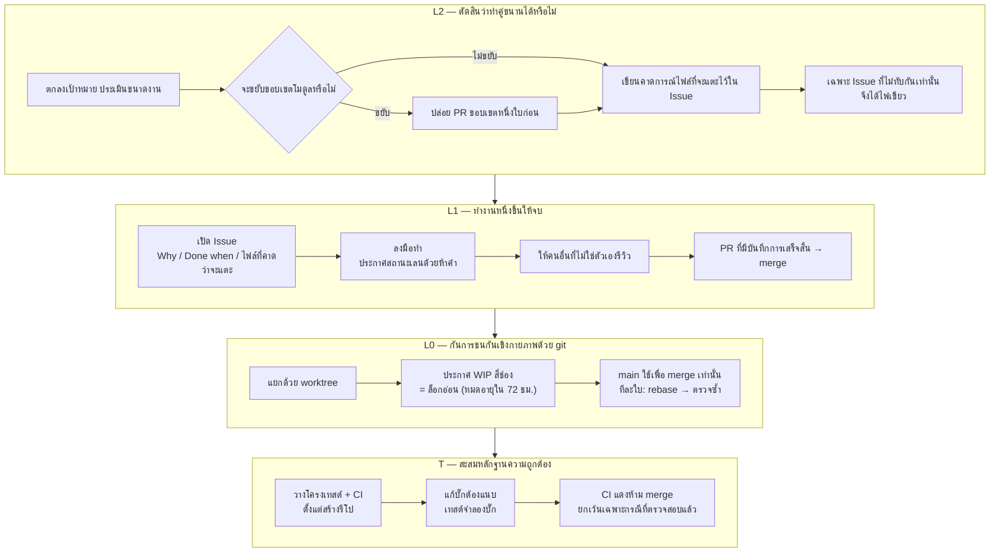
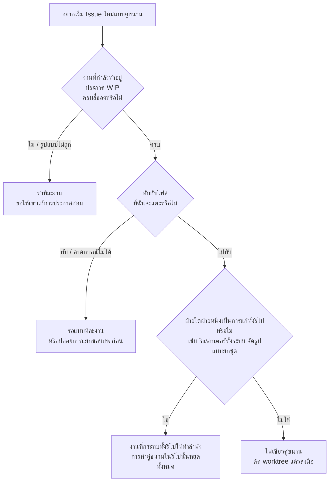

# Family Dev Handbook

<div align="center">

[🇺🇸 English](README.md) ｜ [🇯🇵 日本語（正本）](README.ja.md) ｜ [🇨🇳 简体中文](README.zh.md) ｜ **🇹🇭 ไทย**


[](LICENSE)


[](https://github.com/caty-ai/family-dev-handbook/actions/workflows/test-lint.yml)

กฎกลางที่ทำให้เอเจนต์ AI หลายตัวและเซสชันหลายเซสชัน พัฒนาโค้ดเบสเดียวกันไปพร้อมกันได้โดยไม่ชนกัน<br>
มันแก้สามเรื่องนี้ คือ สองฝ่ายแก้ไฟล์เดียวกันพร้อมกันจนพัง คำว่า “เสร็จแล้ว” ที่เชื่อถือไม่ได้ และตอนส่งงานต่อแล้วไม่มีใครรู้ว่าอะไรเสร็จไปแล้วบ้าง<br>
วิธีแก้คือย้ายการตัดสินใจออกจากความใส่ใจของคน ไปไว้ที่การตรวจเชิงกลไกก่อนลงมือ และประตูรวมโค้ดที่เรียกร้องหลักฐาน เมื่อยืนยันไม่ได้ ก็ไม่ทำพร้อมกัน แต่เปลี่ยนเป็นทำทีละงาน (serial)

**ถ้าตรวจสอบไม่ได้ ก็ทำทีละงาน**

🔧 [ตัวบทของกฎ — วินัย git ระดับ L0](docs/03-git-protocol.md) ｜ 📘 [แบบฟอร์มฉบับหลัก — เทมเพลต Issue](templates/issue-template.md)

</div>
<!-- repo-state:begin (generated; do not edit) -->
<p align="center"><sub>generation: <code>2451115</code> (2026-09-03T18:29:52Z) · verify: <a href="https://api.github.com/repos/caty-ai/family-dev-handbook/commits/main">API HEAD</a> · <a href="./status.json">status.json</a></sub></p>
<!-- repo-state:end -->

---

<a id="toc"></a>

## สารบัญ

- [คุณเคยเจอแบบนี้ไหม](#problems)
- [ข้อตั้งต้น](#premises)
- [สิ่งที่คุณจะได้](#what-you-get)
- [สิ่งที่ต้องมีก่อนใช้งาน](#requirements)
- [เริ่มต้นใช้งาน](#get-started)
- [ทำไมจึงนำไปใช้ได้อย่างสบายใจ](#safety)
- [วิธีตัดสินว่าทำคู่ขนานได้หรือไม่](#parallel-go)
- [ภาพรวมของกฎทั้งหมด](#rules)
- [เอกสารเชิงลึก](#docs)
- [ครอบครัว Caty AI](#ecosystem)
- [สถานะการพัฒนา](#status)
- [การมีส่วนร่วม](#contributing)
- [กิตติกรรมประกาศ](#acknowledgements)
- [สัญญาอนุญาต](#license)

---

<a id="problems"></a>

## คุณเคยเจอแบบนี้ไหม

เมื่องานที่มอบให้เอเจนต์ AI มากขึ้น สิ่งเหล่านี้มักเกิดขึ้นก่อนปัญหาในตัวโค้ดเสียอีก

- **สองฝ่าย (สองตัว) กำลังแก้ไฟล์เดียวกันอยู่พร้อมกัน** — กว่าจะรู้ตัวก็ตอนรวมโค้ดแล้ว
- **คำว่า “เสร็จแล้ว” เชื่อถือไม่ได้** — ไม่มีบันทึกว่าตรวจอะไรไปบ้าง และตรวจไปถึงไหน
- **พอรับงานต่อก็มืดแปดด้าน** — ความจำของเซสชันก่อนหน้าหายไปหมดแล้ว
- **ต้องมานั่งลังเลทุกครั้งว่าทำคู่ขนานได้ไหม** — แต่ละคนตัดสินไม่เหมือนกัน และทุกครั้งที่เกิดอุบัติเหตุก็ได้มาแค่กฎเพิ่มอีกข้อ

คู่มือเล่มนี้มีอยู่เพื่อปิดสี่ข้อนี้ด้วยกลไก แทนที่จะพึ่งความใส่ใจ

ก่อนอื่น ขอบอกก่อนว่าคู่มือเล่มนี้ตั้งต้นจากอะไร

---

<a id="premises"></a>

## ข้อตั้งต้น

ก่อนจะเริ่มอ่าน มีจุดตั้งต้นสามข้อที่อยากบอกไว้ก่อน คำอธิบายทั้งหมดหลังจากนี้ตั้งอยู่บนสามข้อนี้ ทั้งสามไม่ใช่ลำดับ — จะเริ่มจากข้อไหนก็ได้ ล้วนเป็นข้อตั้งต้นเพื่อให้ยืนอยู่บนพื้นเดียวกัน

### เริ่มจาก Issue

งานเริ่มต้นด้วยการ**เปิด GitHub Issue หนึ่งใบก่อนจะแตะโค้ดใด ๆ** (Issue-first)

สิ่งที่ตกลงกันในบทสนทนาจะหายไปเมื่อเซสชันจบลง และเอเจนต์ AI ยิ่งเป็นเช่นนั้น เพราะมันเริ่มต้นด้วยความจำเป็นศูนย์ทุกครั้ง สิ่งที่เหลืออยู่มีเพียงเนื้อหาของ Issue กับ diff ของ Pull Request และด้วยเหตุนี้เองสองสิ่งนั้นจึงถูกถือเป็นฉบับหลักเพียงหนึ่งเดียวของการส่งงานต่อ นี่ไม่ใช่เรื่องว่าใครขี้ลืม แต่เป็นเรื่องของการ**เลือกที่เก็บไว้หนึ่งแห่ง บนสมมติฐานว่าความจำจะหายไปแน่นอน**

อ่านฉบับเต็มได้ที่ [Issue-first คืออะไร](docs/why-issue-first.md)

### แบ่งโมดูลให้เล็ก

**การจะทำคู่ขนานได้หรือไม่ ถูกกำหนดไว้แล้วโดยรูปร่างของโค้ด ตั้งแต่ก่อนที่ใครจะลงมือ**

เมื่อไฟล์ขนาดใหญ่ไฟล์เดียวแบกความรับผิดชอบหลายอย่างไว้ด้วยกัน ไม่ว่าจะทำอะไรในบริเวณนั้นก็ต้องไปแตะไฟล์นั้น บริเวณนั้นจึงต้องทำทีละงานเสมอ การแยกไฟล์จึงไม่ใช่ “การจัดระเบียบที่ไว้ค่อยทำทีหลัง” แต่เป็น**การลงทุนที่ทำก่อน** และมันคืนกลับมาสามอย่าง

- **ทำคู่ขนานได้** — ทันทีที่บริเวณนั้นถูกแยก การทำคู่ขนานในบริเวณนั้นก็ปลอดภัยเชิงโครงสร้าง
- **จดจ่อได้** — ยิ่งต้องอ่านน้อยลง เอเจนต์ก็ยิ่งอยู่กับงานตรงหน้าได้
- **เปลี่ยนชิ้นส่วนได้** — เหมือนถอดตัวต่อออกทีละก้อน ชิ้นที่พังชิ้นเดียวก็ซ่อมได้โดยไม่ต้องแตะที่เหลือ

คุณไม่จำเป็นต้องออกแบบสิ่งเหล่านี้เอง **แค่ส่งคู่มือเล่มนี้ให้เอเจนต์ของคุณ จุดที่ควรแยกก็จะถูกยกขึ้นมาเป็น Issue เอง**

อ่านฉบับเต็มได้ที่ [ทำไมจึงแบ่งโมดูลให้เล็ก](docs/why-small-modules.md)

### ตัดความซับซ้อนที่ตัวความต้องการ ไม่ใช่ที่การออกแบบ

**เมื่อการออกแบบเริ่มยาก อย่าเพิ่งหาการออกแบบที่ฉลาดขึ้น — ให้ตั้งคำถามกับความต้องการก่อน**

ความยากส่วนใหญ่ไม่ได้มาจากการออกแบบ แต่มาจากความต้องการ ตัดข้อตั้งต้นออกหนึ่งข้อ จุดยากของการออกแบบก็หายไปทั้งก้อน — ทั้งการพัฒนา การทดสอบ และการดูแลรักษาในอนาคต การตั้งคำถามเป็นอิสระของเอเจนต์เสมอ แต่**การตัดสินใจตัดความต้องการเป็นของผู้ที่ขอ** ความซับซ้อนที่ยอมรับหลังจากตั้งคำถามแล้ว ให้บันทึกเหตุผลไว้หนึ่งบรรทัดใน Issue

อ่านฉบับเต็มได้ที่ [ทำไมจึงสร้างให้เรียบง่าย](docs/why-simple-systems.md)

---

<a id="what-you-get"></a>

## สิ่งที่คุณจะได้

ปัญหาถูกแบ่งออกเป็นสามชั้น และแต่ละชั้นถูกปิดด้วยวิธีที่ต่างกัน ชั้นบนทำหน้าที่ *ป้องกัน* อุบัติเหตุ ส่วนชั้นล่างทำหน้าที่ *ตรวจจับและกักกัน* มัน และตั้งแต่ v0.10.0 ยังมีรากฐานอยู่ใต้สามชั้นนั้น — **T (เกณฑ์พื้นฐานด้านเทสต์ & CI)** — เพื่อให้ไม่ใช่แค่ "งานเดินอย่างไร" แต่ "หลักฐานว่าผลงานถูกต้อง" ก็อยู่ในสัญญาด้วย

ขออธิบายคำสามคำที่จะโผล่ในแผนภาพก่อน **เลน** คือสายงานที่ผูกกับ Issue หนึ่งใบ **WIP** คือการประกาศว่างานกำลังดำเนินอยู่ (work in progress) และ **ล็อกอ่อน** คือข้อตกลงว่าคนอื่นจะไม่แตะไฟล์เหล่านั้นตราบใดที่การประกาศยังอยู่



- 🚦 **ตัดสินเรื่องคู่ขนานตั้งแต่ก่อนลงมือ**

  จะอนุญาตให้ทำคู่ขนานก็ต่อเมื่อรู้ได้ตั้งแต่ก่อนลงมือว่า “ชุดไฟล์ที่งานสองชิ้นจะแตะนั้นไม่ทับกัน” การตัดสินขึ้นอยู่กับคำถามสามข้อ และถ้ามีข้อใดข้อหนึ่งที่ตอบไม่ได้ มันจะเอนไปทางทำทีละงานโดยอัตโนมัติ

- 📋 **ทำงานหนึ่งชิ้นให้จบพร้อมหลักฐาน**

  ทุก Issue ต้องเขียน Why, Done when และไฟล์ที่คาดว่าจะแตะ ทุกการ merge ต้องมีบันทึกการเสร็จสิ้นแนบมาด้วย ได้แก่ PASS / FAIL / N/A พร้อมเหตุผลของ Done when ทุกข้อ คอมมิตที่เป็นตัวเลือก การเทียบสิ่งที่ประกาศไว้กับ diff จริง และผู้รีวิวที่ไม่ใช่ผู้เขียนเอง คำว่า “เสร็จแล้ว” จึงกลายจากคำพูดเป็นบันทึก

- 🔒 **กักการชนกันเชิงกายภาพไว้ด้วยวิธีใช้ git**

  หนึ่งเซสชัน = หนึ่ง Issue = หนึ่งบรานช์ = หนึ่ง worktree (ฟีเจอร์ของ git ที่แยกรีโปเดียวออกเป็นหลายโฟลเดอร์ทำงาน) main ใช้เพื่อ merge เท่านั้น เลนที่กำลังทำงานจะนับเป็นล็อกอ่อนเฉพาะช่วงที่ยังประกาศครบสี่ช่องเท่านั้น และจะหมดอายุไปเองใน 72 ชั่วโมง

- 🧪 **สะสมหลักฐานความถูกต้องของผลงานไว้ในเทสต์และ CI**

  รีโปที่มีโค้ดจะมีโครง CI ตั้งแต่วันที่ถูกสร้าง และการแก้บั๊กจะถูก merge พร้อมเทสต์ที่จำลองบั๊กนั้น (แดงก่อนแก้ เขียวหลังแก้) ห้าม merge ขณะ CI ยังแดง — สิ่งเดียวที่ผ่านได้คือสีแดงที่รู้จักและไม่เกี่ยวข้องซึ่งผ่านเงื่อนไขการตรวจสอบครบทุกข้อ ไม่ใช่ "น่าจะใช้งานได้" แต่เป็นหลักฐานที่เพิ่มขึ้นเรื่อย ๆ

ก่อนจะถามว่ามันได้ผลไหม ลองถามว่าการลองใช้มันต้องจ่ายเท่าไร คำตอบคือ แทบไม่ต้องจ่ายอะไรเลย

---

<a id="requirements"></a>

## สิ่งที่ต้องมีก่อนใช้งาน

ตัวบทของรีโปนี้ประกอบด้วยเอกสารล้วน ๆ ไม่มีโปรแกรมให้ติดตั้งสำหรับตัวรีโปเอง (ใน [templates/ci/](templates/ci/README.md) มีเทมเพลตด่านตรวจสำหรับแจกจ่าย — YAML และสคริปต์ — ไว้คัดลอกไปใช้ในรีโปของคุณ)

| สิ่งที่ต้องมี | สถานะ |
|---|---|
| รันไทม์ (Node, Python ฯลฯ) | ไม่จำเป็น — ตัวบทมีแต่เอกสาร ส่วน templates/ci มีเทมเพลตด่านตรวจสำหรับแจกจ่าย (YAML + สคริปต์) |
| ระบบควบคุมเวอร์ชัน | ✅ git |
| ที่สำหรับบันทึกงาน | ✅ Issue / Pull Request ของ GitHub |
| เอเจนต์ AI | ✅ ตัวไหนก็ได้ ขอเพียงมีไฟล์ตั้งค่าที่ถูกโหลดตลอดเวลา (`CLAUDE.md` / `AGENTS.md` / system prompt ฯลฯ) |
| ใช้คนล้วน ไม่ใช้ AI | ✅ ได้ (ทีมที่ไม่ใช้ AI ก็ใช้ได้ตามนี้เลย) |

มันไม่ผูกกับผลิตภัณฑ์เอเจนต์ตัวใดตัวหนึ่ง ไม่ผูกกับโครงสร้างพื้นฐานด้านความจำแบบใดแบบหนึ่ง และไม่ผูกกับชุดเครื่องมือใด เพราะสิ่งที่คุณรับมาใช้คือโปรโตคอล ไม่ใช่เครื่องมือ ส่วนวิธีจัดการรายการปลายทางที่นำไปติดตั้งอยู่ใน [docs/04](docs/04-adoption.md)

เมื่อมีครบแล้ว การนำไปใช้ก็เหลือแค่ “แปะ” เท่านั้น

---

<a id="get-started"></a>

## เริ่มต้นใช้งาน

การนำไปใช้ หมายถึงการวางบทสรุปของกฎไว้ในบริบทที่โหลดตลอดเวลาของเอเจนต์แต่ละตัว

หน้าต่าง ๆ ใต้ `docs/` เขียนด้วยภาษาญี่ปุ่นเท่านั้น บล็อกสรุปนั้นตั้งใจให้แปะไปทั้งก้อนอยู่แล้ว คุณจึงไม่จำเป็นต้องอ่านภาษาญี่ปุ่นก็นำไปใช้ได้ เพียงแต่ตัวบทของกฎที่อยู่เบื้องหลัง ID เหล่านั้นเป็นภาษาญี่ปุ่น

### ให้ AI ติดตั้งให้

บอกเอเจนต์ที่คุณใช้อยู่เป็นประจำแบบนี้

```text
กรุณาเปิด docs/04-adoption.md ใน https://github.com/caty-ai/family-dev-handbook
แล้วแปะ "บล็อกสรุปสำหรับแจกจ่าย" ในนั้นลงในบริบทที่โหลดตลอดเวลาของฉัน
(CLAUDE.md / AGENTS.md) ถ้ายังไม่มีไฟล์ตั้งค่านั้น กรุณาสร้างขึ้นมา
บรรทัดแรก ให้เปลี่ยน owner เป็นชื่อฉัน และ last-verified เป็นวันที่วันนี้
บรรทัดที่สอง ตรง "正本:" ให้ใส่ URL ของรีโปนี้
ส่วนค่า handbook-revision กรุณาอย่าแก้
```

### ติดตั้งด้วยตัวเอง

1. เปิด “บล็อกสรุปสำหรับแจกจ่าย” ใน [docs/04](docs/04-adoption.md) (เป็นข้อความประมาณ 50 บรรทัด)
2. แปะทั้งก้อนลงในไฟล์ตั้งค่าที่ถูกโหลดตลอดเวลา
3. แก้ `owner` และ `last-verified` ในบรรทัดแรกให้เป็นชื่อคุณกับวันที่วันนี้ ส่วน `handbook-revision` ให้คงไว้ตามเดิม
4. แก้ `正本:` ในบรรทัดที่สองให้เป็น URL ของรีโปนี้ (ถ้าคุณ fork ไป ก็ใส่ที่อยู่ fork ของคุณ)

ที่ต้องแปะมีเท่านี้ ข้างในมีเพียง rule ID สิบตระกูล (`L2-1`–`L2-6` / `L1-1`–`L1-11` / `L0-1`–`L0-9` / `FP-1`–`FP-9` / `E-1`–`E-10` / `B-1`–`B-5` / `LC-1`–`LC-5` / `R-1`–`R-6` / `T-1`–`T-7` / `PB-1`–`PB-5`) กับท่าทีบรรทัดเดียวของแต่ละข้อ ตัวบทของกฎไม่ได้อยู่ในนั้น **ฉบับหลักของตัวบทคือรีโปนี้ และเมื่อบทสรุปขัดกับฉบับหลัก ให้ยึดฉบับหลักเป็นหลัก** จะปรับให้เข้มขึ้นตามรีโปของคุณเองได้อย่างอิสระ แต่การผ่อนให้หลวมลงนั้นห้าม

ถ้าอยากเลิกใช้ แค่ลบราว 50 บรรทัดที่แปะไว้ ทุกอย่างก็กลับไปเหมือนเดิม ไฟล์อื่นไม่ถูกแตะเลย

การเตรียมฝั่งรีโป (แผนที่ความปลอดภัยของการทำคู่ขนาน เทมเพลต Issue การป้องกัน main เทสต์รันเนอร์ + CI) อยู่ใน [docs/04](docs/04-adoption.md)

ก่อนจะแปะ คงยังมีบางอย่างค้างคาใจอยู่ ขอตอบไว้ตรงนี้ก่อน

---

<a id="safety"></a>

## ทำไมจึงนำไปใช้ได้อย่างสบายใจ

- **ไม่จำเป็นต้องรับมาทั้งหมดในคราวเดียว** — เอาแค่ L0 (วินัย git) ก็ได้ผลแล้ว ส่วน L2 กับ L1 ค่อยเติมตอนที่ระบบเริ่มเดินแล้วก็ได้
- **ไม่จำเป็นต้องรื้อวิธีใช้ Issue / PR ที่มีอยู่** — สิ่งที่เพิ่มมีแค่สามหัวข้อในเนื้อหา Issue กับห้าคำที่ใช้บอกสถานะของเลน (WIP / HOLD / MERGED / SUPERSEDED / ABANDONED)
- **ห้ามเฉพาะการแก้ไปทางที่หลวมลง** — จะทำให้เข้มขึ้นในรีโปของตัวเองนั้นอิสระเต็มที่ สิ่งที่ต้องรักษามีข้อเดียวคือ อย่าแจกจ่ายบทสรุปที่หลวมกว่าฉบับหลัก
- **มันถูกออกแบบบนสมมติฐานว่าเอเจนต์จะไม่ทำตาม** — ไม่พึ่งความใส่ใจหรือความจำ วางไว้ในที่ที่ถูกโหลดตลอดเวลา การตัดสินเป็นสองค่าคือทับหรือไม่ทับ และถ้ายืนยันไม่ได้ก็จะเอนไปฝั่งทำทีละงานเสมอ

และก็มี **การใช้งานที่ไม่เหมาะ** เช่นกัน

- คนเดียว เซสชันเดียว และทำงานทีละอย่างเสมอ — แทบทุกข้อจะไม่ได้ทำงาน ยกเว้น L0-4
- การทำงานที่ไม่ใช้ Issue / PR — ประตูการเสร็จสิ้นของ L1 จะตั้งอยู่ไม่ได้
- รีโปเล็ก ๆ ที่มีแต่การแก้บักเดี่ยว ๆ — การรีวิวต้นน้ำ (การให้โมเดลอีกตัวดูแบบก่อนจะลงมือพัฒนา, L1-9) ไม่เข้าข่ายมาตั้งแต่แรก

สิ่งที่ลังเลบ่อยที่สุดในการใช้งานจริงคือ “ตอนนี้เริ่มแบบคู่ขนานได้ไหม” เฉพาะการตัดสินข้อนี้ จะจบให้ครบตรงนี้เลย

---

<a id="parallel-go"></a>

## วิธีตัดสินว่าทำคู่ขนานได้หรือไม่

ตัดสินด้วยคำถามสามข้อ ถ้ามีข้อใดข้อหนึ่งที่ยืนยันไม่ได้ ก็ไม่ทำคู่ขนาน



ถ้าทำอะไรก็ทับกันทุกครั้ง นั่นไม่ใช่ปัญหาของการตัดสิน แต่เป็นปัญหาของวิธีแบ่งโค้ด ([ทำไมจึงแบ่งโมดูลให้เล็ก](docs/why-small-modules.md))

แผนภาพหนึ่งใบนี้เป็นเพียงข้อเดียวชื่อ `L2-4` เท่านั้น แผนที่ทั้งหมดอยู่ถัดจากนี้

---

<a id="rules"></a>

## ภาพรวมของกฎทั้งหมด

กฎแบ่งเป็นสิบตระกูล และทุกข้อมี ID ที่ไม่เปลี่ยนแปลงกำกับไว้ ทั้งบทสรุป บทสนทนา และ Issue ต่างอ้างถึงกันด้วย ID เหล่านี้

| ตระกูล | ตัดสินเรื่องอะไร | rule ID | ตัวบท |
|---|---|---|---|
| **L2** ลูปไมล์สโตน | ทำคู่ขนานได้หรือไม่ | `L2-1`–`L2-6` | [docs/01](docs/01-milestone-loop.md) |
| **L1** ลูป Issue | งานหนึ่งชิ้นจะไปถึงจุดจบอย่างไร | `L1-1`–`L1-11` | [docs/02](docs/02-issue-loop.md) |
| **L0** วินัย git | กันการชนกันเชิงกายภาพอย่างไร | `L0-1`–`L0-9` | [docs/03](docs/03-git-protocol.md) |
| **FP** ท่าทีเมื่อล้มเหลว | เมื่อตรวจสอบไม่ได้ จะเอนไปทางไหน | `FP-1`–`FP-9` | [docs/05](docs/05-fail-posture.md) |
| **E** เลน Epic | จะขับเคลื่อน Issue ทั้งพวงอย่างไร | `E-1`–`E-10` | [docs/06](docs/06-epic-lane.md) |
| **B** บรีฟการมอบหมาย | การมอบหมายหนึ่งครั้งกลายเป็นสัญญาได้อย่างไร | `B-1`–`B-5` | [docs/07](docs/07-delegation-brief.md) |
| **LC** วงจรชีวิต | สิ่งที่วางไว้จะออกไปเมื่อใดและอย่างไร | `LC-1`–`LC-5` | [docs/08](docs/08-lifecycle.md) |
| **R** เกณฑ์การปฏิเสธ | รับอะไร และปฏิเสธอะไร | `R-1`–`R-6` | [docs/09](docs/09-rejection-rubric.md) |
| **T** เกณฑ์เทสต์ & CI | จะสะสมหลักฐานความถูกต้องอย่างไร | `T-1`–`T-7` | [docs/10](docs/10-test-ci-baseline.md) |
| **PB** การเตรียมพร้อมเผยแพร่ | อะไรเป็นประตูของการเผยแพร่รีโพ | `PB-1`–`PB-5` | [docs/11](docs/11-publication.md) |

มีสองข้อที่ชี้ขาดผลลัพธ์เป็นพิเศษ ข้อแรกคือคำขวัญของ **FP** ที่ว่า “ถ้าตรวจสอบไม่ได้ก็ทำทีละงาน — fail-open ไม่ได้แปลว่า *ผ่าน*” นี่คือการประกาศว่า ต่อให้คุณเลือกจะปล่อยผ่านในตอนที่ยืนยันไม่ได้ นั่นก็ไม่มีวันถูกอ่านว่า “ตรวจแล้ว” อีกข้อคือ **นิยามเดียวของพื้นที่ความเสี่ยงสูง** งานที่แตะพื้นที่นี้จะต้องหยุดรอคนเสมอ และที่นั่งรีวิวจะเพิ่มขึ้น (การเผยแพร่สู่ภายนอก การใช้จ่าย การกระทำที่ย้อนกลับไม่ได้ และขอบเขตของสิทธิ์ ล้วนอยู่ในข่ายนี้ ส่วนเส้นแบ่งที่แม่นยำให้ดูจากฉบับหลัก) เพื่อไม่ให้นิยามเดียวกันไปอยู่สองที่ ฉบับหลักจึงถูกวางไว้ที่ [docs/06](docs/06-epic-lane.md) เพียงแห่งเดียว

เลน Epic (`E-1`–`E-10`) เป็นทางเลือก มันจะเกิดขึ้นก็ต่อเมื่อเจ้าของงานอนุมัติ และก่อนหน้านั้นทุกอย่างเดินแบบ Issue ปกติ

<details>
<summary>สัญญาแกน P1–P5 (กระดูกสันหลังห้าข้อที่เพิ่มมาใน v0.1.0)</summary>

สัญญาแกน P1–P5 นี้เป็นคนละเรื่องกับชั้น PB (`PB-1`–`PB-5`・[docs/11](docs/11-publication.md))

| สัญญา | เนื้อหา | rule ID |
|---|---|---|
| **P1 ล็อก WIP** | WIP เป็นล็อกอ่อนเฉพาะช่วงที่ยังมีสี่ช่อง `agent / date / Files to touch / Branch` ครบเท่านั้น ไฟล์นอกการประกาศห้ามแตะ stale คือ 72 ชั่วโมง และการรับช่วงต่อให้ทำตามขั้นตอน TAKEOVER | `L0-1`–`L0-3` |
| **P2 สถานะเลน** | ชุดคำห้าสถานะแบบปิด WIP เป็นสถานะที่ต้องประกาศ ไม่ใช่ค่าเริ่มต้น สถานะที่ไม่ทราบหรือไม่ถูกต้องให้ถือว่าไม่ทำงานและรอการซ่อม การลองใหม่ (retry) มีจำนวนจำกัด และการใช้จนหมดไม่นับว่าสำเร็จ | `L1-4`–`L1-6` |
| **P3 การตรวจก่อนทำต่อ** | ก่อนเขียนครั้งแรกในเลนที่ทำต่อหรือรับช่วงมา ให้โพสต์ผลการตรวจสี่จุด (ล็อก / ขอบเขต / บรานช์ / Done when) ลงใน Issue | `L0-9` |
| **P4 ท่าทีเมื่อล้มเหลว** | ทุกการเปลี่ยนผ่านที่มีตัวกั้น ให้ประกาศ fail-open หรือ fail-closed ไว้ล่วงหน้า การขาดการประกาศให้เอนไปทางที่สิทธิ์แคบลงเสมอ และตัวเนื้อหาของผลงานจะไม่อนุมัติตัวเอง | `FP-1`–`FP-9` |
| **P5 ประตูหลักฐานการเสร็จสิ้น** | การ merge ต้องมีบันทึกการเสร็จสิ้น ได้แก่ PASS / FAIL / N/A พร้อมเหตุผลของ Done when ทุกข้อ หลักฐานที่แนบมาในบันทึก SHA ของคอมมิตที่เสนอ การเทียบสิ่งที่ประกาศกับ diff และผู้รีวิวที่เป็นคนละโมเดลหรือคนละเอเจนต์ | `L1-7`–`L1-8` |

ห้าข้อนี้ถูกแช่แข็งไว้ตั้งแต่นั้นเป็นต้นมา

</details>

ตัวบทของกฎทั้งหมดอยู่ใน `docs/` เชิญดูสารบัญได้เลย

---

<a id="docs"></a>

## เอกสารเชิงลึก

ไฟล์ด้านล่างเป็นภาษาญี่ปุ่น (ฉบับหลัก) ฉบับแปลโดยเครื่องภาษาไทยของ docs/ และ templates/ อยู่ที่ [i18n/](i18n/README.md) — หากขัดกัน ให้ยึดข้อความภาษาญี่ปุ่นเป็นหลัก

| ไฟล์ | เนื้อหา |
|---|---|
| [docs/why-issue-first.md](docs/why-issue-first.md) | Issue-first คืออะไร — คำอธิบายข้อตั้งต้น (**ไม่ใช่ตัวบท** เหตุผลที่เริ่มจาก Issue แทนบทสนทนา สิ่งที่ต้องเขียนใน Issue และกรณีที่ไม่จำเป็น) |
| [docs/why-small-modules.md](docs/why-small-modules.md) | ทำไมจึงแบ่งโมดูลให้เล็ก — คำอธิบายข้อตั้งต้น (**ไม่ใช่ตัวบท** เหตุผลที่การแยกคือการลงทุนเพื่อความเป็นไปได้ของการทำคู่ขนาน ความหมายของคำว่า “เล็ก” และวิธีที่คู่มือเล่มนี้แบ่งตัวเอง) |
| [docs/why-simple-systems.md](docs/why-simple-systems.md) | ทำไมจึงสร้างให้เรียบง่าย — คำอธิบายข้อตั้งต้น (**ไม่ใช่ตัวบท** เหตุผลที่ตัดความซับซ้อนที่ตัวความต้องการแทนที่จะแก้ในการออกแบบ คำถามที่ควรถาม และ “การตั้งคำถามเป็นอิสระ แต่การตัดความต้องการเป็นของผู้ขอ”) |
| [docs/01-milestone-loop.md](docs/01-milestone-loop.md) | L2 ลูปไมล์สโตน — ชั้นที่ตัดสินว่าทำคู่ขนานได้หรือไม่ (`L2-1`–`L2-6`) |
| [docs/02-issue-loop.md](docs/02-issue-loop.md) | L1 ลูป Issue — การทำให้จบ สถานะเลน ประตูหลักฐานการเสร็จสิ้น การรีวิวต้นน้ำแบบต่างชนิด (`L1-1`–`L1-11`) |
| [docs/03-git-protocol.md](docs/03-git-protocol.md) | L0 วินัย git — ล็อก WIP, worktree, ขั้นตอน merge, การตรวจก่อนทำต่อ (`L0-1`–`L0-9`) |
| [docs/04-adoption.md](docs/04-adoption.md) | วิธีนำไปใช้ — ปลายทางที่ติดตั้ง บล็อกสรุปสำหรับแจกจ่าย วินัยของบทสรุป |
| [docs/05-fail-posture.md](docs/05-fail-posture.md) | ท่าทีเมื่อล้มเหลว — เมื่อตรวจสอบไม่ได้จะเอนไปทางไหน (`FP-1`–`FP-9`) |
| [docs/06-epic-lane.md](docs/06-epic-lane.md) | เลน Epic — ชั้นที่รวบการยืนยันของคนไว้เป็นหน่วย Epic และนิยามเดียวของพื้นที่ความเสี่ยงสูง (`E-1`–`E-10`) |
| [docs/07-delegation-brief.md](docs/07-delegation-brief.md) | บรีฟการมอบหมาย B — สัญญาที่อยู่ในพรอมต์ทุกครั้งที่ส่งงานให้ซับเอเจนต์ (`B-1`–`B-5`) |
| [docs/08-lifecycle.md](docs/08-lifecycle.md) | วงจรชีวิตเวิร์กสเปซ LC — ชั้นที่ทำให้การออกจากที่เก็บกลายเป็นสัญญา ตัวเลขของเงื่อนไขการออกอยู่ที่การตั้งค่าท้องถิ่น (`LC-1`–`LC-5`) |
| [docs/09-rejection-rubric.md](docs/09-rejection-rubric.md) | เกณฑ์การปฏิเสธ R — ชั้นเจตนาที่กำหนดว่ารับอะไรและปฏิเสธอะไร: เหตุผลปฏิเสธอัตโนมัติสามข้อ เกณฑ์ต้อนรับ/ปฏิเสธ การตรวจสอบสมมติฐาน บันไดการจัดวาง และการยกระดับนโยบายเป็น check (`R-1`–`R-6`) |
| [docs/10-test-ci-baseline.md](docs/10-test-ci-baseline.md) | เกณฑ์เทสต์ & CI ชั้น T — การจัดเตรียมเบื้องต้น・ค่าเริ่มต้นของ regression test・การเชื่อมกับบรีฟการมอบหมาย・fail-closed merge・ค่าเริ่มต้นของ release・สัญญาเอาต์พุตเทสต์・ความซื่อตรงของแบดจ์และตัวเลข ภาคผนวกมีตารางแนะนำตัวรันเนอร์แบบไม่บังคับ (`T-1`–`T-7`) |
| [docs/11-publication.md](docs/11-publication.md) | การเตรียมพร้อมเผยแพร่ชั้น PB — ชั้นที่ใช้เช็คลิสต์ฉบับหลักเป็นประตูของการเผยแพร่รีโพ (`PB-1`–`PB-5`) |
| [templates/issue-template.md](templates/issue-template.md) | เทมเพลต Issue และรูปแบบคอมเมนต์ของเลนทั้งหมด (WIP / HOLD / การปิด / TAKEOVER / การตรวจก่อนทำต่อ / บันทึกการเสร็จสิ้น) |
| [templates/epic-template.md](templates/epic-template.md) | เทมเพลต Epic และตารางจุดตรวจของมนุษย์ |
| [templates/brief-template.md](templates/brief-template.md) | เทมเพลตบรีฟการมอบหมาย (โครงสร้างสามชั้นและแนวทางการเขียน) |
| [templates/publication-checklist.md](templates/publication-checklist.md) | เช็คลิสต์การเผยแพร่รีโพ — ฉบับหลักของการตัดสินรายข้อ ขั้นตอน และหลักฐาน artifact ตั้งแต่ A1–E4 |
| [templates/architecture-parallel-map.md](templates/architecture-parallel-map.md) | เทมเพลต “แผนที่ความปลอดภัยของการทำคู่ขนาน” สำหรับวางใน `ARCHITECTURE.md` ของแต่ละรีโป |
| [templates/ci/](templates/ci/README.md) | ชุดเทมเพลตด่านตรวจของเครื่อง — test+lint / ตรวจจับ secret / ขนาด PR / ปฏิเสธ PR ประวัติขาด / ด่านยืนยันโดยมนุษย์สำหรับความเสี่ยงสูง / ตัวรวมรายงาน (มีคู่มือติดตั้งแนบ) |
| [templates/conformance/](templates/conformance/README.md) | เวกเตอร์ตรวจสอบการตัดสินที่นั่ง 31 รายการ (ID นามธรรม・`L1-9` / `L1-10` / `L1-11` / `FP-7`) พร้อมวิธีรันฝั่งสมาชิก |
| [templates/seat-resolver/](templates/seat-resolver/README.md) | การอิมพลีเมนต์อ้างอิงของการตัดสินที่นั่ง (ขับเคลื่อนด้วยคอนฟิก ผ่านเวกเตอร์ทั้ง 31 รายการ เป็นตัวอย่างไม่ใช่ส่วนประกอบบังคับ) |
| [CONTRIBUTING.md](CONTRIBUTING.md) | ขั้นตอนการมีส่วนร่วม (Issue-first / การประกาศ WIP / บทสรุปของบันทึกการเสร็จสิ้น) |

สุดท้าย ขอพูดสั้น ๆ ว่าคู่มือเล่มนี้มาจากไหน และถูกใช้อยู่ที่ใด

---

<a id="ecosystem"></a>

## ครอบครัว Caty AI

<!-- family:generated:family-footer:start -->

---

รีโพนี้เป็นส่วนหนึ่งของ **ครอบครัว Caty AI** — ชุดเครื่องมือโอเพนซอร์สสำหรับดูแลครอบครัวเอเจนต์ AI แผนที่ฉบับเต็ม (รวมโมดูลที่กำลังเตรียมเปิด) อยู่ที่ [Family OS](https://github.com/caty-ai/family-os)

| แกน | โมดูล | ทำอะไร | สถานะ |
| --- | --- | --- | --- |
| แผนที่ | [Family OS](https://github.com/caty-ai/family-os) | แผนที่ของทั้งครอบครัว — โมดูล สถานะ และโครงสร้าง | เปิดแล้ว・MIT |
| กติกา | **Family Dev Handbook** | กติกากลางของการพัฒนา — Issue, PR, worktree, การส่งงานต่อ และการทำงานคู่ขนาน | เปิดแล้ว・MIT |
| แกนตั้ง · รากฐาน | [Caty Agent Harness](https://github.com/caty-ai/caty-agent-harness) | แกนงานของเอเจนต์ AI — การลองใหม่ เช็คพอยต์ และการตัดสินว่าเสร็จจริง | เปิดแล้ว・MIT |
| แกนตั้ง | [context-kit](https://github.com/caty-ai/context-kit) | ชุดดูแลคอนเท็กซ์ 6 ชิ้นสำหรับเอเจนต์หนึ่งตัว — จำกัดเอาต์พุตขนาดใหญ่, ตรวจ brief การมอบงาน, การ์ดความปลอดภัย, ค้นความทรงจำ, snapshot ของ worktree | เปิดแล้ว・MIT |
| แกนตั้ง | [Persona Engine](https://github.com/caty-ai/persona-engine) | ซ้อนเลเยอร์ความสัมพันธ์และอารมณ์บนบุคลิกเดิมของเอเจนต์ | เปิดแล้ว・MIT |
| แกนตั้ง | [Persona Growth Loop](https://github.com/caty-ai/persona-growth-loop) | พัฒนาบุคลิกของเอเจนต์ — สร้างข้อเสนอแบบน้อยที่สุดและทำซ้ำได้ | เปิดแล้ว・MIT |
| แกนตั้ง | [X Collector](https://github.com/caty-ai/x-collector) | รวบรวมข้อมูลจาก X และเว็บเป็นสรุปวันละฉบับ — สำหรับคนและเอเจนต์ | เปิดแล้ว・MIT |
| แกนตั้ง | [Self Growth Loop](https://github.com/caty-ai/self-growth-loop) | วงจรให้เอเจนต์พัฒนาความสามารถของตัวเอง — ข้อเสนอ ธรรมาภิบาล และบันทึกการนำไปใช้ | เปิดแล้ว・MIT |
| แกนนอน · รากฐาน | [Family Memory Architecture](https://github.com/caty-ai/family-memory-architecture) | บัสความทรงจำ — ชั้นที่ครอบครัวใช้แบ่งปันสิ่งที่รู้ | เปิดแล้ว・MIT |
| แกนนอน | [Sitter](https://github.com/caty-ai/sitter) | พี่เลี้ยงของงานที่มอบหมายให้เอเจนต์ — เฝ้าดู เก็บหลักฐาน และรีสตาร์ตเฉพาะในขอบเขตที่ประกาศไว้ | เปิดแล้ว・MIT |
| แกนนอน | [Alpha Nightshift](https://github.com/caty-ai/alpha-nightshift) | ลูปบำรุงรักษาอัตโนมัติยามค่ำคืน — เลนกลางคืนทำงานหลังการ์ดแบบปฏิเสธโดยปริยาย ตอนเช้ามนุษย์เลือก cherry-pick | เปิดแล้ว・MIT |

<!-- family:generated:family-footer:end -->

คู่มือเล่มนี้สมบูรณ์ในตัวเอง ไม่ต้องใช้บริการภายนอก ไม่ต้องใช้รีโปพี่น้อง และไม่ต้องใช้โครงสร้างพื้นฐานด้านความจำแบบใดแบบหนึ่ง สิ่งที่ต้องมีคือ git, Issue / PR และผู้ที่ยอมทำตามกฎเท่านั้น ทุก ๆ รีโปในตารางก็เช่นเดียวกัน — ใช้งานเดี่ยว ๆ ได้ การนำมารวมกันเป็นทางเลือก และการใช้เพียงตัวใดตัวหนึ่งก็สมบูรณ์ในตัวเอง

บรรทัดฐานทั่วไปที่ข้ามเอเจนต์ (เช่น ขอบเขตการใช้ของ fail-posture) เป็นของฝั่ง family-os ส่วน**คู่มือเล่มนี้รับผิดชอบเฉพาะโปรโตคอลการทำงานร่วมกันระหว่างคนกับเอเจนต์ — ตัวบท และเทมเพลตสำหรับแจกจ่าย (templates/) ที่ช่วยบังคับใช้ตัวบท — เท่านั้น** เราจะไม่ตั้งบรรทัดฐานทั่วไปขึ้นใหม่ที่นี่

ต่อไปนี้คือสถานะปัจจุบันและทิศทางข้างหน้า

---

<a id="status"></a>

## สถานะการพัฒนา

เวอร์ชันปัจจุบันคือ **v0.18.0** (2026-08-21) เพิ่ม **เลเยอร์ PB** ที่ทำประตูให้การเผยแพร่รีโป (`PB-1`〜`PB-5`・[docs/11](docs/11-publication.md)) พร้อมเช็คลิสต์ฉบับหลัก ([templates/publication-checklist.md](templates/publication-checklist.md)・28 รายการ A1〜E4) ([#109](https://github.com/caty-ai/family-dev-handbook/issues/109); การสำรวจและคำตัดสินของ owner อยู่ใน [#100](https://github.com/caty-ai/family-dev-handbook/issues/100)) เลนเผยแพร่ต้องเขียนบันทึกความเสร็จสมบูรณ์เป็นตาราง PASS / FAIL / N/A พร้อมเหตุผล และหลักฐาน artifact รายข้อ ตราบใดที่ยังมีรายการที่เป็น FAIL หรือตรวจสอบไม่ได้ ห้ามเผยแพร่ (fail-closed) รายการ (c) ผ่านได้ด้วยบันทึกที่ owner ออกเท่านั้น (เงื่อนไขผู้ออก 3 รูปแบบ; ไม่มีวันผ่านด้วยการอ้างตนเอง) คำตัดสินของ owner สองข้อถูกฝังไว้แล้ว: รูปแบบประกาศเดียวด้วยป้าย `size-exempt` สำหรับไฟล์ฉบับหลักขนาดใหญ่ที่ vendored (D7) และการยกระดับการสแกน secret ทั้งประวัติก่อนเผยแพร่เป็น must-pass (C1 — สแกนด้วยมือ + transcript จนกว่ากลไกจะถูกสร้าง) รหัสเลเยอร์ใช้ `PB` เพื่อเลี่ยงการชนกับสัญญาแกน P1〜P5 ที่ถูกแช่แข็ง (finding ที่ 3 ที่นั่งรีวิวดีไซน์บรรจบกัน) ส่วน PB-5 เป็นบทเฉพาะกาลนำร่องแบบจำกัดเวลา จะสิ้นผลเมื่อการป้อนกลับช่องว่างจากเลนผู้บริโภคที่ 1 และที่ 2 ถูกสะท้อนเข้าฉบับหลักแล้ว

- **v0.17.0** (2026-08-21) — เพิ่มเลเยอร์บังคับใช้ด้วยเครื่องสำหรับการปฏิบัติตามการปล่อยรุ่นของ `T-5` ([#103](https://github.com/caty-ai/family-dev-handbook/issues/103)) ① **ตัวพา release-sync** ([templates/ci/](templates/ci/README.md)・reusable เป็นแบบ API ล้วน＝ไม่มี checkout) — การ push แท็ก `v*` แบบ annotated SemVer จะสร้าง GitHub Release โดยอัตโนมัติ (notes＝ข้อความของแท็ก; แท็ก lightweight／ไม่ใช่ SemVer／ข้อความว่างเป็นสีแดง; การยกเว้นมาจาก `.github/release-sync-ignore` บน default branch เท่านั้น ต้นไม้ที่ถูกแท็กจึงยกเว้นตัวเองไม่ได้) ② **การตรวจสอบ drift** (`templates/ci/check-release-drift.sh`) — ตรวจจับและรายงานความคลาดเคลื่อนระหว่างแท็กกับ Releases ผ่าน API เท่านั้น (ตรวจจับอย่างเดียว ไม่ลบอัตโนมัติ; หากอ่านสถานะไม่ได้จะออกด้วย exit 2 โดยไม่รายงาน findings ใด ๆ) ③ **การปรับตัวบท** — พันธะ tag URL จะถือว่าปฏิบัติแล้วต่อเมื่อ **Release มีอยู่จริง** ([docs/10](docs/10-test-ci-baseline.md) `T-5`; แม้แท็กเปล่า URL `/releases/tag/<ชื่อ>` ก็ตอบ 200 การมี URL จึงไม่ได้แปลว่ามี Release) ส่วน record-vs-reality PR-side check และการสแกนตามรอบเวลา ติดตามใน [#106](https://github.com/caty-ai/family-dev-handbook/issues/106)

- **v0.16.0** (2026-08-19) — เพิ่มข้อบัญญัติ 2 ข้อเพื่อปิดช่องว่างด้านความซื่อตรงของเทสต์และการแสดงสถานะ ([#81](https://github.com/caty-ai/family-dev-handbook/issues/81)) ① **สัญญาเอาต์พุตเทสต์** (`T-6`・[docs/10](docs/10-test-ci-baseline.md)) — ตัวรันเนอร์ที่ครอบครัวเขียนต้องสร้างสรุปสามฟิลด์ `suites: declared=N executed=M skipped=K` แบบไดนามิก และยึด `declared = executed + skipped` เป็นเงื่อนไขคงที่ exit code เป็นเซตปิด; หาก dependency ที่จำเป็นหายไป ให้รายงาน `missing-dep:` และออกด้วย 127; แม้จบผิดปกติก็ต้องมีบรรทัดสรุป อัตรา SKIP เกิน 20% เป็นสีแดง หากเปลี่ยนเพดานต้องเก็บค่าท้องถิ่นและเหตุผลตามรูปแบบ LC-3 การรับข้อกำหนดนี้เสร็จสมบูรณ์ต่อเมื่อเปิด gate กระทบยอดใน CI แล้ว ② **สัญญาการแสดงผล** (`T-7`・[docs/10](docs/10-test-ci-baseline.md)) — สีเขียวต้องมาจากเครื่องเท่านั้น รีโปสาธารณะที่มี README ต้องแสดง live badge ที่ผูกกับ test workflow ของ T-1 หรือ `CI: not yet` สีเทา สีแบบ static ใช้ได้เฉพาะรายการปิด `lightgrey` / `blue` เท่านั้น รูปแบบมาตรฐานของ Project status อยู่ในตัวบท และตัวเลขที่วัดจริงต้องมี run URL พร้อมวันที่วัด จุดเริ่มต้นของดีไซน์คือ consistency campaign W0-4 และ family-os#56 ก่อนถูกตรึงด้วยการรีวิวดีไซน์ 3 ที่นั่ง

- **v0.15.0** (2026-08-18) — แก้ไขข้อบัญญัติ 4 จุด ([#75](https://github.com/caty-ai/family-dev-handbook/issues/75)・ป้อนกลับมาจากการรีวิวข้าม 5 ที่นั่งของการวิเคราะห์ runtime แบบ grok-build) ① **ห้าม ratchet ในรอบถัดไป** (`L1-3`・[docs/02](docs/02-issue-loop.md)) — ตั้งแต่รอบที่ 2 เป็นต้นไป การเพิ่ม blocking ใหม่ได้เฉพาะข้อบกพร่องที่พิสูจน์แล้วหรือเกณฑ์ gate ที่ยังไม่ผ่านเท่านั้น เป็นข้อบัญญัติแคบ ๆ ที่หยุด "ratchet churn" ซึ่งยิ่งรีวิวผ่านไปหลายรอบ ความชอบใหม่ก็ยิ่งกลายเป็น blocking ที่เพิ่มทีหลังจนเลนไม่มีวันสิ้นสุด ② **ข้อกำหนดการอ้างอิงของข้อบ่งชี้** (`R-4`・[docs/09](docs/09-rejection-rubric.md)) — ข้อบ่งชี้ที่ชี้ path:line หรืออ้างอิง execution log ไม่ได้จะทำเป็น blocking ไม่ได้ (เสนอเป็นข้อกังวลแบบ non-blocking ยังทำได้อย่างอิสระ) เป็นการเขียน "พื้น" ระดับการอ้างอิงที่ข้อ ① ซ้อนข้อกำหนดการพิสูจน์เพิ่มไว้ด้านบนให้ชัดเจน (ข้อจำกัดสองชั้น ไม่ใช่ระดับเดียวกัน) ③ **เพิ่มประโยคเหตุผลใน B-4** ([docs/07](docs/07-delegation-brief.md)) — เพราะมี runtime ที่ไฟล์ instruction ประจำไม่ถูกอ่านและเสื่อมคุณภาพลงที่ขอบเขตการมอบหมายงานอยู่จริง ข้อกำหนดที่จำเป็นจึงต้องเขียนแบบ inline ไว้ในเนื้อหาบรีฟ ④ **ประโยคสุขอนามัยของ automation ที่แตะ git** (`L0-7`・[docs/03](docs/03-git-protocol.md)) — ต้องระบุ identity / config อย่างชัดเจนผ่าน env ทุกครั้ง และไม่อ่าน・ไม่เขียนสถานะ git ของผู้ใช้

- **v0.14.1** (2026-08-16) — ไม่มีการแก้ไขข้อบัญญัติ — เป็นการแก้ไขจุดที่ประวัติเวอร์ชัน v0.12.0 ใน README (4 ภาษา) คลาดเคลื่อนไปจากข้อบัญญัติ `T-5` เลนที่ยังไม่ปฏิบัติตาม (เลนที่ประกาศ `vX.Y.Z` ไว้แต่ยังไม่ได้ตัดแท็ก) จะ**ไม่สิ้นสุดและค้างอยู่ในสถานะ WIP** และติดอยู่บนนาฬิกา stale ไม่ใช่ถูกถือว่าไม่ active (สิ่งที่ถือว่าไม่ active คือ **MERGED ที่ขาด tag URL**) ในย่อหน้าเดียวกันยังเคยเขียนรายการปิดของ `N/A` ไว้ว่า "3 ประเภท" จึงแก้เป็น **4 ประเภท** (รวมกรณี Epic ลูก→epic ที่เพิ่มเข้ามาใน v0.12.0) ข้อบัญญัติ ([docs/10](docs/10-test-ci-baseline.md)) มิเรอร์ i18n และบทสรุปใน [docs/04](docs/04-adoption.md) ถูกต้องมาตั้งแต่ต้น มีเพียง README ที่ตกค้างอยู่ — นี่คือการนำหลัก "เมื่อชั้นสรุปกับต้นฉบับขัดกัน ให้ยึดต้นฉบับและปรับชั้นสรุปตาม" มาใช้กับตัวเอง ([#73](https://github.com/caty-ai/family-dev-handbook/issues/73))

- **v0.14.0** (2026-08-16) — ไม่มีการแก้ไขข้อบัญญัติ สิ่งที่เพิ่มเข้ามาคือ**การอิมพลีเมนต์อ้างอิง**ของการตัดสินที่นั่ง ([templates/seat-resolver/](templates/seat-resolver/README.md)) — ตัวเลือกที่นั่งที่ขับเคลื่อนด้วยคอนฟิกและ**ผ่านเวกเตอร์ตรวจสอบทั้ง 31 รายการ**ที่แจกใน v0.13.0 ตารางกฎ คำศัพท์โมเดล สายตระกูล พื้นที่ความเสี่ยง และ writer มาจากคอนฟิกทั้งหมด บ้านจึงสลับเป็นองค์ประกอบของตนเองได้ (ไม่มีชื่อโมเดลจริงทั้งในโค้ดและตัวอย่างคอนฟิก) นี่คือ**ตัวอย่างอ้างอิง ไม่ใช่ส่วนประกอบบังคับ** — ไม่มีข้อบัญญัติใดเรียกร้องมัน บ้านที่อยากใช้จึงค่อยใช้ และขอให้มี**การอิมพลีเมนต์การเลือกที่นั่งเพียงหนึ่งเดียวต่อบ้าน** การคัดลอกกลไกเดียวกันไปหลายรีโปจะทำให้อำนาจและการแก้ไขแตกออกจากกัน สิ่งที่ครอบครัวแบ่งปันกันไม่ใช่การอิมพลีเมนต์ แต่คือความสอดคล้องกับ [templates/conformance/](templates/conformance/README.md) ([#71](https://github.com/caty-ai/family-dev-handbook/issues/71))

- **v0.13.0** (2026-08-15) — ไม่มีการแก้ไขข้อบัญญัติ สิ่งที่เพิ่มเข้ามาคือ**เวกเตอร์ตรวจสอบ**สำหรับการตัดสินที่นั่ง ([templates/conformance/](templates/conformance/README.md)) เป็นชุดเคส 31 รายการที่ทำให้ตัวเลือกที่นั่งของแต่ละบ้าน (โปรแกรมที่ตัดสินที่นั่ง) **ตรวจสอบตัวเองได้โดยไม่ขึ้นกับการอิมพลีเมนต์** เทียบกับจำนวนที่นั่งของ `L1-9` ความต่างชนิดและสายตระกูลของ `L1-10` และมาตราส่วนจำนวนที่นั่งของ `L1-11` รวมถึง FP-7 เวกเตอร์ไม่มีชื่อโมเดลจริง (ใช้ ID นามธรรมเท่านั้น) และเมื่อขัดกับตัวบท ให้ถือตัวบทเป็นหลัก (เวกเตอร์เป็นสิ่งที่อนุมานมา) เคสที่ตัวเลือกแสดงไม่ได้ให้นับเป็น FAIL ไม่ใช่ skip (fail-closed) และเมื่อเปลี่ยนเวอร์ชันให้เพิ่มไฟล์ใหม่โดยเก็บของเดิมไว้ (บันทึกการรับมาตรฐานอ้างถึงเวอร์ชัน) ([#63](https://github.com/caty-ai/family-dev-handbook/issues/63))

- **v0.12.0** (2026-08-15) — เพิ่มข้อบัญญัติค่าเริ่มต้นของ release (`T-5`・[docs/10](docs/10-test-ci-baseline.md)) ที่ผ่านมา release tag มีแค่ประโยคเดียวคือ "ตัด git tag ที่จุดเสถียร" ต่อให้ลืมตัดก็ไม่มีอะไรมาเตือน และพอเปลี่ยนเซสชันก็ถูกลืมไปโดยโครงสร้าง (พบเห็นซ้ำ ๆ ในการใช้งานจริง) T-5 ไม่ได้ใช้วิธี "พยายามอย่าลืม" แต่ทำให้เป็น "**ถ้าลืม บันทึกความเสร็จสมบูรณ์ ([L1-7](docs/02-issue-loop.md)) จะผ่านไม่ได้**" — วางช่อง **release** ไว้ในบันทึกความเสร็จสมบูรณ์ทุกฉบับ (หนึ่งใน 3 คำศัพท์: การประกาศ `vX.Y.Z` / `deferred` (เหตุผล + Issue ที่มีทริกเกอร์การออก) / `N/A` (เหตุผลจาก 4 ประเภทแบบปิด)) และ**การเปลี่ยนแปลงระดับ release** (merge ที่เปลี่ยนพฤติกรรมที่ผู้ใช้ต้องเจอ・public API・สิ่งที่แจกจ่าย・บรรทัดฐานที่ผู้ใช้ต้องทำตาม) จะเลือก `N/A` ไม่ได้ (ไม่แน่ใจให้ถือเป็นระดับ release) และเพื่อไม่ให้จบแค่คำประกาศ ยังกำหนดว่า**เลนจะสิ้นสุดก็ต่อเมื่อ MERGED มี URL ของแท็กที่ตัดแล้วเท่านั้น** — เลนที่ยังไม่ปฏิบัติตามจะ**ไม่สิ้นสุดและค้างอยู่ในสถานะ WIP** จึงติดอยู่บนนาฬิกา stale (`L0-3`) ทำให้แม้แต่รีโปที่ไม่มีเลนถัดไปเข้ามา การลืมตัดแท็กก็ยังมองเห็นได้ (MERGED ที่ขาด tag URL ถือว่า**รูปแบบไม่ถูกต้อง** การสิ้นสุดจึงไม่สำเร็จ และตกอยู่ใต้การถือว่าไม่ active ตาม `L1-4`) deferred ถูกวางไว้บนพื้นที่ที่จะโผล่กลับมาได้ (Issue ที่มีทริกเกอร์) หากเกิดขึ้นติดกัน 2 ครั้ง merge ระดับ release ครั้งที่ 3 ก็ต้องตัดแท็ก (กลไกยกระดับแบบเดียวกับ `R-6` — นับย้อนหลังตรวจสอบได้ผ่าน `previous release` ของบันทึกความเสร็จสมบูรณ์) การบังคับใช้เท่ากันทุกรีโป — รีโปที่ไม่มีการเปลี่ยนแปลงระดับ release จะตกเป็น N/A โดยธรรมชาติ จึงไม่มีภาระจริงกับ scratch ส่วนตัว ([#64](https://github.com/caty-ai/family-dev-handbook/issues/64))

- **v0.11.0** (2026-08-15) — มีการแก้ไขข้อบัญญัติของที่นั่งรีวิว 2 จุด (`L1-10` / `L1-11`・[docs/02](docs/02-issue-loop.md)) ข้อแรก **เกณฑ์ขั้นต่ำของที่นั่ง S / M เพิ่มจากต่างชนิด 2 ที่นั่งเป็น 3 ที่นั่ง** — มีผล**เป็นรายสมาชิก (บ้าน)**: ข้อมูลวันมีผลอยู่ใน pinned Issue หนึ่งรายการต่อบ้าน ในรีโป handbook ต้นฉบับของบ้านนั้น (ถ้า fork คือฝั่ง fork) บ้านที่ยังไม่ถึงวันมีผลถือว่าถูกต้องตามเกณฑ์เดิม 2 ที่นั่ง (ช่องว่างของการบังคับใช้จึงเป็น "กำหนดการ" ไม่ใช่ "การละเมิด" — บ้านที่ไม่มี pinned Issue 3 ฟิลด์ไม่อาจอ้างสถานะ "ก่อนมีผล" ได้) และบัญญัติชัดว่า SEAT-WAIT ใช้กับเลนเท่านั้น ข้อสอง **ข้อบัญญัติแคตตาล็อกชื่อจริงกับ correlated-seats** — แคตตาล็อกโมเดลชื่อจริงที่แชร์กันในครอบครัวเป็นชั้นข้อมูล อยู่นอกแฮนด์บุ๊ก และไม่ใช่บรรทัดฐาน: แคตตาล็อกไม่อาจทำให้ที่นั่งที่กฎห้ามกลายเป็นถูกกฎ และไม่อาจทำให้โมเดลที่สมาชิกยืนยันการมีชีวิตไม่ได้กลายเป็นใช้งานได้ สำหรับสายตระกูล (lineage) ของที่นั่ง เส้นทางที่เครื่องเลือก (การจับสลาก・ตัวสำรอง) ต้องต่างตระกูลเป็นคู่ ๆ หรือมีข้อยกเว้นที่บันทึกไว้ ส่วนที่นั่งตระกูลเดียวกันบนพาเนลที่ owner ระบุชื่อจะถูกต้องเฉพาะเมื่อมีแฟล็ก correlated-seats ที่บันทึกไว้ จุดเริ่มต้นคือดีไซน์ MoA ทั่วทั้งครอบครัว — การบัญญัติ v2.1 หลังการรีวิวดีไซน์ 7 ที่นั่ง 2 รอบและการตรวจ delta 3 ที่นั่ง ([#45](https://github.com/caty-ai/family-dev-handbook/issues/45) / [#57](https://github.com/caty-ai/family-dev-handbook/issues/57))

- **v0.10.0** (2026-08-14) — ชั้นเกณฑ์เทสต์ & CI (`T-1`–`T-4`・[docs/10](docs/10-test-ci-baseline.md)) รีโปใหม่ที่มีโค้ดจัดเตรียมเทสต์รันเนอร์ + CI ตั้งแต่ตอนสร้าง・การแก้บั๊กขนาด M / L / H แนบเทสต์สร้างซ้ำเป็นค่าเริ่มต้น・บรีฟการมอบหมายมีหัวข้อมาตรฐาน "เทสต์ที่เพิ่ม/แก้ไขพร้อมผลการรัน"・ห้าม merge ขณะ CI แดง (ยกเว้นเฉพาะสีแดงที่รู้อยู่แล้วและไม่เกี่ยวข้องซึ่งผ่าน 4 เงื่อนไข) จุดเริ่มต้น: [caty-ai/x-collector#9](https://github.com/caty-ai/x-collector/issues/9)
- **v0.9.2** (2026-08-11) — การปรับปรุงให้แข็งแกร่งขึ้นของชุดเทมเพลตด่านตรวจของเครื่อง ([templates/ci/](templates/ci/README.md)) อุดข้อบกพร่องแบบ "เขียวแบบเงียบ ๆ" 3 จุดที่สะท้อนกลับมาจากการใช้งานจริงของการติดตั้งครั้งแรก (3 รีโป) (เพิ่มหมวดหมู่ประจำ `RISK_PATHS_AUTH` ใหม่・ทำให้การประกาศ `none` เข้มงวดเรื่องตัวพิมพ์เล็ก-ใหญ่และตรวจสอบความสมบูรณ์ของบรรทัดประกาศ・เพิ่มข้อควรระวังของการตรวจสอบการติดตั้งลงใน README ของ templates/ci) การปรับปรุงนี้ผ่านการรีวิวหลายที่นั่ง 4 รอบ (ทั้ง 3 ที่นั่ง GO) และซิงก์ไปยังรีโปที่ติดตั้งไปแล้ว
- **v0.9.1** (2026-08-10, ไม่มี tag, ปรับปรุงเฉพาะเทมเพลต) — เพิ่มหมวดหมู่ประจำ `RISK_PATHS_GATES` ใหม่ และเพิ่ม Makefile / `scripts/ci/**` เข้าเน็ตค่าเริ่มต้น (ข้อมูลย้อนกลับจากการตรวจสอบการติดตั้ง v0.9.0)

- **v0.9.0** (2026-08-10) — เพิ่มชุดเทมเพลตด่านตรวจของเครื่อง ([templates/ci/](templates/ci/README.md)) — ด่านตรวจหกด่าน (test+lint / ตรวจจับ secret / ขนาด PR / ปฏิเสธ PR ประวัติขาด / ด่านยืนยันโดยมนุษย์สำหรับความเสี่ยงสูง / ตัวรวมรายงาน) แบบ standalone ที่คัดลอกไปวางในรีโปก็ใช้ได้เลย ทุกด่านเป็นสีแดงเมื่อไม่สามารถตรวจสอบหรือยังไม่ได้ตั้งค่า (fail-closed) และการอนุมัติผูกกับ head SHA การออกแบบอ้างอิงบางส่วนจาก [Hermes Agent](https://github.com/NousResearch/hermes-agent) (MIT — ดู[กิตติกรรมประกาศ](#acknowledgements))

- **v0.8.0** (2026-08-09) — ชั้นเกณฑ์การปฏิเสธ (`R-1`–`R-6`, [docs/09](docs/09-rejection-rubric.md)) — ในขณะที่ชั้น L กำหนด "จะเดินงานอย่างไร" ชั้นเจตนานี้กำหนด "รับอะไร และปฏิเสธอะไร" การปิดข้อเสนอโดยไม่ผ่านมนุษย์ทำได้ด้วยเหตุผลที่ขาวดำเชิงกลไกเพียงสามข้อเท่านั้น การตัดสินเชิงคุณค่าทั้งหมดเป็นอำนาจเฉพาะของ owner และยังบัญญัติผลงานที่ต้อนรับหกข้อ สิ่งที่ปฏิเสธแม้ทำมาดีเจ็ดข้อ รูปแบบการตรวจสอบสมมติฐานสี่แบบ บันไดการจัดวางหกขั้น และ "นโยบายที่ถูกละเมิดให้ยกระดับเป็น check" (อ้างอิงบางส่วนจาก Contribution Rubric ของ [Hermes Agent](https://github.com/NousResearch/hermes-agent), MIT)

- **v0.7.1** (2026-08-07) — การตามปรับถ้อยคำ: จัดรายการขอบเขตของการรีวิวต้นน้ำ (`L1-9`, [docs/02](docs/02-issue-loop.md)) ให้ตรงกับระบบขนาด (L / H / Epic = ฝั่งหนัก)
- **v0.7.0** (2026-08-07) — เกณฑ์จำแนกขนาดงาน (ส่วนขยาย `L2-1`, [docs/01](docs/01-milestone-loop.md)): ตารางนิยามบวกสามแกน เมื่อไม่แน่ใจให้ปัดไปทางหนักกว่า
- **v0.6.0** (2026-08-07) — ชั้นวงจรชีวิตเวิร์กสเปซ (`LC-1`–`LC-5`, [docs/08](docs/08-lifecycle.md)): การออกจากที่เก็บกลายเป็นสัญญา (ทริกเกอร์การออก การตรวจสอบเพียงเตือน ตัวเลขเงื่อนไขการออกมีฉบับหลักที่การตั้งค่าท้องถิ่น)
- **v0.5.0** (2026-08-06) — ชั้นบรีฟการมอบหมาย (`B-1`–`B-5`, [docs/07](docs/07-delegation-brief.md)): พรอมต์ที่ส่งงานให้ซับเอเจนต์กลายเป็นสัญญาสามชั้น ได้แก่ สเปกการพัฒนา การตรวจสอบตนเอง และเกณฑ์ของผู้รีวิว (แบบฟอร์มอยู่ที่ [templates/brief-template.md](templates/brief-template.md))
- **v0.4.0** (2026-08-05) — ข้อตั้งต้นที่สาม “สร้างให้เรียบง่าย — ตัดความซับซ้อนที่ตัวความต้องการ” ([docs/why-simple-systems.md](docs/why-simple-systems.md)) และฮุกตั้งคำถามกับความต้องการใน L2-1 (การตัดความต้องการเป็นของผู้ขอ)
- **v0.3.0** (2026-07-31) — เลน Epic (`E-1`–`E-10`) และการรีวิวต้นน้ำแบบต่างชนิดก่อนเริ่มลงมือพัฒนา (`L1-9`–`L1-11`)
- **v0.2.1 / v0.2.0** (2026-07-22) — จัดเตรียมสัญญาอนุญาต MIT และ community health files พร้อมทำให้ใช้ได้ทั่วไปโดยถอดถ้อยคำเฉพาะของครอบครัวออก
- **v0.1.0 / v0.1.1** (2026-07-21) — เปลี่ยนกฎจากความเรียงให้กลายเป็นสัญญา ได้แก่ rule ID ที่เสถียร ชุดคำห้าสถานะแบบปิด ประตู merge ที่ต้องมีหลักฐาน และการประกาศท่าทีเมื่อล้มเหลวไว้ล่วงหน้า

แผนถัดจากนี้ยึด [รายการ Issue](https://github.com/caty-ai/family-dev-handbook/issues) เป็นฉบับหลัก README จะไม่เก็บอีกชุดซ้ำ

ทางเข้าสำหรับข้อเสนอ ก็ตั้งอยู่บนกฎชุดเดียวกันนี้

## Project status

[](https://github.com/caty-ai/family-dev-handbook/actions/workflows/test-lint.yml)

- CI: caller ในรีโปจะเรียกใช้ชุด reusable `@ci-v1` (ห้า gate) ซึ่งรวม Test + Lint และเปิดใช้การกระทบยอด suite-count แล้ว หากต้องการใช้ entry point เดียวกับ CI ในเครื่อง ให้รัน `make test` และ `make lint`
- 検証済み環境: CI รันบน `ubuntu-latest` และ `macos-latest` รวมทั้งมีการพัฒนาในเครื่องบน macOS นอกจากนี้ WSL2 ก็อยู่ในขอบเขตการรองรับด้วย — ใช้เส้นทาง GNU เดียวกับที่เลน `ubuntu-latest` ตรวจสอบไว้ (ให้ clone ลงในไฟล์ซิสเต็มฝั่ง Linux ไม่ใช่ใต้ `/mnt/c`)
- maturity: `stable` — เป็นฉบับหลักเชิงบรรทัดฐาน
- 既知の制約: ข้อบัญญัติเป็นเอกสารล้วน `templates/` มีตัวอย่างที่ให้ผู้นำไปใช้คัดลอกเข้า CI ของตนเอง (เทมเพลตเกต・YAML+Python) แนบมาเป็นแซมเปิล ขณะที่ `scripts/` เป็นสคริปต์ตรวจสอบที่รีโปนี้ใช้เอง สำหรับลิงก์ที่ทราบปัญหาสองรายการในมิเรอร์ภาษาไทยกำลังติดตามอยู่ใน [#89](https://github.com/caty-ai/family-dev-handbook/issues/89)

---

<a id="contributing"></a>

## การมีส่วนร่วม

- ข้อเสนอการเปลี่ยนแปลง ให้เปิด Issue ในรีโปนี้ ส่ง PR และผ่านการรีวิวจากคนละโมเดลหรือคนละเอเจนต์ก่อนจึง merge (ห้ามอนุมัติตัวเอง)
- **คู่มือเล่มนี้เองก็ถูกอัปเดตด้วยขั้นตอนนี้** — ประกาศ WIP สี่ช่อง → worktree → รีวิวข้ามโมเดล → PR ที่มีบันทึกการเสร็จสิ้น การเพิ่มและการแก้ไขตัวบททุกครั้ง ล้วนผ่านเส้นทางเดียวกันนี้
- ขั้นตอนโดยละเอียดอยู่ใน [CONTRIBUTING.md](CONTRIBUTING.md)

ก่อนถึงสัญญาอนุญาต ขอกล่าวขอบคุณโปรเจกต์ที่เป็นแหล่งอ้างอิงของแนวทางนี้สักหนึ่งย่อหน้า

---

<a id="acknowledgements"></a>

## กิตติกรรมประกาศ

- [Hermes Agent](https://github.com/NousResearch/hermes-agent) (Nous Research, MIT) — เฟรมเวิร์กเอเจนต์อัตโนมัติแบบโอเพนซอร์ส เกณฑ์รับผลงาน (Contribution Rubric) และโครงสร้างด่านตรวจ CI ของโปรเจกต์นี้ให้บทเรียนกับเราอย่างมาก และเราได้อ้างอิงบางส่วนในการออกแบบชั้นเกณฑ์การปฏิเสธ R (docs/09) กับ templates/ci โดยใน templates/ci มีไฟล์ที่มาจากโปรเจกต์นี้ (ดัดแปลง 2 ไฟล์ และคัดลอกตามต้นฉบับ 1 ไฟล์) — ที่มาระดับไฟล์บันทึกไว้ที่ [templates/ci/NOTICE.md](templates/ci/NOTICE.md)

เงื่อนไขการใช้งาน ถูกทำให้หลวมที่สุดเท่าที่จะเป็นไปได้

---

<a id="license"></a>

## สัญญาอนุญาต

[MIT](LICENSE) © 2026 Sho Jikumaru

กฎจะมีความหมายก็ต่อเมื่อมันแพร่ออกไป จึงเลือก MIT ที่แก้ไขและเผยแพร่ต่อได้อย่างอิสระ การใช้งานที่ตั้งใจไว้คือการ fork ไปแล้วปรับให้เข้มขึ้นตามทีมของคุณเอง

เอกสารใต้ `docs/` เขียนด้วยภาษาญี่ปุ่น และ README ภาษาไทยฉบับนี้เป็นฉบับแปล เมื่อทั้งสองขัดกัน ให้ยึดฉบับภาษาญี่ปุ่นเป็นหลัก

<div align="center">

**ตัวบทเป็นเอกสารล้วน** ｜ **ไม่ต้องมีรันไทม์** ｜ **ทำงานได้ด้วย git กับ Issue / PR เท่านั้น**

</div>
