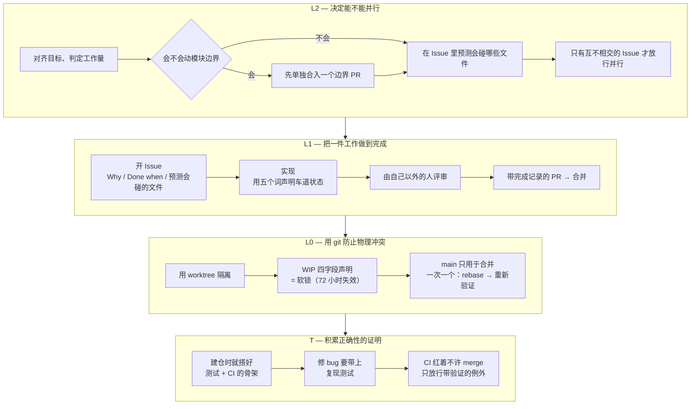
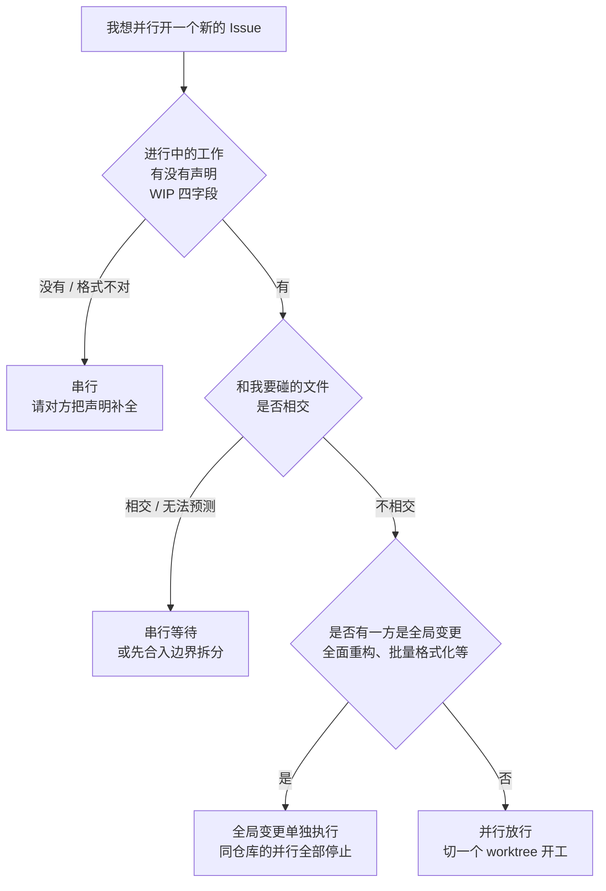

# Family Dev Handbook

<div align="center">

[🇺🇸 English](README.md) ｜ [🇯🇵 日本語（正本）](README.ja.md) ｜ **🇨🇳 简体中文** ｜ [🇹🇭 ไทย](README.th.md)


[](LICENSE)


[](https://github.com/caty-ai/family-dev-handbook/actions/workflows/test-lint.yml)

让多个 AI 智能体和多个会话并行开发同一个代码库而不发生冲突的共通规则。<br>
它要解决的是这三件事：两边同时改同一个文件把它改坏、“做完了”这句话不可信、交接的那一刻没人说得清什么已经完成。<br>
做法是把判断从人的注意力，挪到动工之前的机械判定和一道要求证据的合并关卡上。确认不了的时候就不并行，改成一次只做一件（串行）。

**无法验证，就串行。**

🔧 [规则正文 — L0 git 纪律](docs/03-git-protocol.md) ｜ 📘 [模板正本 — Issue 模板](templates/issue-template.md)

</div>
<!-- repo-state:begin (generated; do not edit) -->
<p align="center"><sub>generation: <code>22ba921</code> (2026-09-05T12:34:13Z) · verify: <a href="https://api.github.com/repos/caty-ai/family-dev-handbook/commits/main">API HEAD</a> · <a href="./status.json">status.json</a></sub></p>
<!-- repo-state:end -->

---

<a id="toc"></a>

## 目录

- [你是否也遇到过？](#problems)
- [前提](#premises)
- [你能得到什么](#what-you-get)
- [使用它需要什么](#requirements)
- [开始使用](#get-started)
- [为什么可以放心采用](#safety)
- [如何判断能否并行](#parallel-go)
- [规则全景](#rules)
- [更深入的文档](#docs)
- [Caty AI 家族](#ecosystem)
- [开发状态](#status)
- [参与贡献](#contributing)
- [致谢](#acknowledgements)
- [许可证](#license)

---

<a id="problems"></a>

## 你是否也遇到过？

当交给 AI 智能体的工作变多，比代码本身更早出问题的，往往是下面这些。

- **两个人（两个智能体）在同时改同一个文件** — 等到合并的时候才发现
- **“做完了”这句话不可信** — 没有留下任何记录说明确认了什么、确认到哪一步
- **一交接就两眼一抹黑** — 上一个会话的记忆已经不在了
- **每次都要纠结能不能并行** — 判断因人而异，每出一次事故就只是又多一条规则

这本手册的存在，就是为了用机制而不是靠注意力把这四件事堵住。

在那之前，先说清楚这本手册是从哪里出发的。

---

<a id="premises"></a>

## 前提

开始阅读之前，有三个出发点想先共享。后面所有的说明都以这三点为出发点。三者没有先后顺序——从哪一个进入，都是为了站上同一个立足点的前提。

### 从 Issue 开始

工作从**在动任何代码之前先开一个 GitHub Issue** 开始（Issue-first）。

在对话或聊天里定下来的事，会话一结束就消失了。AI 智能体每次都是从零记忆开始的，就更是如此。留下来的只有 Issue 的正文和 Pull Request 的差异，正因如此，这两样才被当作每一次交接唯一的正本。这不是在说谁健忘，而是说——**以“记忆一定会丢”为前提，事先定好一个存放的地方**。

详见 [什么是 Issue-first](docs/why-issue-first.md)。

### 把模块切小

**能不能并行，在任何人动工之前，就已经由代码的形状决定了。**

当一个巨大的文件同时承担了很多职责，那片区域里做什么都会碰到它，于是那片区域里做什么都只能串行。所以拆分不是“以后有空再整理”，而是**先做的投资**。它会还给你三样东西。

- **能并行** — 一片区域被拆开的那一刻，它的并行在结构上就安全了
- **能专注** — 要读的东西越少，智能体越能只盯着眼前这件事
- **能替换** — 像积木一样拆下一块，坏掉的那一块可以单独修好

这些你不需要自己设计。**把这本手册交给你的智能体，该拆的地方会以 Issue 的形式主动找上门来。**

详见 [为什么要把模块切小](docs/why-small-modules.md)。

### 复杂度在需求处消除，而不是在设计里

**设计卡住时，先怀疑需求，而不是去找更聪明的设计。**

大部分难度不是设计带来的，而是需求带来的。消掉一个前提，设计的难点就连同实现、测试和日后的维护一起整个消失。怀疑对智能体来说永远是自由的；**删掉需求的决定属于提出需求的人**。经过怀疑仍然接受的复杂度，在 Issue 里留一行理由。

详见 [为什么要构建得简单](docs/why-simple-systems.md)。

---

<a id="what-you-get"></a>

## 你能得到什么

问题被拆成三层，每一层用不同的方式解决。越上面的层负责**预防**事故，越下面的层负责**检出并封住**事故。而从 v0.10.0 起，三层之下又多了一块地基 — **T（测试 & CI 基准）**，让“工作怎么推进”之外，“成果物正确性的证明”也成为契约。

先把图里会出现的三个词说清楚。**车道**＝对应一个 Issue 的那条工作流。**WIP** ＝ work in progress（进行中）的声明。**软锁**＝只在声明还挂着的期间，别人不碰那些文件的约定。



- 🚦 **在动工之前就决定能不能并行**

  只有当你在动工前就能判断“两件工作要碰的文件集合互不相交”时，才允许并行。判断由三个问题决定，只要有一个答不上来，就自动倒向串行。

- 📋 **让一件工作带着证据结束**

  每个 Issue 都必须写清 Why、Done when，以及预计会碰的文件。每一次合并都必须带上完成记录：Done when 每一项的 PASS / FAIL / 带理由的 N/A、候选提交、声明与实际差异的比对，以及一位作者之外的评审者。“做完了”于是从一句话变成了一份记录。

- 🔒 **用 git 的使用方式把物理冲突封住**

  一个会话 = 一个 Issue = 一个分支 = 一个 worktree（把同一个仓库分成多个工作目录的 git 功能）。main 只用于合并。进行中的车道只在四个字段处于声明状态时才算软锁，并在 72 小时后自然失效。

- 🧪 **把成果物的正确性积累进测试和 CI**

  含代码的仓库从建仓那天起就带着 CI 骨架，修 bug 的合并要带上该 bug 的复现测试（修复前红、修复后绿）。CI 红着的时候禁止 merge — 能通过的只有满足全部验证条件的已知且无关的红。不再是“应该能跑”，而是证明在不断增加。

在问它有没有用之前，先问试一次要花多少。答案是：几乎不花什么。

---

<a id="requirements"></a>

## 使用它需要什么

这个仓库的条文只由文档组成。仓库本身没有任何程序需要安装（[templates/ci/](templates/ci/README.md) 中含有分发用的门禁模板 — YAML 与脚本 — 供复制到各仓库使用）。

| 需要的东西 | 情况 |
|---|---|
| 运行时（Node、Python 等） | 不需要 — 条文只有文档；templates/ci 含分发用的门禁模板（YAML+脚本） |
| 版本管理 | ✅ git |
| 记录工作的地方 | ✅ GitHub 的 Issue / Pull Request |
| AI 智能体 | ✅ 只要它有一个常驻加载的配置文件（`CLAUDE.md` / `AGENTS.md` / 系统提示词等），什么产品都可以 |
| 只有人、不用 AI | ✅ 可以（不使用 AI 的团队也能照用） |

它不依赖特定的智能体产品、特定的记忆基础设施、特定的工具链，因为你采用的是协议本身，而不是工具。如何管理自己这边的采用清单，写在 [docs/04](docs/04-adoption.md)。

只要这些都有了，采用就只是“粘贴”这一件事。

---

<a id="get-started"></a>

## 开始使用

所谓采用，就是把规则的摘要放进每个智能体的常驻上下文里。

`docs/` 下的页面只有日语。摘要块本来就是原样粘贴的，所以不懂日语也能采用——只是 ID 背后的条文正文是日语。

### 让 AI 帮你装

对你平时在用的智能体这样说：

```text
请打开 https://github.com/caty-ai/family-dev-handbook 里的 docs/04-adoption.md，
把其中的“分发用摘要块”粘贴到我的常驻上下文（CLAUDE.md / AGENTS.md）里。
如果那个配置文件还不存在，请创建它。
第一行的 owner 改成我的名字，last-verified 改成今天的日期。
第二行的“正本:”请填上这个仓库的 URL。
handbook-revision 的值请不要改动。
```

### 自己动手装

1. 打开 [docs/04](docs/04-adoption.md) 里的“分发用摘要块”（大约 50 行文本）
2. 整块粘贴进一个常驻加载的配置文件
3. 把第一行的 `owner` 和 `last-verified` 改成你自己和今天的日期。`handbook-revision` 原样保留
4. 把第二行的 `正本:` 改成本仓库的 URL（如果你 fork 了，就填你 fork 的地址）

要粘贴的就这些。里面只有十套 rule ID（`L2-1`–`L2-6` / `L1-1`–`L1-11` / `L0-1`–`L0-9` / `FP-1`–`FP-9` / `E-1`–`E-10` / `B-1`–`B-5` / `LC-1`–`LC-5` / `R-1`–`R-6` / `T-1`–`T-7` / `PB-1`–`PB-5`）和每一条一行的姿态，条文正文并不在里面。**正文的正本是这个仓库，摘要与正本不一致时，以正本为准。** 按自己的仓库把它改得更严格是自由的，但放宽是禁止的。

想停用的话，把粘进去的那 50 行左右删掉就回到原样。其他文件一概不碰。

仓库这一侧的准备（并行安全地图、Issue 模板、保护 main、测试运行器 + CI）写在 [docs/04](docs/04-adoption.md)。

在粘贴之前，你心里大概还有几个疙瘩。先在这里回答。

---

<a id="safety"></a>

## 为什么可以放心采用

- **不必一次全部采用** — 只上 L0（git 纪律）就已经有效。L2 和 L1 可以等运转起来之后再加
- **不必推翻现在的 Issue / PR 做法** — 要加的只是 Issue 正文里的三项，和表示车道状态的五个词（WIP / HOLD / MERGED / SUPERSEDED / ABANDONED）
- **只禁止往松的方向改** — 在自己的仓库里改严格完全自由。要守住的只有一条：不要分发比正本更松的摘要
- **它是按“智能体不会遵守”来设计的** — 不依赖体贴与记忆，放在常驻加载的位置，判定是相交或不相交的二值，确认不了就一定倒向串行

也有**不适合的用法**。

- 一个人、一个会话，永远只串行工作 — 除了 L0-4 之外基本都用不上
- 不使用 Issue / PR 的做法 — L1 的完成关卡立不起来
- 只处理零散 bug 修复的小仓库 — 上游评审（动工之前把设计交给另一个模型看一遍，L1-9）从一开始就不适用

日常使用中最常犯难的是“现在能不能并行开工”。这一个判断，就在这里说清楚。

---

<a id="parallel-go"></a>

## 如何判断能否并行

由三个问题决定。只要有一个答不上来，就不并行。



如果不管做什么每次都会相交，那就不是判定的问题，而是切分方式的问题（[为什么要把模块切小](docs/why-small-modules.md)）。

这一张图不过是 `L2-4` 这一条而已。整体的地图在后面。

---

<a id="rules"></a>

## 规则全景

规则分为十套，每一条都带着不会改变的 ID。摘要、对话、Issue，全都用这些 ID 互相指认。

| 体系 | 决定什么 | rule ID | 正文 |
|---|---|---|---|
| **L2** 里程碑循环 | 能不能并行 | `L2-1`–`L2-6` | [docs/01](docs/01-milestone-loop.md) |
| **L1** Issue 循环 | 一件工作如何走到完成 | `L1-1`–`L1-11` | [docs/02](docs/02-issue-loop.md) |
| **L0** git 纪律 | 如何防止物理冲突 | `L0-1`–`L0-9` | [docs/03](docs/03-git-protocol.md) |
| **FP** 失败时姿态 | 无法验证时倒向哪一边 | `FP-1`–`FP-9` | [docs/05](docs/05-fail-posture.md) |
| **E** Epic 车道 | 一束 Issue 如何推进 | `E-1`–`E-10` | [docs/06](docs/06-epic-lane.md) |
| **B** 委派简报 | 一次委派如何成为契约 | `B-1`–`B-5` | [docs/07](docs/07-delegation-brief.md) |
| **LC** 生命周期 | 放下的东西何时、如何退场 | `LC-1`–`LC-5` | [docs/08](docs/08-lifecycle.md) |
| **R** 拒收准则 | 接受什么、拒绝什么 | `R-1`–`R-6` | [docs/09](docs/09-rejection-rubric.md) |
| **T** 测试与 CI 基准 | 如何积累“正确”的证明 | `T-1`–`T-7` | [docs/10](docs/10-test-ci-baseline.md) |
| **PB** 公开准备 | 仓库公开靠什么把关 | `PB-1`–`PB-5` | [docs/11](docs/11-publication.md) |

其中有两条特别左右成效。一条是 **FP** 的口号“无法验证就串行。fail-open 不等于‘通过’”——它宣告的是：即便你有意选择在无法确认时放行，那也绝不能被读成“已确认”。另一条是**高风险领域的单一定义**，碰到这里的工作一定要停下来等人确认，评审席位也会增加（对外发布、计费、不可逆操作、权限边界之类都算。准确的界线请看正本）。为了不让同一个定义存在于两个地方，正本只放在 [docs/06](docs/06-epic-lane.md) 这一处。

Epic 车道（`E-1`–`E-10`）是可选的。只有在负责人批准之后才成立，在那之前一切照普通 Issue 运作。

<details>
<summary>核心契约 P1–P5（v0.1.0 引入的五根脊梁）</summary>

核心契约 P1–P5 与 PB 层（`PB-1`–`PB-5`・[docs/11](docs/11-publication.md)）是两回事。

| 契约 | 内容 | rule ID |
|---|---|---|
| **P1 WIP 锁** | WIP 只在具备 `agent / date / Files to touch / Branch` 四个字段期间算作软锁。声明之外的文件不碰，stale 为 72 小时，接手走 TAKEOVER 手续 | `L0-1`–`L0-3` |
| **P2 车道状态** | 封闭的五状态词汇。WIP 是需要声明的状态，不是默认值。不明或不合法的状态按非活跃处理，等待修复。重试次数有限，用尽不等于成功 | `L1-4`–`L1-6` |
| **P3 恢复检查** | 在恢复或接手的车道上写第一笔之前，把四点（锁 / 范围 / 分支 / Done when）的确认结果发到 Issue 上 | `L0-9` |
| **P4 失败时姿态** | 每一个带守卫的转换都要事先声明 fail-open / fail-closed。缺失一律朝权限收窄的方向倒。产出物的正文不自我批准 | `FP-1`–`FP-9` |
| **P5 完成证据关卡** | 合并必须带完成记录。Done when 每一项的 PASS / FAIL / 带理由的 N/A、证据、候选 SHA、声明与 diff 的比对、以及一位不同模型或不同智能体的评审者 | `L1-7`–`L1-8` |

这五条自那以后一直按冻结处理。

</details>

条文正文全部在 `docs/` 里。索引在这里。

---

<a id="docs"></a>

## 更深入的文档

下列文件为日文（正本）。docs/ 与 templates/ 的简体中文机器翻译镜像在 [i18n/](i18n/README.md) — 与日文不一致时，以日文为准。

| 文件 | 内容 |
|---|---|
| [docs/why-issue-first.md](docs/why-issue-first.md) | 什么是 Issue-first — 前提的说明（**不是条文**。为什么从 Issue 而不是对话开始、Issue 里写什么、什么时候不需要） |
| [docs/why-small-modules.md](docs/why-small-modules.md) | 为什么要把模块切小 — 前提的说明（**不是条文**。为什么拆分是对并行可能性的投资、“小”指的是什么、这本手册自己是怎么切的） |
| [docs/why-simple-systems.md](docs/why-simple-systems.md) | 为什么要构建得简单 — 前提的说明（**不是条文**。为什么复杂度要在需求处消除而不是在设计里、该问哪些问题、以及“怀疑是自由的，删需求的决定属于委托人”） |
| [docs/01-milestone-loop.md](docs/01-milestone-loop.md) | L2 里程碑循环 — 决定能否并行的一层（`L2-1`–`L2-6`） |
| [docs/02-issue-loop.md](docs/02-issue-loop.md) | L1 Issue 循环 — 完成、车道状态、完成证据关卡、上游异构评审（`L1-1`–`L1-11`） |
| [docs/03-git-protocol.md](docs/03-git-protocol.md) | L0 git 纪律 — WIP 锁、worktree、合并流程、恢复检查（`L0-1`–`L0-9`） |
| [docs/04-adoption.md](docs/04-adoption.md) | 采用方法 — 装到哪里、分发用摘要块、摘要的纪律 |
| [docs/05-fail-posture.md](docs/05-fail-posture.md) | 失败时姿态 — 无法验证时倒向哪一边（`FP-1`–`FP-9`） |
| [docs/06-epic-lane.md](docs/06-epic-lane.md) | Epic 车道 — 把人的确认按 Epic 打包的一层、高风险领域的单一定义（`E-1`–`E-10`） |
| [docs/07-delegation-brief.md](docs/07-delegation-brief.md) | B 委派简报 — 每次把工作交给子智能体时，提示词所承载的契约（`B-1`–`B-5`） |
| [docs/08-lifecycle.md](docs/08-lifecycle.md) | LC 工作区生命周期 — 把“退场”变成契约的层；退场条件的数值以本地设置为正本（`LC-1`–`LC-5`） |
| [docs/09-rejection-rubric.md](docs/09-rejection-rubric.md) | R 拒收准则 — 决定接受什么、拒绝什么的意图层：自动拒收的三个理由、欢迎/拒收的判断标准、前提验证、放置阶梯、把方针升格为 check（`R-1`–`R-6`） |
| [docs/10-test-ci-baseline.md](docs/10-test-ci-baseline.md) | T 测试与 CI 基准 — 初期整备、回归测试既定、简报对接、fail-closed merge、发布既定、测试输出契约、徽章与数字的诚实性。附录为非规范性的运行器速查表（`T-1`–`T-7`） |
| [docs/11-publication.md](docs/11-publication.md) | PB 公开准备 — 用正本检查清单为仓库公开把关的一层（`PB-1`–`PB-5`） |
| [templates/issue-template.md](templates/issue-template.md) | Issue 模板与全部车道评论格式（WIP / HOLD / 终结 / TAKEOVER / 恢复检查 / 完成记录） |
| [templates/epic-template.md](templates/epic-template.md) | Epic 模板与人类检查点表 |
| [templates/brief-template.md](templates/brief-template.md) | 委派简报模板（三层结构与写法要点） |
| [templates/publication-checklist.md](templates/publication-checklist.md) | 仓库公开检查清单 — A1–E4 逐项判定・步骤・证据 artifact 的正本 |
| [templates/architecture-parallel-map.md](templates/architecture-parallel-map.md) | 放进各仓库 `ARCHITECTURE.md` 的“并行安全地图”模板 |
| [templates/ci/](templates/ci/README.md) | 机器门禁模板一套 — 测试+lint / 密钥检测 / PR 体积 / 拒绝历史断裂 / 高风险人工确认门 / 报告汇总器（附部署指南） |
| [templates/conformance/](templates/conformance/README.md) | 席位决定的 31 条验证向量（抽象 ID・`L1-9` / `L1-10` / `L1-11` / `FP-7`）与成员侧的运行方法 |
| [templates/seat-resolver/](templates/seat-resolver/README.md) | 席位决定的参考实现（配置驱动・通过全部 31 条验证向量・是参考示例而非必需组件） |
| [CONTRIBUTING.md](CONTRIBUTING.md) | 参与贡献的流程（Issue-first / WIP 声明 / 完成记录的摘要） |

最后，用一句话说说这本手册从哪里来、在哪里被使用。

---

<a id="ecosystem"></a>

## Caty AI 家族

<!-- family:generated:family-footer:start -->

---

本仓库属于 **Caty AI 家族** — 用于运营 AI 智能体家族的开源工具集。完整地图（包括仍在准备公开的模块）见 [Family OS](https://github.com/caty-ai/family-os)。

| 轴 | 模块 | 做什么 | 状态 |
| --- | --- | --- | --- |
| 地图 | [Family OS](https://github.com/caty-ai/family-os) | 整个家族的地图 — 模块、状态与结构 | 已公开・MIT |
| 规则 | **Family Dev Handbook** | 开发的交通规则 — Issue、PR、worktree、交接与并行开发 | 已公开・MIT |
| 纵轴・基座 | [Caty Agent Harness](https://github.com/caty-ai/caty-agent-harness) | AI 智能体的任务基座 — 重试、检查点与完成判定 | 已公开・MIT |
| 纵轴 | [context-kit](https://github.com/caty-ai/context-kit) | 面向单个智能体的六件上下文卫生工具组 — 限制大输出、委托简报校验、安全防护、记忆检索、worktree 快照 | 已公开・MIT |
| 纵轴 | [Persona Engine](https://github.com/caty-ai/persona-engine) | 在智能体已有人格之上叠加关系与情感层 | 已公开・MIT |
| 纵轴 | [Persona Growth Loop](https://github.com/caty-ai/persona-growth-loop) | 让人格本身成长 — 以最小且幂等的提案 | 已公开・MIT |
| 纵轴 | [X Collector](https://github.com/caty-ai/x-collector) | 把 X 与网络素材汇成每日一份摘要 — 给人也给智能体 | 已公开・MIT |
| 纵轴 | [Self Growth Loop](https://github.com/caty-ai/self-growth-loop) | 让智能体自我成长的循环 — 提案、治理与采用记录 | 已公开・MIT |
| 横轴・基座 | [Family Memory Architecture](https://github.com/caty-ai/family-memory-architecture) | 记忆总线 — 家族共享所知的一层 | 已公开・MIT |
| 横轴 | [Sitter](https://github.com/caty-ai/sitter) | 替你盯着委派出去的智能体 — 监视、留证、仅在声明范围内重启 | 已公开・MIT |
| 横轴 | [Alpha Nightshift](https://github.com/caty-ai/alpha-nightshift) | 夜间自主维护循环 — 在默认拒绝的防护边界内运行夜间通道，早晨由人工挑选合并 | 已公开・MIT |

<!-- family:generated:family-footer:end -->

这本手册本身是自洽的。不需要外部服务，不需要姊妹仓库，也不需要特定的记忆基础设施。需要的只有 git、Issue / PR，以及愿意守规则的主体。表中的每个仓库也一样，都能单独使用——组合是可选的，只用其中一个也完全成立。

跨智能体的一般规范（例如 fail-posture 适用到哪里）归 family-os 那一侧所有，**这本手册只负责人与智能体的协作协议——条文，以及帮助执行条文的分发用模板（templates/）**。一般规范不会在这里新设。

下面是现状与接下来的方向。

---

<a id="status"></a>

## 开发状态

当前版本是 **v0.18.0**（2026-08-21）。新增为仓库公开设门的 **PB 层**（`PB-1`〜`PB-5`・[docs/11](docs/11-publication.md)）及其正本检查清单（[templates/publication-checklist.md](templates/publication-checklist.md)・A1〜E4 共28项）（[#109](https://github.com/caty-ai/family-dev-handbook/issues/109)；盘点与 owner 决裁见 [#100](https://github.com/caty-ai/family-dev-handbook/issues/100)）。公开车道以逐项 PASS / FAIL / 带理由 N/A 表与证据 artifact 写完成记录，只要仍有 FAIL 或无法验证的项目就不公开（fail-closed）。(c) 项目仅凭 owner 发行的记录通过（3种发行者要件；绝对不能靠自我申报通过）。两项 owner 决裁已写入条文与清单：超大 vendored 正本文件的 `size-exempt` 标签唯一宣言形（D7），以及公开前全历史 secret 扫描的 must-pass 化（C1——在机制建成前以手动扫描 + transcript 充足）。层 ID 采用 `PB` 以避免与冻结的核心契约 P1〜P5 冲突（设计评审3席的收敛 finding）。PB-5 为限时试点条款，在指定的第1、第2消费者车道的缺口回流反映到正本后失效。

- **v0.17.0**（2026-08-21） — 新增用于机器强制执行 `T-5` 发布履行的层（[#103](https://github.com/caty-ai/family-dev-handbook/issues/103)）。① **release-sync 载体**（[templates/ci/](templates/ci/README.md)・reusable 为纯 API 实现＝无 checkout）— 推送 annotated SemVer 的 `v*` 标签即自动创建 GitHub Release（notes＝标签消息；lightweight／非 SemVer／空消息标签为红；豁免仅来自 default branch 上的 `.github/release-sync-ignore`，被标签的树无法自我豁免）。② **漂移审计**（`templates/ci/check-release-drift.sh`）— 仅通过 API 检测并报告标签与 Releases 的偏离（仅检测、不自动删除；状态不可读时以 exit 2 结束且不输出任何 findings）。③ **条文跟进** — tag URL 义务现在**包含 Release 的实际存在**才算履行（[docs/10](docs/10-test-ci-baseline.md) `T-5`；裸标签的 `/releases/tag/<名称>` URL 也返回 200，URL 的存在不代表 Release 的存在）。record-vs-reality 的 PR-side check 与定期扫描在 [#106](https://github.com/caty-ai/family-dev-handbook/issues/106) 中跟踪。

- **v0.16.0**（2026-08-19） — 新增两条条文，用于封闭测试与状态展示中的诚实性缺口（[#81](https://github.com/caty-ai/family-dev-handbook/issues/81)）。① **测试输出契约**（`T-6`・[docs/10](docs/10-test-ci-baseline.md)）— 家族编写的运行器须动态输出 `suites: declared=N executed=M skipped=K` 三字段摘要，并以 `declared = executed + skipped` 为不变条件。exit code 采用闭合集；必需依赖缺失时输出 `missing-dep:` 并以 127 退出；即使异常退出也必须输出摘要。SKIP 率超过 20% 即为红；如调整上限，须按 LC-3 型在本地保存数值并记录理由。只有 CI 对账 gate 开启后，才算完成采用。② **展示契约**（`T-7`・[docs/10](docs/10-test-ci-baseline.md)）— 只有机器涂出的结果才能是绿色。带 README 的公开仓库必须展示绑定 T-1 测试 workflow 的 live badge，或灰色的 `CI: not yet`；静态颜色只允许闭合列举中的 `lightgrey` / `blue`。Project status 的标准形式直接写入条文，实测数字必须附 run URL 和实测日期。设计起点为 consistency campaign W0-4 与 family-os#56，并经 3 席设计评审冻结。

- **v0.15.0**（2026-08-18） — 条文修订4点（[#75](https://github.com/caty-ai/family-dev-handbook/issues/75)・来自 grok-build 运行时解析5席交叉评审的反馈）。① **禁止后续轮次的 ratchet**（`L1-3`・[docs/02](docs/02-issue-loop.md)）— 从第2轮开始，能新增 blocking 的仅限已证实的缺陷或尚未满足的门槛标准。这是一条狭窄的条款，用来阻止"评审轮次越往后，新的偏好就变成后补 blocking，导致车道永远无法终结"的 ratchet churn。② **意见的引用要求**（`R-4`・[docs/09](docs/09-rejection-rubric.md)）— 指不出 path:line 或无法引用执行日志的意见不能被标记为 blocking（作为 non-blocking 的担忧提出是自由的）。这是①在其上叠加实证要求的引用水位「地板」的明文化（两层约束，并非同一水位）。③ **B-4 新增理由一句**（[docs/07](docs/07-delegation-brief.md)）— 因为确实存在常设 instruction 文件在委托边界处不被读取而失效的 runtime，所以需要的规约要写进简报正文内联。④ **触碰 git 的自动化卫生一句**（`L0-7`・[docs/03](docs/03-git-protocol.md)）— identity / config 每次都要通过 env 显式指定，不读取也不写入用户的 git 状态。

- **v0.14.1**（2026-08-16） — 条文没有修订——本次订正的是 README（4 种语言）中 v0.12.0 版本历史与 `T-5` 条文不一致之处。未履行的车道（已宣告 `vX.Y.Z` 却没有切 tag 的车道）是「**不会终结，会以 WIP 状态留存**」并挂在 stale 时钟上，而不是按非活跃处理（按非活跃处理的是**缺少 tag URL 的 MERGED**）。同一段中把 `N/A` 的闭合列举写成「3 种类型」，也一并改为 **4 种类型**（含 v0.12.0 加入的 Epic 子→epic）。条文（[docs/10](docs/10-test-ci-baseline.md)）、i18n 镜像与 [docs/04](docs/04-adoption.md) 的摘要一直是正确的，只有 README 被落下了——这正是「摘要层与正本不一致时以正本为准、让摘要跟随」的自我适用（[#73](https://github.com/caty-ai/family-dev-handbook/issues/73)）。

- **v0.14.0**（2026-08-16） — 条文没有修订，新增的是席位决定的**参考实现**（[templates/seat-resolver/](templates/seat-resolver/README.md)）——一个**通过 v0.13.0 全部 31 条验证向量**、由配置驱动的选席程序。规则表、模型词汇、系统（lineage）、风险领域与 writer 全部来自配置，因此各团队可以替换成自己的构成（代码与配置示例中都不含实名模型 ID）。它是**参考示例而非必需组件**——条文并不要求它，想用的团队才用。并且请保持**每个团队只有一份选席实现**：把同一机制复制到多个仓库会让权限与修订分裂。家族之间共享的不是实现，而是对 [templates/conformance/](templates/conformance/README.md) 的符合性（[#71](https://github.com/caty-ai/family-dev-handbook/issues/71)）。

- **v0.13.0**（2026-08-15）——条文没有修订，新增的是席位决定的**验证向量**（[templates/conformance/](templates/conformance/README.md)）。这是 31 条用例，可让各团队的选席程序**以与实现无关的方式自我评分**：对照 `L1-9` 的席位数、`L1-10` 的异种与系统（lineage）、`L1-11` 的席数标度以及 FP-7。向量不含实名模型 ID（只用抽象 ID），与条文冲突时以条文为准（向量是导出物）。选席程序无法表达的用例计为 FAIL 而非 skip（fail-closed）；版本变更时新增文件并保留旧版（采用记录指向具体版本）（[#63](https://github.com/caty-ai/family-dev-handbook/issues/63)）。

- **v0.12.0**（2026-08-15） — 新增了发布既定条文（`T-5`・[docs/10](docs/10-test-ci-baseline.md)）。此前 release tag 只靠「在稳定点打 git tag」这一句话来维系，忘了打也不会触发任何提示，一旦会话切换就会在结构上被遗忘（这种情况被反复观测到）。T-5 采用的思路不是「设法让人记住」，而是「**忘记的话，完成记录（[L1-7](docs/02-issue-loop.md)）就无法通过**」——在所有完成记录中都设置 **release 栏**（三个词汇之一：`vX.Y.Z` 宣告 / `deferred`（理由 + 带退场触发条件的 Issue） / `N/A`（闭合的 4 种类型理由）），**出货级变更**（改变用户会用到的行为・公开 API・发布物・用户须遵循的规范的 merge）不得选择 `N/A`（拿不准就按出货级处理）。为了不让宣告就此止步，还规定**只有在 MERGED 带有已切 tag 的 URL 时车道才会终结**——未履行的车道**不会终结，会以 WIP 状态留存**，因此会挂在 stale 时钟（`L0-3`）上，即便该仓库之后没有新车道进来，忘打 tag 的问题也依旧可见（缺少 tag URL 的 MERGED 属于**不合法格式**，终结不成立，按 `L1-4` 的非活跃处理）。deferred 被放在会重新浮现的位置（带触发条件的 Issue）上，若连续出现两次，第三次出货级 merge 就必须打 tag（与 `R-6` 同型的升级机制，次数可以通过完成记录中的 `previous release` 事后核验）。执行强度在所有仓库中一致——没有出货级变更的仓库会自然落在 N/A 上，因此私有 scratch 仓库不会有实质负担（[#64](https://github.com/caty-ai/family-dev-handbook/issues/64)）。

- **v0.11.0**（2026-08-15） — 评审席条文的两项修订（`L1-10` / `L1-11`・[docs/02](docs/02-issue-loop.md)）。其一，**S / M 的席位下限从异种 2 席提高到异种 3 席**——生效**按成员（团队）逐个进行**：生效数据由各团队的手册正本仓库（fork 的情况下为 fork 侧）中每团队一条的 pinned Issue 持有，未到生效日的团队按旧下限 2 席即为合规（施行间隙因此是“日程”而不是“违规”——没有 3 字段 pinned Issue 的团队不得主张“生效前”状态），并明文规定 SEAT-WAIT 只适用于车道。其二，**实名目录条款与 correlated-seats**——家族共享的实名模型目录属于数据层，放在手册之外，且为非规范：目录既不能把法所禁止的席位合法化，也不能让成员无法确认存活的模型变为可用。关于席位的系统（lineage），机器选择的路径（抽签・替补）必须两两异系或有记录在案的例外；owner 点名固定的面板中出现同系席位，仅在有记录的 correlated-seats 标志时合法。出发点是 MoA 家族整体化设计——经过 7 席 ×2 轮设计评审与 3 席 delta 确认后的 v2.1 条文化（[#45](https://github.com/caty-ai/family-dev-handbook/issues/45) / [#57](https://github.com/caty-ai/family-dev-handbook/issues/57)）

- **v0.10.0**（2026-08-14） — 测试与 CI 基准层（`T-1`–`T-4`・[docs/10](docs/10-test-ci-baseline.md)）。包含代码的新仓库在创建时整备测试运行器 + CI・尺寸 M / L / H 的 bug 修复默认同梱复现测试・委托简报把“新增/变更的测试及其运行结果”列为标准项目・禁止在 CI 红的状态下 merge（例外仅限满足 4 条件的已知无关的红）。出发点是 [caty-ai/x-collector#9](https://github.com/caty-ai/x-collector/issues/9)
- **v0.9.2**（2026-08-11） — 机器门禁模板（[templates/ci/](templates/ci/README.md)）的强化改版。把首次落地（3 个仓库）实测反馈回来的 3 个“悄悄变绿”缺陷用模板层面堵上了（新增常设分类 `RISK_PATHS_AUTH`・`none` 声明的大小写强化与声明行健全性检查・把落地验证的坑点补写进 README）。经过 4 轮多席评审（3 席全部 GO），已同步到已落地的仓库
- **v0.9.1**（2026-08-10・未打 tag・仅模板层面的改版） — 新增常设分类 `RISK_PATHS_GATES`，并把 Makefile / `scripts/ci/**` 加入默认网（来自 v0.9.0 落地验证的反馈）

- **v0.9.0**（2026-08-10） — 新增了机器门禁模板一套（[templates/ci/](templates/ci/README.md)）——测试+lint / 密钥检测 / PR 体积上限 / 拒绝历史断裂 / 高风险人工确认门 / 报告汇总器共六道门禁，复制进仓库即可使用的 standalone 型。所有门禁在无法验证或未配置时一律变红（fail-closed），批准与 head SHA 绑定。设计上部分参考了 [Hermes Agent](https://github.com/NousResearch/hermes-agent)（MIT — 见[致谢](#acknowledgements)）。

- **v0.8.0**（2026-08-09） — 拒收准则层（`R-1`–`R-6`，[docs/09](docs/09-rejection-rubric.md)）——相对于规定“怎么推进”的 L 层，这是规定“接受什么、拒绝什么”的意图层。不经人判断就关闭提案，只允许三个机械上黑白分明的理由；一切价值判断都由 owner 专属决定。它还把欢迎的贡献六条、做得再好也要拒收的七条、前提验证的四个模式、放置阶梯六级、以及“被破坏的方针升格为 check”写成了条文（部分参考了 [Hermes Agent](https://github.com/NousResearch/hermes-agent) 的 Contribution Rubric，MIT）。

- **v0.7.1**（2026-08-07） — 措辞跟进：把上游评审（`L1-9`，[docs/02](docs/02-issue-loop.md)）的适用对象列举对齐到尺寸体系（L / H / Epic = 重的一侧）
- **v0.7.0**（2026-08-07） — 尺寸判别标准（`L2-1` 扩展，[docs/01](docs/01-milestone-loop.md)）：定义表加三条轴，拿不准就往重的一侧靠
- **v0.6.0**（2026-08-07） — 工作区生命周期层（`LC-1`–`LC-5`，[docs/08](docs/08-lifecycle.md)）：把退场变成契约（退场触发器、检查只告警、退场条件数值以本地设置为正本）
- **v0.5.0**（2026-08-06） — 委派简报层（`B-1`–`B-5`，[docs/07](docs/07-delegation-brief.md)）：把工作交给子智能体的提示词，成为“实现规格、自我检查、评审标准”三层的契约（样式见 [templates/brief-template.md](templates/brief-template.md)）
- **v0.4.0**（2026-08-05） — 第三个前提“构建得简单——复杂度在需求处消除”（[docs/why-simple-systems.md](docs/why-simple-systems.md)），以及 L2-1 的怀疑需求钩子（删需求的决定属于委托人）
- **v0.3.0**（2026-07-31） — Epic 车道（`E-1`–`E-10`），以及在实现动工之前的上游异构评审（`L1-9`–`L1-11`）
- **v0.2.1 / v0.2.0**（2026-07-22） — 整备 MIT 许可证与 community health files，去掉家族特有描述的通用化
- **v0.1.0 / v0.1.1**（2026-07-21） — 把规则从散文变成契约。稳定的 rule ID、封闭的五状态词汇、带证据的合并关卡、事先声明的失败时姿态

接下来的计划以 [Issue 列表](https://github.com/caty-ai/family-dev-handbook/issues)为正本。README 不做第二份管理。

提案的入口，也建立在同一套规则之上。

## Project status

[](https://github.com/caty-ai/family-dev-handbook/actions/workflows/test-lint.yml)

- CI: 本地 caller 会运行包含 Test + Lint 在内的 reusable `@ci-v1` 套件（五个关卡），并已启用 suite-count 对账。若要在本地运行与 CI 相同的入口，请使用 `make test` 和 `make lint`。
- 検証済み環境: CI 会运行 `ubuntu-latest` 与 `macos-latest`，本地开发也使用 macOS。WSL2 同样在支持范围内 — 它运行的正是 `ubuntu-latest` 通道所验证的同一条 GNU 路径（请把仓库 clone 到 Linux 文件系统内，而不是 `/mnt/c` 下）。
- maturity: `stable` — 规范性正本。
- 既知の制約: 条文均为纯文档。`templates/` 以样例形式附带供采用方复制到自己 CI 的范本（门禁模板，YAML+Python），`scripts/` 则是本仓库自身使用的检查脚本；四种语言 README 镜像的相对链接与锚点由 CI 中的 `make lint` 检查。

---

<a id="contributing"></a>

## 参与贡献

- 变更提案请在本仓库开 Issue、提 PR，并在经过不同模型或不同智能体的评审之后再合并（禁止自我批准）
- **这本手册自己就是按这个流程更新的** — WIP 四字段声明 → worktree → 跨模型评审 → 带完成记录的 PR。条文的新增与修订，全都走过这条路
- 详细流程见 [CONTRIBUTING.md](CONTRIBUTING.md)

在许可证之前，向这套做法的参考来源道一声谢。

---

<a id="acknowledgements"></a>

## 致谢

- [Hermes Agent](https://github.com/NousResearch/hermes-agent)（Nous Research・MIT） — 一个开源的自主智能体框架。它的贡献接受准则（Contribution Rubric）与 CI 门禁结构给了我们很多启发，R 拒收准则层（docs/09）和 templates/ci 的设计部分参考了它。templates/ci 中含有来自该项目的文件（改编 2 个、原样复制 1 个）——逐文件的来源记录在 [templates/ci/NOTICE.md](templates/ci/NOTICE.md)。

使用条件，做成了最宽松的形式。

---

<a id="license"></a>

## 许可证

[MIT](LICENSE) © 2026 Sho Jikumaru

规则只有传播开来才有意义，所以采用了可以自由修改与再分发的 MIT。设想中的用法就是 fork 之后按自己团队的情况改得更严格。

`docs/` 下的文档是用日语写的，这份简体中文 README 是翻译版。两者不一致时，以日语原文为准。

<div align="center">

**条文只有文档** ｜ **无需运行时** ｜ **只靠 git 和 Issue / PR 就能运转**

</div>
