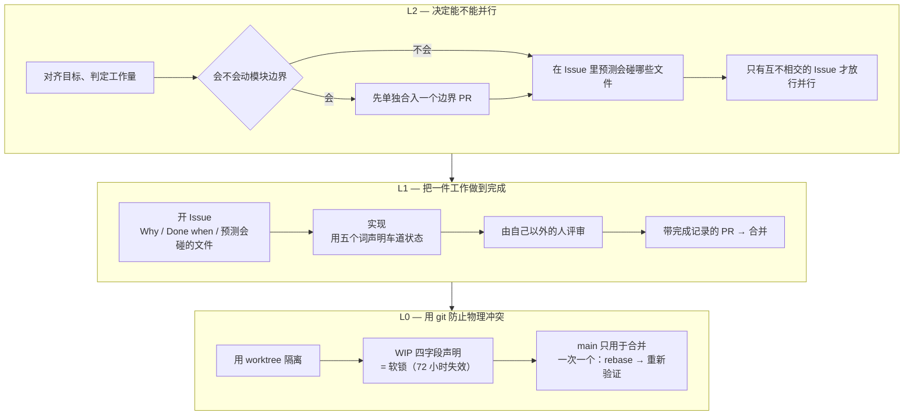
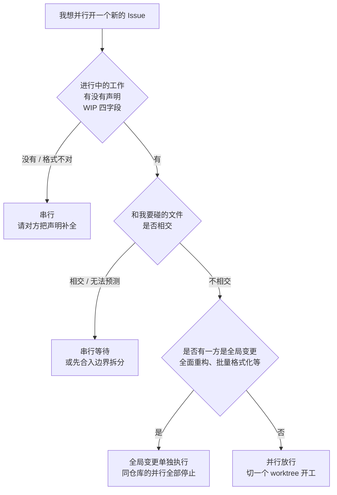

# Family Dev Handbook

<div align="center">

[🇺🇸 English](README.md) ｜ [🇯🇵 日本語（正本）](README.ja.md) ｜ **🇨🇳 简体中文** ｜ [🇹🇭 ไทย](README.th.md)


[](LICENSE)


让多个 AI 智能体和多个会话并行开发同一个代码库而不发生冲突的共通规则。<br>
它要解决的是这三件事：两边同时改同一个文件把它改坏、“做完了”这句话不可信、交接的那一刻没人说得清什么已经完成。<br>
做法是把判断从人的注意力，挪到动工之前的机械判定和一道要求证据的合并关卡上。确认不了的时候就不并行，改成一次只做一件（串行）。

**无法验证，就串行。**

🔧 [规则正文 — L0 git 纪律](docs/03-git-protocol.md) ｜ 📘 [模板正本 — Issue 模板](templates/issue-template.md)

</div>

---

<a id="toc"></a>

## 目录

- [你是否也遇到过？](#problems)
- [前提](#premises)
- [你能得到什么](#what-you-get)
- [使用它需要什么](#requirements)
- [开始使用](#get-started)
- [为什么可以放心采用](#safety)
- [如何判断能否并行](#parallel-go)
- [规则全景](#rules)
- [更深入的文档](#docs)
- [Caty AI 家族](#ecosystem)
- [开发状态](#status)
- [参与贡献](#contributing)
- [许可证](#license)

---

<a id="problems"></a>

## 你是否也遇到过？

当交给 AI 智能体的工作变多，比代码本身更早出问题的，往往是下面这些。

- **两个人（两个智能体）在同时改同一个文件** — 等到合并的时候才发现
- **“做完了”这句话不可信** — 没有留下任何记录说明确认了什么、确认到哪一步
- **一交接就两眼一抹黑** — 上一个会话的记忆已经不在了
- **每次都要纠结能不能并行** — 判断因人而异，每出一次事故就只是又多一条规则

这本手册的存在，就是为了用机制而不是靠注意力把这四件事堵住。

在那之前，先说清楚这本手册是从哪里出发的。

---

<a id="premises"></a>

## 前提

开始阅读之前，有三个出发点想先共享。后面所有的说明都以这三点为出发点。三者没有先后顺序——从哪一个进入，都是为了站上同一个立足点的前提。

### 从 Issue 开始

工作从**在动任何代码之前先开一个 GitHub Issue** 开始（Issue-first）。

在对话或聊天里定下来的事，会话一结束就消失了。AI 智能体每次都是从零记忆开始的，就更是如此。留下来的只有 Issue 的正文和 Pull Request 的差异，正因如此，这两样才被当作每一次交接唯一的正本。这不是在说谁健忘，而是说——**以“记忆一定会丢”为前提，事先定好一个存放的地方**。

详见 [什么是 Issue-first](docs/why-issue-first.md)。

### 把模块切小

**能不能并行，在任何人动工之前，就已经由代码的形状决定了。**

当一个巨大的文件同时承担了很多职责，那片区域里做什么都会碰到它，于是那片区域里做什么都只能串行。所以拆分不是“以后有空再整理”，而是**先做的投资**。它会还给你三样东西。

- **能并行** — 一片区域被拆开的那一刻，它的并行在结构上就安全了
- **能专注** — 要读的东西越少，智能体越能只盯着眼前这件事
- **能替换** — 像积木一样拆下一块，坏掉的那一块可以单独修好

这些你不需要自己设计。**把这本手册交给你的智能体，该拆的地方会以 Issue 的形式主动找上门来。**

详见 [为什么要把模块切小](docs/why-small-modules.md)。

### 复杂度在需求处消除，而不是在设计里

**设计卡住时，先怀疑需求，而不是去找更聪明的设计。**

大部分难度不是设计带来的，而是需求带来的。消掉一个前提，设计的难点就连同实现、测试和日后的维护一起整个消失。怀疑对智能体来说永远是自由的；**删掉需求的决定属于提出需求的人**。经过怀疑仍然接受的复杂度，在 Issue 里留一行理由。

详见 [为什么要构建得简单](docs/why-simple-systems.md)。

---

<a id="what-you-get"></a>

## 你能得到什么

问题被拆成三层，每一层用不同的方式解决。越上面的层负责**预防**事故，越下面的层负责**检出并封住**事故。

先把图里会出现的三个词说清楚。**车道**＝对应一个 Issue 的那条工作流。**WIP** ＝ work in progress（进行中）的声明。**软锁**＝只在声明还挂着的期间，别人不碰那些文件的约定。



- 🚦 **在动工之前就决定能不能并行**

  只有当你在动工前就能判断“两件工作要碰的文件集合互不相交”时，才允许并行。判断由三个问题决定，只要有一个答不上来，就自动倒向串行。

- 📋 **让一件工作带着证据结束**

  每个 Issue 都必须写清 Why、Done when，以及预计会碰的文件。每一次合并都必须带上完成记录：Done when 每一项的 PASS / FAIL / 带理由的 N/A、候选提交、声明与实际差异的比对，以及一位作者之外的评审者。“做完了”于是从一句话变成了一份记录。

- 🔒 **用 git 的使用方式把物理冲突封住**

  一个会话 = 一个 Issue = 一个分支 = 一个 worktree（把同一个仓库分成多个工作目录的 git 功能）。main 只用于合并。进行中的车道只在四个字段处于声明状态时才算软锁，并在 72 小时后自然失效。

在问它有没有用之前，先问试一次要花多少。答案是：几乎不花什么。

---

<a id="requirements"></a>

## 使用它需要什么

这个仓库只由文档组成。没有任何程序需要安装。

| 需要的东西 | 情况 |
|---|---|
| 运行时（Node、Python 等） | 不需要 — 只有文档，无需安装 |
| 版本管理 | ✅ git |
| 记录工作的地方 | ✅ GitHub 的 Issue / Pull Request |
| AI 智能体 | ✅ 只要它有一个常驻加载的配置文件（`CLAUDE.md` / `AGENTS.md` / 系统提示词等），什么产品都可以 |
| 只有人、不用 AI | ✅ 可以（不使用 AI 的团队也能照用） |

它不依赖特定的智能体产品、特定的记忆基础设施、特定的工具链，因为你采用的是协议本身，而不是工具。如何管理自己这边的采用清单，写在 [docs/04](docs/04-adoption.md)。

只要这些都有了，采用就只是“粘贴”这一件事。

---

<a id="get-started"></a>

## 开始使用

所谓采用，就是把规则的摘要放进每个智能体的常驻上下文里。

`docs/` 下的页面只有日语。摘要块本来就是原样粘贴的，所以不懂日语也能采用——只是 ID 背后的条文正文是日语。

### 让 AI 帮你装

对你平时在用的智能体这样说：

```text
请打开 https://github.com/caty-ai/family-dev-handbook 里的 docs/04-adoption.md，
把其中的“分发用摘要块”粘贴到我的常驻上下文（CLAUDE.md / AGENTS.md）里。
如果那个配置文件还不存在，请创建它。
第一行的 owner 改成我的名字，last-verified 改成今天的日期。
第二行的“正本:”请填上这个仓库的 URL。
handbook-revision 的值请不要改动。
```

### 自己动手装

1. 打开 [docs/04](docs/04-adoption.md) 里的“分发用摘要块”（大约 50 行文本）
2. 整块粘贴进一个常驻加载的配置文件
3. 把第一行的 `owner` 和 `last-verified` 改成你自己和今天的日期。`handbook-revision` 原样保留
4. 把第二行的 `正本:` 改成本仓库的 URL（如果你 fork 了，就填你 fork 的地址）

要粘贴的就这些。里面只有八套 rule ID（`L2-1`–`L2-6` / `L1-1`–`L1-11` / `L0-1`–`L0-9` / `FP-1`–`FP-9` / `E-1`–`E-10` / `B-1`–`B-5` / `LC-1`–`LC-5` / `R-1`–`R-6`）和每一条一行的姿态，条文正文并不在里面。**正文的正本是这个仓库，摘要与正本不一致时，以正本为准。** 按自己的仓库把它改得更严格是自由的，但放宽是禁止的。

想停用的话，把粘进去的那 50 来行删掉就回到原样。其他文件一概不碰。

仓库这一侧的准备（并行安全地图、Issue 模板、保护 main）写在 [docs/04](docs/04-adoption.md)。

在粘贴之前，你心里大概还有几个疙瘩。先在这里回答。

---

<a id="safety"></a>

## 为什么可以放心采用

- **不必一次全部采用** — 只上 L0（git 纪律）就已经有效。L2 和 L1 可以等运转起来之后再加
- **不必推翻现在的 Issue / PR 做法** — 要加的只是 Issue 正文里的三项，和表示车道状态的五个词（WIP / HOLD / MERGED / SUPERSEDED / ABANDONED）
- **只禁止往松的方向改** — 在自己的仓库里改严格完全自由。要守住的只有一条：不要分发比正本更松的摘要
- **它是按“智能体不会遵守”来设计的** — 不依赖体贴与记忆，放在常驻加载的位置，判定是相交或不相交的二值，确认不了就一定倒向串行

也有**不适合的用法**。

- 一个人、一个会话，永远只串行工作 — 除了 L0-4 之外基本都用不上
- 不使用 Issue / PR 的做法 — L1 的完成关卡立不起来
- 只处理零散 bug 修复的小仓库 — 上游评审（动工之前把设计交给另一个模型看一遍，L1-9）从一开始就不适用

日常使用中最常犯难的是“现在能不能并行开工”。这一个判断，就在这里说清楚。

---

<a id="parallel-go"></a>

## 如何判断能否并行

由三个问题决定。只要有一个答不上来，就不并行。



如果不管做什么每次都会相交，那就不是判定的问题，而是切分方式的问题（[为什么要把模块切小](docs/why-small-modules.md)）。

这一张图不过是 `L2-4` 这一条而已。整体的地图在后面。

---

<a id="rules"></a>

## 规则全景

规则分为八套，每一条都带着不会改变的 ID。摘要、对话、Issue，全都用这些 ID 互相指认。

| 体系 | 决定什么 | rule ID | 正文 |
|---|---|---|---|
| **L2** 里程碑循环 | 能不能并行 | `L2-1`–`L2-6` | [docs/01](docs/01-milestone-loop.md) |
| **L1** Issue 循环 | 一件工作如何走到完成 | `L1-1`–`L1-11` | [docs/02](docs/02-issue-loop.md) |
| **L0** git 纪律 | 如何防止物理冲突 | `L0-1`–`L0-9` | [docs/03](docs/03-git-protocol.md) |
| **FP** 失败时姿态 | 无法验证时倒向哪一边 | `FP-1`–`FP-9` | [docs/05](docs/05-fail-posture.md) |
| **E** Epic 车道 | 一束 Issue 如何推进 | `E-1`–`E-10` | [docs/06](docs/06-epic-lane.md) |
| **B** 委派简报 | 一次委派如何成为契约 | `B-1`–`B-5` | [docs/07](docs/07-delegation-brief.md) |
| **LC** 生命周期 | 放下的东西何时、如何退场 | `LC-1`–`LC-5` | [docs/08](docs/08-lifecycle.md) |
| **R** 拒收准则 | 接受什么、拒绝什么 | `R-1`–`R-6` | [docs/09](docs/09-rejection-rubric.md) |

其中有两条特别左右成效。一条是 **FP** 的口号“无法验证就串行。fail-open 不等于‘通过’”——它宣告的是：即便你有意选择在无法确认时放行，那也绝不能被读成“已确认”。另一条是**高风险领域的单一定义**，碰到这里的工作一定要停下来等人确认，评审席位也会增加（对外发布、计费、不可逆操作、权限边界之类都算。准确的界线请看正本）。为了不让同一个定义存在于两个地方，正本只放在 [docs/06](docs/06-epic-lane.md) 这一处。

Epic 车道（`E-1`–`E-10`）是可选的。只有在负责人批准之后才成立，在那之前一切照普通 Issue 运作。

<details>
<summary>核心契约 P1–P5（v0.1.0 引入的五根脊梁）</summary>

| 契约 | 内容 | rule ID |
|---|---|---|
| **P1 WIP 锁** | WIP 只在具备 `agent / date / Files to touch / Branch` 四个字段期间算作软锁。声明之外的文件不碰，stale 为 72 小时，接手走 TAKEOVER 手续 | `L0-1`–`L0-3` |
| **P2 车道状态** | 封闭的五状态词汇。WIP 是需要声明的状态，不是默认值。不明或不合法的状态按非活跃处理，等待修复。重试次数有限，用尽不等于成功 | `L1-4`–`L1-6` |
| **P3 恢复检查** | 在恢复或接手的车道上写第一笔之前，把四点（锁 / 范围 / 分支 / Done when）的确认结果发到 Issue 上 | `L0-9` |
| **P4 失败时姿态** | 每一个带守卫的转换都要事先声明 fail-open / fail-closed。缺失一律朝权限收窄的方向倒。产出物的正文不自我批准 | `FP-1`–`FP-9` |
| **P5 完成证据关卡** | 合并必须带完成记录。Done when 每一项的 PASS / FAIL / 带理由的 N/A、证据、候选 SHA、声明与 diff 的比对、以及一位不同模型或不同智能体的评审者 | `L1-7`–`L1-8` |

这五条自那以后一直按冻结处理。

</details>

条文正文全部在 `docs/` 里。索引在这里。

---

<a id="docs"></a>

## 更深入的文档

下列文件为日文（正本）。docs/ 与 templates/ 的简体中文机器翻译镜像在 [i18n/zh/](i18n/zh/) — 与日文不一致时，以日文为准。

| 文件 | 内容 |
|---|---|
| [docs/why-issue-first.md](docs/why-issue-first.md) | 什么是 Issue-first — 前提的说明（**不是条文**。为什么从 Issue 而不是对话开始、Issue 里写什么、什么时候不需要） |
| [docs/why-small-modules.md](docs/why-small-modules.md) | 为什么要把模块切小 — 前提的说明（**不是条文**。为什么拆分是对并行可能性的投资、“小”指的是什么、这本手册自己是怎么切的） |
| [docs/why-simple-systems.md](docs/why-simple-systems.md) | 为什么要构建得简单 — 前提的说明（**不是条文**。为什么复杂度要在需求处消除而不是在设计里、该问哪些问题、以及“怀疑是自由的，删需求的决定属于委托人”） |
| [docs/01-milestone-loop.md](docs/01-milestone-loop.md) | L2 里程碑循环 — 决定能否并行的一层（`L2-1`–`L2-6`） |
| [docs/02-issue-loop.md](docs/02-issue-loop.md) | L1 Issue 循环 — 完成、车道状态、完成证据关卡、上游异构评审（`L1-1`–`L1-11`） |
| [docs/03-git-protocol.md](docs/03-git-protocol.md) | L0 git 纪律 — WIP 锁、worktree、合并流程、恢复检查（`L0-1`–`L0-9`） |
| [docs/04-adoption.md](docs/04-adoption.md) | 采用方法 — 装到哪里、分发用摘要块、摘要的纪律 |
| [docs/05-fail-posture.md](docs/05-fail-posture.md) | 失败时姿态 — 无法验证时倒向哪一边（`FP-1`–`FP-9`） |
| [docs/06-epic-lane.md](docs/06-epic-lane.md) | Epic 车道 — 把人的确认按 Epic 打包的一层、高风险领域的单一定义（`E-1`–`E-10`） |
| [docs/07-delegation-brief.md](docs/07-delegation-brief.md) | B 委派简报 — 每次把工作交给子智能体时，提示词所承载的契约（`B-1`–`B-5`） |
| [docs/08-lifecycle.md](docs/08-lifecycle.md) | LC 工作区生命周期 — 把“退场”变成契约的层；退场条件的数值以本地设置为正本（`LC-1`–`LC-5`） |
| [docs/09-rejection-rubric.md](docs/09-rejection-rubric.md) | R 拒收准则 — 决定接受什么、拒绝什么的意图层：自动拒收的三个理由、欢迎/拒收的判断标准、前提验证、放置阶梯、把方针升格为 check（`R-1`–`R-6`） |
| [templates/issue-template.md](templates/issue-template.md) | Issue 模板与全部车道评论格式（WIP / HOLD / 终结 / TAKEOVER / 恢复检查 / 完成记录） |
| [templates/epic-template.md](templates/epic-template.md) | Epic 模板与人类检查点表 |
| [templates/brief-template.md](templates/brief-template.md) | 委派简报模板（三层结构与写法要点） |
| [templates/architecture-parallel-map.md](templates/architecture-parallel-map.md) | 放进各仓库 `ARCHITECTURE.md` 的“并行安全地图”模板 |
| [CONTRIBUTING.md](CONTRIBUTING.md) | 参与贡献的流程（Issue-first / WIP 声明 / 完成记录的摘要） |

最后，用一句话说说这本手册从哪里来、在哪里被使用。

---

<a id="ecosystem"></a>

## Caty AI 家族

<!-- family:generated:family-footer:start -->

---

本仓库属于 **Caty AI 家族** — 用于运营 AI 智能体家族的开源工具集。完整地图（包括仍在准备公开的模块）见 [Family OS](https://github.com/caty-ai/family-os)。

| 轴 | 模块 | 做什么 | 状态 |
| --- | --- | --- | --- |
| 地图 | [Family OS](https://github.com/caty-ai/family-os) | 整个家族的地图 — 模块、状态与结构 | 已公开・MIT |
| 规则 | **Family Dev Handbook** | 开发的交通规则 — Issue、PR、worktree、交接与并行开发 | 已公开・MIT |
| 纵轴・基座 | [Caty Agent Harness](https://github.com/caty-ai/caty-agent-harness) | AI 智能体的任务基座 — 重试、检查点与完成判定 | 已公开・MIT |
| 纵轴 | [context-kit](https://github.com/caty-ai/context-kit) | 面向单个智能体的上下文卫生工具组 — 限制大输出、委托简报校验、安全防护、记忆检索 | 已公开・MIT |
| 纵轴 | [Persona Engine](https://github.com/caty-ai/persona-engine) | 为智能体赋予人格 — 分层人格与情感渐变 | 已公开・MIT |
| 纵轴 | **Persona Growth Loop** | 让人格本身成长 — 以最小且幂等的提案 | 准备公开中 |
| 纵轴 | [X Collector](https://github.com/caty-ai/x-collector) | 把 X 与网络素材汇成每日一份摘要 — 给人也给智能体 | 已公开・MIT |
| 纵轴 | **Self Growth Loop** | 让智能体自我成长的循环 — 提案、治理与采用记录 | 准备公开中 |
| 横轴・基座 | [Family Memory Architecture](https://github.com/caty-ai/family-memory-architecture) | 记忆总线 — 家族共享所知的一层 | 已公开・MIT |
| 横轴 | [Sitter](https://github.com/caty-ai/sitter) | 替你盯着委派出去的智能体 — 监视、留证、重启 | 已公开・MIT |

<!-- family:generated:family-footer:end -->

这本手册本身是自洽的。不需要外部服务，不需要姊妹仓库，也不需要特定的记忆基础设施。需要的只有 git、Issue / PR，以及愿意守规则的主体。表中的每个仓库也一样，都能单独使用——组合是可选的，只用其中一个也完全成立。

跨智能体的一般规范（例如 fail-posture 适用到哪里）归 family-os 那一侧所有，**只有人与智能体协作协议的措辞属于这本手册**。一般规范不会在这里新设。

下面是现状与接下来的方向。

---

<a id="status"></a>

## 开发状态

当前版本是 **v0.8.0**（2026-08-09）。新增了拒收准则层（`R-1`–`R-6`，[docs/09](docs/09-rejection-rubric.md)）——相对于规定“怎么推进”的 L 层，这是规定“接受什么、拒绝什么”的意图层。不经人判断就关闭提案，只允许三个机械上黑白分明的理由；一切价值判断都由 owner 专属决定。它还把欢迎的贡献六条、做得再好也要拒收的七条、前提验证的四个模式、放置阶梯六级、以及“被破坏的方针升格为 check”写成了条文（改编自 NousResearch/hermes-agent 的 Contribution Rubric，MIT）。

- **v0.7.1**（2026-08-07） — 措辞跟进：把上游评审（`L1-9`，[docs/02](docs/02-issue-loop.md)）的适用对象列举对齐到尺寸体系（L / H / Epic = 重的一侧）
- **v0.7.0**（2026-08-07） — 尺寸判别标准（`L2-1` 扩展，[docs/01](docs/01-milestone-loop.md)）：定义表加三条轴，拿不准就往重的一侧靠
- **v0.6.0**（2026-08-07） — 工作区生命周期层（`LC-1`–`LC-5`，[docs/08](docs/08-lifecycle.md)）：把退场变成契约（退场触发器、检查只告警、退场条件数值以本地设置为正本）
- **v0.5.0**（2026-08-06） — 委派简报层（`B-1`–`B-5`，[docs/07](docs/07-delegation-brief.md)）：把工作交给子智能体的提示词，成为“实现规格、自我检查、评审标准”三层的契约（样式见 [templates/brief-template.md](templates/brief-template.md)）
- **v0.4.0**（2026-08-05） — 第三个前提“构建得简单——复杂度在需求处消除”（[docs/why-simple-systems.md](docs/why-simple-systems.md)），以及 L2-1 的怀疑需求钩子（删需求的决定属于委托人）
- **v0.3.0**（2026-07-31） — Epic 车道（`E-1`–`E-10`），以及在实现动工之前的上游异构评审（`L1-9`–`L1-11`）
- **v0.2.1 / v0.2.0**（2026-07-22） — 整备 MIT 许可证与 community health files，去掉家族特有描述的通用化
- **v0.1.0 / v0.1.1**（2026-07-21） — 把规则从散文变成契约。稳定的 rule ID、封闭的五状态词汇、带证据的合并关卡、事先声明的失败时姿态

接下来的计划以 [Issue 列表](https://github.com/caty-ai/family-dev-handbook/issues)为正本。README 不做第二份管理。

提案的入口，也建立在同一套规则之上。

---

<a id="contributing"></a>

## 参与贡献

- 变更提案请在本仓库开 Issue、提 PR，并在经过不同模型或不同智能体的评审之后再合并（禁止自我批准）
- **这本手册自己就是按这个流程更新的** — WIP 四字段声明 → worktree → 跨模型评审 → 带完成记录的 PR。条文的新增与修订，全都走过这条路
- 详细流程见 [CONTRIBUTING.md](CONTRIBUTING.md)

使用条件，做成了最宽松的形式。

---

<a id="license"></a>

## 许可证

[MIT](LICENSE) © 2026 Caty

规则只有传播开来才有意义，所以采用了可以自由修改与再分发的 MIT。设想中的用法就是 fork 之后按自己团队的情况改得更严格。

`docs/` 下的文档是用日语写的，这份简体中文 README 是翻译版。两者不一致时，以日语原文为准。

<div align="center">

**只有文档** ｜ **无需运行时** ｜ **只靠 git 和 Issue / PR 就能运转**

</div>
